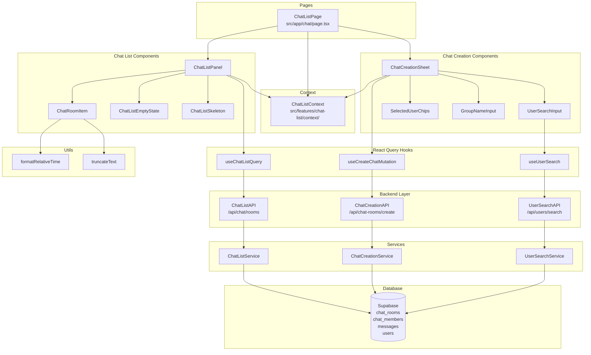
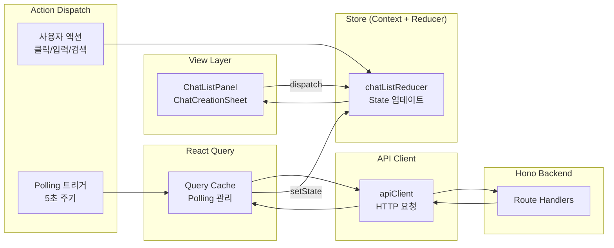

# 채팅 목록 페이지 모듈화 설계

## 개요

채팅 목록 페이지(`/chat`)는 사용자가 참여한 채팅방 목록을 조회하고, 새 채팅을 생성하며, 채팅방에 진입하는 기능을 제공합니다. 이 페이지는 두 가지 주요 유스케이스를 포함합니다:

- **UC008: 채팅 목록 조회** - 참여한 채팅방 목록 조회, Polling 기반 자동 갱신, 읽지 않은 메시지 배지 표시
- **UC003: 새 채팅 생성** - 1:1 또는 그룹 채팅 생성, 사용자 검색 및 선택

### 모듈 목록

| 모듈명 | 위치 | 설명 |
|--------|------|------|
| **ChatListPage** | `src/app/chat/page.tsx` | 채팅 목록 페이지 진입점 |
| **ChatListContext** | `src/features/chat-list/context/chat-list-context.tsx` | 채팅 목록 상태 관리 (Context + useReducer) |
| **ChatListAPI** | `src/features/chat-list/backend/route.ts` | 채팅 목록 조회 API 라우트 |
| **ChatListService** | `src/features/chat-list/backend/service.ts` | 채팅 목록 조회 비즈니스 로직 |
| **ChatListSchema** | `src/features/chat-list/backend/schema.ts` | 요청/응답 스키마 정의 |
| **ChatListError** | `src/features/chat-list/backend/error.ts` | 에러 코드 정의 |
| **ChatListDTO** | `src/features/chat-list/lib/dto.ts` | 클라이언트 측 스키마 재노출 |
| **useChatListQuery** | `src/features/chat-list/hooks/use-chat-list-query.ts` | 채팅 목록 조회 React Query 훅 |
| **ChatListPanel** | `src/features/chat-list/components/chat-list-panel.tsx` | 채팅 목록 메인 컴포넌트 |
| **ChatRoomItem** | `src/features/chat-list/components/chat-room-item.tsx` | 개별 채팅방 목록 아이템 |
| **ChatListEmptyState** | `src/features/chat-list/components/chat-list-empty-state.tsx` | 빈 목록 상태 표시 |
| **ChatListSkeleton** | `src/features/chat-list/components/chat-list-skeleton.tsx` | 로딩 스켈레톤 UI |
| **ChatCreationSheet** | `src/features/chat-creation/components/chat-creation-sheet.tsx` | 새 채팅 생성 Sheet 컴포넌트 |
| **UserSearchInput** | `src/features/chat-creation/components/user-search-input.tsx` | 사용자 검색 입력 필드 |
| **SelectedUserChips** | `src/features/chat-creation/components/selected-user-chips.tsx` | 선택된 사용자 칩 목록 |
| **GroupNameInput** | `src/features/chat-creation/components/group-name-input.tsx` | 그룹 채팅방 이름 입력 |
| **ChatCreationAPI** | `src/features/chat-creation/backend/route.ts` | 채팅 생성 API 라우트 |
| **ChatCreationService** | `src/features/chat-creation/backend/service.ts` | 채팅 생성 비즈니스 로직 |
| **ChatCreationSchema** | `src/features/chat-creation/backend/schema.ts` | 채팅 생성 스키마 |
| **ChatCreationError** | `src/features/chat-creation/backend/error.ts` | 채팅 생성 에러 코드 |
| **useCreateChatMutation** | `src/features/chat-creation/hooks/use-create-chat-mutation.ts` | 채팅 생성 React Query 훅 |
| **useUserSearch** | `src/features/chat-creation/hooks/use-user-search.ts` | 사용자 검색 React Query 훅 |
| **UserSearchAPI** | `src/features/user-search/backend/route.ts` | 사용자 검색 API (공통 모듈) |
| **UserSearchService** | `src/features/user-search/backend/service.ts` | 사용자 검색 서비스 (공통 모듈) |
| **formatRelativeTime** | `src/lib/utils/time.ts` | 상대 시간 포맷 유틸 (공통) |
| **truncateText** | `src/lib/utils/text.ts` | 텍스트 자르기 유틸 (공통) |

---

## Diagram

### 모듈 간 관계도



### 데이터 플로우 (Flux 패턴)



---

## Implementation Plan

### 1. Backend Layer

#### 1.1 Chat List API Route (`src/features/chat-list/backend/route.ts`)

**책임**:
- `GET /api/chat/rooms` 엔드포인트 제공
- Query Parameter `since` 지원 (incremental update)
- 인증 검증 및 응답 포맷팅

**구현 계획**:
```typescript
import type { Hono } from 'hono';
import { respond, failure } from '@/backend/http/response';
import { getLogger, getSupabase, type AppEnv } from '@/backend/hono/context';
import { ChatListQuerySchema, ChatListResponseSchema } from './schema';
import { getChatRoomsByUserId } from './service';
import { chatListErrorCodes } from './error';

export const registerChatListRoutes = (app: Hono<AppEnv>) => {
  app.get('/api/chat/rooms', async (c) => {
    const parsedQuery = ChatListQuerySchema.safeParse({
      since: c.req.query('since'),
      limit: c.req.query('limit'),
    });

    if (!parsedQuery.success) {
      return respond(
        c,
        failure(
          400,
          chatListErrorCodes.invalidQuery,
          'Invalid query parameters',
          parsedQuery.error.format()
        )
      );
    }

    const supabase = getSupabase(c);
    const logger = getLogger(c);

    // 세션 검증 (미들웨어에서 처리되거나 여기서 직접 확인)
    const { data: { user }, error: authError } = await supabase.auth.getUser();

    if (authError || !user) {
      return respond(
        c,
        failure(401, chatListErrorCodes.unauthorized, 'Unauthorized')
      );
    }

    const result = await getChatRoomsByUserId(
      supabase,
      user.id,
      parsedQuery.data.since,
      parsedQuery.data.limit
    );

    if (!result.ok) {
      logger.error('Failed to fetch chat rooms', result.error);
      return respond(c, result);
    }

    return respond(c, result);
  });
};
```

**Unit Test**:
```typescript
describe('ChatListAPI', () => {
  it('should return 401 if user is not authenticated', async () => {
    // Arrange: Mock unauthenticated request
    // Act: Call GET /api/chat/rooms
    // Assert: Response status 401
  });

  it('should return 400 if query params are invalid', async () => {
    // Arrange: Invalid 'since' format
    // Act: Call GET /api/chat/rooms?since=invalid
    // Assert: Response status 400
  });

  it('should return chat rooms list on success', async () => {
    // Arrange: Authenticated user with chat rooms
    // Act: Call GET /api/chat/rooms
    // Assert: Response status 200, rooms array exists
  });

  it('should return only updated rooms when "since" is provided', async () => {
    // Arrange: Provide valid ISO timestamp
    // Act: Call GET /api/chat/rooms?since=2025-01-01T00:00:00Z
    // Assert: Only rooms updated after timestamp are returned
  });
});
```

---

#### 1.2 Chat List Service (`src/features/chat-list/backend/service.ts`)

**책임**:
- Supabase 쿼리 실행
- 채팅방 목록, 최신 메시지, 읽지 않은 개수 조회
- 참여자 정보 조인

**구현 계획**:
```typescript
import type { SupabaseClient } from '@supabase/supabase-js';
import { success, failure } from '@/backend/http/response';
import { chatListErrorCodes } from './error';
import type { ChatRoomItem } from './schema';

export const getChatRoomsByUserId = async (
  supabase: SupabaseClient,
  userId: string,
  since?: string,
  limit: number = 50
) => {
  try {
    // 1. 사용자가 참여한 채팅방 조회
    let query = supabase
      .from('chat_rooms')
      .select(`
        id,
        room_type,
        name,
        created_at,
        updated_at,
        chat_members!inner(user_id, last_read_message_id)
      `)
      .eq('chat_members.user_id', userId)
      .order('updated_at', { ascending: false })
      .limit(limit);

    if (since) {
      query = query.gt('updated_at', since);
    }

    const { data: rooms, error: roomsError } = await query;

    if (roomsError) {
      return failure(500, chatListErrorCodes.fetchError, roomsError.message);
    }

    // 2. 각 채팅방의 최신 메시지 및 읽지 않은 개수 조회
    const roomsWithDetails = await Promise.all(
      rooms.map(async (room) => {
        // 최신 메시지 조회
        const { data: lastMessage } = await supabase
          .from('messages')
          .select('id, content, message_type, sender_id, is_deleted, created_at, users(nickname)')
          .eq('chat_room_id', room.id)
          .order('created_at', { ascending: false })
          .limit(1)
          .single();

        // 읽지 않은 메시지 개수
        const member = room.chat_members.find((m: any) => m.user_id === userId);
        const lastReadId = member?.last_read_message_id;

        const { count: unreadCount } = await supabase
          .from('messages')
          .select('id', { count: 'exact', head: true })
          .eq('chat_room_id', room.id)
          .neq('sender_id', userId)
          .eq('is_deleted', false)
          .gt('id', lastReadId || '00000000-0000-0000-0000-000000000000');

        // 참여자 정보 조회
        const { data: participants } = await supabase
          .from('chat_members')
          .select('user_id, users(id, nickname, profile_image_url)')
          .eq('chat_room_id', room.id);

        return {
          id: room.id,
          type: room.room_type,
          name: room.name,
          participants: participants?.map((p: any) => p.users) || [],
          lastMessage: lastMessage
            ? {
                id: lastMessage.id,
                content: lastMessage.content,
                type: lastMessage.message_type,
                senderId: lastMessage.sender_id,
                senderNickname: lastMessage.users?.nickname,
                isDeleted: lastMessage.is_deleted,
                createdAt: lastMessage.created_at,
              }
            : null,
          unreadCount: unreadCount || 0,
          createdAt: room.created_at,
          updatedAt: room.updated_at,
        } as ChatRoomItem;
      })
    );

    return success(200, {
      rooms: roomsWithDetails,
      hasMore: rooms.length === limit,
      updatedAt: new Date().toISOString(),
    });
  } catch (error: any) {
    return failure(500, chatListErrorCodes.fetchError, error.message);
  }
};
```

**Unit Test**:
```typescript
describe('getChatRoomsByUserId', () => {
  it('should return empty array if user has no chat rooms', async () => {
    // Arrange: Mock Supabase response with empty array
    // Act: Call service
    // Assert: rooms = []
  });

  it('should return rooms with last message and unread count', async () => {
    // Arrange: Mock user with 2 chat rooms
    // Act: Call service
    // Assert: Each room has lastMessage and unreadCount
  });

  it('should only return rooms updated after "since" timestamp', async () => {
    // Arrange: Mock rooms with different updated_at
    // Act: Call with since parameter
    // Assert: Only newer rooms returned
  });

  it('should handle deleted messages in preview', async () => {
    // Arrange: Last message is deleted
    // Act: Call service
    // Assert: lastMessage.isDeleted = true
  });

  it('should exclude sender\'s own messages from unread count', async () => {
    // Arrange: Room with 5 messages, 2 from user
    // Act: Call service
    // Assert: unreadCount = 3
  });
});
```

---

#### 1.3 Chat Creation API Route (`src/features/chat-creation/backend/route.ts`)

**책임**:
- `POST /api/chat-rooms/create` 엔드포인트 제공
- 1:1 채팅 중복 확인 및 재사용
- 그룹 채팅 생성 트랜잭션 처리

**구현 계획**:
```typescript
import type { Hono } from 'hono';
import { respond, failure } from '@/backend/http/response';
import { getLogger, getSupabase, type AppEnv } from '@/backend/hono/context';
import { CreateChatRequestSchema } from './schema';
import { createChatRoom, findExistingDirectChat } from './service';
import { chatCreationErrorCodes } from './error';

export const registerChatCreationRoutes = (app: Hono<AppEnv>) => {
  app.post('/api/chat-rooms/create', async (c) => {
    const body = await c.req.json();
    const parsedBody = CreateChatRequestSchema.safeParse(body);

    if (!parsedBody.success) {
      return respond(
        c,
        failure(400, chatCreationErrorCodes.invalidRequest, 'Invalid request body', parsedBody.error.format())
      );
    }

    const supabase = getSupabase(c);
    const logger = getLogger(c);

    const { data: { user }, error: authError } = await supabase.auth.getUser();

    if (authError || !user) {
      return respond(c, failure(401, chatCreationErrorCodes.unauthorized, 'Unauthorized'));
    }

    const { type, name, user_ids } = parsedBody.data;

    // 1:1 채팅인 경우 기존 채팅방 확인
    if (type === 'direct' && user_ids.length === 1) {
      const existingChat = await findExistingDirectChat(supabase, user.id, user_ids[0]);
      if (existingChat.ok && existingChat.data) {
        return respond(c, existingChat);
      }
    }

    // 새 채팅방 생성
    const result = await createChatRoom(supabase, {
      createdBy: user.id,
      type,
      name,
      participantIds: [user.id, ...user_ids],
    });

    if (!result.ok) {
      logger.error('Failed to create chat room', result.error);
      return respond(c, result);
    }

    return respond(c, result);
  });
};
```

**Unit Test**:
```typescript
describe('ChatCreationAPI', () => {
  it('should return 401 if user is not authenticated', async () => {
    // Arrange: No auth token
    // Act: POST /api/chat-rooms/create
    // Assert: 401 response
  });

  it('should return 400 if request body is invalid', async () => {
    // Arrange: Missing user_ids
    // Act: POST with invalid body
    // Assert: 400 response
  });

  it('should reuse existing 1:1 chat room', async () => {
    // Arrange: 1:1 chat already exists
    // Act: POST with same user
    // Assert: 200 response, exists: true
  });

  it('should create new 1:1 chat if not exists', async () => {
    // Arrange: No existing 1:1 chat
    // Act: POST /api/chat-rooms/create
    // Assert: 201 response, new chat_room_id
  });

  it('should create group chat with multiple users', async () => {
    // Arrange: 3 user_ids, group name
    // Act: POST /api/chat-rooms/create
    // Assert: 201 response, room_type = 'group'
  });

  it('should return 400 if group name is missing for group chat', async () => {
    // Arrange: type = 'group', name = null
    // Act: POST
    // Assert: 400 response
  });
});
```

---

#### 1.4 User Search API Route (`src/features/user-search/backend/route.ts`)

**책임**:
- `GET /api/users/search?q={query}` 엔드포인트 제공
- 닉네임/이메일 기반 검색
- 본인 제외, active 사용자만 반환

**구현 계획**:
```typescript
import type { Hono } from 'hono';
import { respond, failure } from '@/backend/http/response';
import { getSupabase, type AppEnv } from '@/backend/hono/context';
import { UserSearchQuerySchema } from './schema';
import { searchUsers } from './service';
import { userSearchErrorCodes } from './error';

export const registerUserSearchRoutes = (app: Hono<AppEnv>) => {
  app.get('/api/users/search', async (c) => {
    const parsedQuery = UserSearchQuerySchema.safeParse({
      q: c.req.query('q'),
      limit: c.req.query('limit'),
    });

    if (!parsedQuery.success) {
      return respond(c, failure(400, userSearchErrorCodes.invalidQuery, 'Invalid query'));
    }

    const supabase = getSupabase(c);
    const { data: { user }, error: authError } = await supabase.auth.getUser();

    if (authError || !user) {
      return respond(c, failure(401, userSearchErrorCodes.unauthorized, 'Unauthorized'));
    }

    const result = await searchUsers(
      supabase,
      parsedQuery.data.q,
      user.id, // 본인 제외
      parsedQuery.data.limit
    );

    return respond(c, result);
  });
};
```

**Unit Test**:
```typescript
describe('UserSearchAPI', () => {
  it('should return 401 if user is not authenticated', async () => {
    // Arrange: No auth
    // Act: GET /api/users/search?q=test
    // Assert: 401
  });

  it('should return users matching query', async () => {
    // Arrange: Users with nickname "김민준"
    // Act: GET /api/users/search?q=김민준
    // Assert: Matching users returned
  });

  it('should exclude current user from results', async () => {
    // Arrange: Current user nickname matches query
    // Act: GET /api/users/search?q=current
    // Assert: Current user not in results
  });

  it('should only return active users', async () => {
    // Arrange: Users with status inactive/withdrawn
    // Act: GET /api/users/search?q=test
    // Assert: Only active users returned
  });
});
```

---

### 2. Client Layer

#### 2.1 ChatListContext (`src/features/chat-list/context/chat-list-context.tsx`)

**책임**:
- 채팅 목록 상태 관리 (Context + useReducer)
- Flux 패턴 구현
- 하위 컴포넌트에 상태 및 액션 제공

**구현 계획**:
```typescript
'use client';

import React, { createContext, useContext, useReducer, useMemo, useCallback } from 'react';
import { useQueryClient } from '@tanstack/react-query';
import type { ChatRoomItem } from '../lib/dto';

// State 정의
export type ChatListState = {
  rooms: Record<string, ChatRoomItem>;
  roomOrder: string[];
  filters: {
    search: string;
    showUnreadOnly: boolean;
    sortBy: 'recent' | 'alphabetical';
  };
  syncStatus: {
    loading: boolean;
    lastSuccessAt: string | null;
    lastError: string | null;
  };
};

// Action 정의
export type ChatListAction =
  | { type: 'UPSERT_ROOMS'; payload: ChatRoomItem[] }
  | { type: 'SET_FILTER'; payload: Partial<ChatListState['filters']> }
  | { type: 'SET_SYNC_STATUS'; payload: Partial<ChatListState['syncStatus']> }
  | { type: 'CLEAR_ROOMS' };

const initialState: ChatListState = {
  rooms: {},
  roomOrder: [],
  filters: { search: '', showUnreadOnly: false, sortBy: 'recent' },
  syncStatus: { loading: false, lastSuccessAt: null, lastError: null },
};

// Reducer
const chatListReducer: React.Reducer<ChatListState, ChatListAction> = (state, action) => {
  switch (action.type) {
    case 'UPSERT_ROOMS': {
      const nextRooms = { ...state.rooms };
      const nextOrder = new Set(state.roomOrder);

      action.payload.forEach((room) => {
        nextRooms[room.id] = room;
        nextOrder.add(room.id);
      });

      const sortedOrder = Array.from(nextOrder).sort((a, b) => {
        const roomA = nextRooms[a];
        const roomB = nextRooms[b];

        if (state.filters.sortBy === 'recent') {
          return (roomB.updatedAt || roomB.createdAt).localeCompare(
            roomA.updatedAt || roomA.createdAt
          );
        } else {
          return (roomA.name || '').localeCompare(roomB.name || '');
        }
      });

      return {
        ...state,
        rooms: nextRooms,
        roomOrder: sortedOrder,
      };
    }

    case 'SET_FILTER':
      return {
        ...state,
        filters: { ...state.filters, ...action.payload },
      };

    case 'SET_SYNC_STATUS':
      return {
        ...state,
        syncStatus: { ...state.syncStatus, ...action.payload },
      };

    case 'CLEAR_ROOMS':
      return initialState;

    default:
      return state;
  }
};

// Context 타입
type ChatListContextValue = {
  state: ChatListState;
  dispatch: React.Dispatch<ChatListAction>;
  actions: {
    upsertRooms: (rooms: ChatRoomItem[]) => void;
    setFilter: (filter: Partial<ChatListState['filters']>) => void;
    setSyncStatus: (status: Partial<ChatListState['syncStatus']>) => void;
  };
};

const ChatListContext = createContext<ChatListContextValue | null>(null);

// Provider
export const ChatListProvider = ({ children }: { children: React.ReactNode }) => {
  const [state, dispatch] = useReducer(chatListReducer, initialState);
  const queryClient = useQueryClient();

  const actions = useMemo(
    () => ({
      upsertRooms: (rooms: ChatRoomItem[]) => dispatch({ type: 'UPSERT_ROOMS', payload: rooms }),
      setFilter: (filter: Partial<ChatListState['filters']>) =>
        dispatch({ type: 'SET_FILTER', payload: filter }),
      setSyncStatus: (status: Partial<ChatListState['syncStatus']>) =>
        dispatch({ type: 'SET_SYNC_STATUS', payload: status }),
    }),
    []
  );

  const value = useMemo<ChatListContextValue>(
    () => ({ state, dispatch, actions }),
    [state, actions]
  );

  return <ChatListContext.Provider value={value}>{children}</ChatListContext.Provider>;
};

// Hook
export const useChatListContext = () => {
  const value = useContext(ChatListContext);
  if (!value) {
    throw new Error('ChatListProvider가 트리 상단에 필요합니다.');
  }
  return value;
};
```

**Integration Test**:
```typescript
describe('ChatListContext', () => {
  it('should provide initial state', () => {
    // Arrange: Render with provider
    // Act: Access context
    // Assert: State matches initialState
  });

  it('should upsert rooms and update order', () => {
    // Arrange: Dispatch UPSERT_ROOMS
    // Act: Add 3 rooms
    // Assert: roomOrder sorted by updatedAt
  });

  it('should filter rooms by search keyword', () => {
    // Arrange: Set filter.search = "test"
    // Act: Dispatch SET_FILTER
    // Assert: Filtered rooms match keyword
  });

  it('should show only unread rooms when filter enabled', () => {
    // Arrange: Set filter.showUnreadOnly = true
    // Act: Dispatch SET_FILTER
    // Assert: Only rooms with unreadCount > 0
  });
});
```

---

#### 2.2 useChatListQuery (`src/features/chat-list/hooks/use-chat-list-query.ts`)

**책임**:
- React Query를 사용한 채팅 목록 조회
- 5초 주기 Polling 설정
- Context 상태 업데이트

**구현 계획**:
```typescript
'use client';

import { useQuery } from '@tanstack/react-query';
import { useEffect } from 'react';
import { apiClient, extractApiErrorMessage } from '@/lib/remote/api-client';
import { ChatListResponseSchema } from '../lib/dto';
import { useChatListContext } from '../context/chat-list-context';

const POLL_INTERVAL = 5000; // 5초

const fetchChatRooms = async (since?: string) => {
  try {
    const url = since ? `/api/chat/rooms?since=${since}` : '/api/chat/rooms';
    const { data } = await apiClient.get(url);
    return ChatListResponseSchema.parse(data);
  } catch (error) {
    const message = extractApiErrorMessage(error, 'Failed to fetch chat rooms');
    throw new Error(message);
  }
};

export const useChatListQuery = (enabled: boolean = true) => {
  const { state, actions } = useChatListContext();

  const query = useQuery({
    queryKey: ['chatRooms'],
    queryFn: () => fetchChatRooms(),
    enabled,
    refetchInterval: POLL_INTERVAL,
    staleTime: 0, // 항상 최신 상태 유지
  });

  useEffect(() => {
    if (query.isSuccess && query.data) {
      actions.upsertRooms(query.data.rooms);
      actions.setSyncStatus({ loading: false, lastSuccessAt: query.data.updatedAt, lastError: null });
    }

    if (query.isError) {
      actions.setSyncStatus({ loading: false, lastError: query.error.message });
    }

    if (query.isLoading) {
      actions.setSyncStatus({ loading: true });
    }
  }, [query.isSuccess, query.isError, query.isLoading, query.data, query.error, actions]);

  return query;
};
```

---

#### 2.3 ChatListPanel (`src/features/chat-list/components/chat-list-panel.tsx`)

**책임**:
- 채팅 목록 메인 UI 렌더링
- 검색 필터 적용
- 스크롤 위치 저장/복원

**구현 계획**:
```typescript
'use client';

import { useMemo } from 'react';
import { useChatListContext } from '../context/chat-list-context';
import { useChatListQuery } from '../hooks/use-chat-list-query';
import { ChatRoomItem } from './chat-room-item';
import { ChatListEmptyState } from './chat-list-empty-state';
import { ChatListSkeleton } from './chat-list-skeleton';

export const ChatListPanel = () => {
  const { state } = useChatListContext();
  const { isLoading, isError, error } = useChatListQuery();

  const filteredRooms = useMemo(() => {
    let rooms = state.roomOrder.map((id) => state.rooms[id]);

    if (state.filters.search) {
      rooms = rooms.filter((room) =>
        room.name?.toLowerCase().includes(state.filters.search.toLowerCase())
      );
    }

    if (state.filters.showUnreadOnly) {
      rooms = rooms.filter((room) => room.unreadCount > 0);
    }

    return rooms;
  }, [state.roomOrder, state.rooms, state.filters]);

  if (isLoading) return <ChatListSkeleton />;

  if (isError) {
    return (
      <div className="p-4 text-center">
        <p className="text-red-500">오류 발생: {error.message}</p>
        <button onClick={() => window.location.reload()} className="mt-2 btn">
          재시도
        </button>
      </div>
    );
  }

  if (filteredRooms.length === 0) {
    return <ChatListEmptyState />;
  }

  return (
    <div className="flex flex-col h-full overflow-y-auto">
      {filteredRooms.map((room) => (
        <ChatRoomItem key={room.id} room={room} />
      ))}
    </div>
  );
};
```

**QA Sheet**:
| Test Case | Input | Expected Output | Pass/Fail |
|-----------|-------|-----------------|-----------|
| 초기 로딩 상태 | isLoading = true | ChatListSkeleton 표시 | |
| 빈 목록 | filteredRooms = [] | ChatListEmptyState 표시 | |
| 채팅방 목록 표시 | 3개 채팅방 | 3개 ChatRoomItem 렌더링 | |
| 검색 필터 적용 | search = "프로젝트" | 이름에 "프로젝트" 포함된 채팅방만 표시 | |
| 읽지 않은 메시지 필터 | showUnreadOnly = true | unreadCount > 0인 채팅방만 표시 | |
| 에러 상태 | isError = true | 에러 메시지 및 재시도 버튼 표시 | |

---

#### 2.4 ChatRoomItem (`src/features/chat-list/components/chat-room-item.tsx`)

**책임**:
- 개별 채팅방 아이템 렌더링
- 프로필 이미지, 이름, 최신 메시지, 타임스탬프, 배지 표시
- 클릭 시 채팅방으로 이동

**구현 계획**:
```typescript
'use client';

import { useRouter } from 'next/navigation';
import { formatRelativeTime } from '@/lib/utils/time';
import { truncateText } from '@/lib/utils/text';
import type { ChatRoomItem as ChatRoomItemType } from '../lib/dto';

type Props = {
  room: ChatRoomItemType;
};

export const ChatRoomItem = ({ room }: Props) => {
  const router = useRouter();

  const handleClick = () => {
    router.push(`/chat/${room.id}`);
  };

  const displayName = room.type === 'direct'
    ? room.participants.find((p) => p.id !== 'currentUserId')?.nickname || '알 수 없음'
    : room.name || room.participants.slice(0, 3).map((p) => p.nickname).join(', ');

  const lastMessagePreview = room.lastMessage?.isDeleted
    ? '삭제된 메시지입니다'
    : truncateText(room.lastMessage?.content || '', 50);

  return (
    <div
      onClick={handleClick}
      className="flex items-center gap-3 p-4 hover:bg-gray-100 cursor-pointer border-b"
    >
      
      <div className="flex-1">
        <div className="flex justify-between items-center">
          <h3 className={`font-semibold ${room.unreadCount > 0 ? 'font-bold' : ''}`}>
            {displayName}
          </h3>
          <span className="text-xs text-gray-500">
            {formatRelativeTime(room.lastMessage?.createdAt || room.createdAt)}
          </span>
        </div>
        <p className="text-sm text-gray-600 truncate">{lastMessagePreview}</p>
      </div>
      {room.unreadCount > 0 && (
        <span className="bg-red-500 text-white text-xs px-2 py-1 rounded-full">
          {room.unreadCount > 999 ? '999+' : room.unreadCount}
        </span>
      )}
    </div>
  );
};
```

**QA Sheet**:
| Test Case | Input | Expected Output | Pass/Fail |
|-----------|-------|-----------------|-----------|
| 1:1 채팅 이름 표시 | type = 'direct' | 상대방 닉네임 표시 | |
| 그룹 채팅 이름 표시 | type = 'group', name = "팀 프로젝트" | "팀 프로젝트" 표시 | |
| 삭제된 메시지 미리보기 | lastMessage.isDeleted = true | "삭제된 메시지입니다" 표시 | |
| 긴 메시지 자르기 | content > 50자 | 50자까지만 표시, "..." 추가 | |
| 읽지 않은 배지 표시 | unreadCount = 5 | 빨간 배지 "5" 표시 | |
| 읽지 않은 배지 999+ | unreadCount = 1000 | "999+" 표시 | |
| 클릭 시 이동 | 아이템 클릭 | /chat/{room.id}로 라우팅 | |

---

#### 2.5 ChatCreationSheet (`src/features/chat-creation/components/chat-creation-sheet.tsx`)

**책임**:
- 새 채팅 생성 Sheet UI
- 사용자 검색 및 선택
- 1:1/그룹 구분 및 그룹명 입력
- 생성 버튼 활성화 조건 제어

**구현 계획**:
```typescript
'use client';

import { useState } from 'react';
import { Sheet, SheetContent, SheetHeader, SheetTitle, SheetTrigger } from '@/components/ui/sheet';
import { Button } from '@/components/ui/button';
import { UserSearchInput } from './user-search-input';
import { SelectedUserChips } from './selected-user-chips';
import { GroupNameInput } from './group-name-input';
import { useCreateChatMutation } from '../hooks/use-create-chat-mutation';

type Props = {
  trigger: React.ReactNode;
};

export const ChatCreationSheet = ({ trigger }: Props) => {
  const [open, setOpen] = useState(false);
  const [selectedUsers, setSelectedUsers] = useState<string[]>([]);
  const [groupName, setGroupName] = useState('');
  const { mutate: createChat, isPending } = useCreateChatMutation();

  const isGroup = selectedUsers.length > 1;
  const canCreate = selectedUsers.length > 0 && (!isGroup || groupName.trim().length > 0);

  const handleCreate = () => {
    createChat(
      {
        type: isGroup ? 'group' : 'direct',
        name: isGroup ? groupName : null,
        user_ids: selectedUsers,
      },
      {
        onSuccess: (data) => {
          setOpen(false);
          // 생성된 채팅방으로 이동
          window.location.href = `/chat/${data.chat_room_id}`;
        },
      }
    );
  };

  return (
    <Sheet open={open} onOpenChange={setOpen}>
      <SheetTrigger asChild>{trigger}</SheetTrigger>
      <SheetContent>
        <SheetHeader>
          <SheetTitle>새 채팅 시작</SheetTitle>
        </SheetHeader>
        <div className="mt-4 space-y-4">
          <UserSearchInput
            selectedUsers={selectedUsers}
            onSelectUser={(userId) => setSelectedUsers([...selectedUsers, userId])}
          />
          <SelectedUserChips
            selectedUsers={selectedUsers}
            onRemove={(userId) => setSelectedUsers(selectedUsers.filter((id) => id !== userId))}
          />
          {isGroup && (
            <GroupNameInput value={groupName} onChange={setGroupName} />
          )}
          <Button
            onClick={handleCreate}
            disabled={!canCreate || isPending}
            className="w-full"
          >
            {isPending ? '생성 중...' : isGroup ? '채팅방 만들기' : '채팅 시작'}
          </Button>
        </div>
      </SheetContent>
    </Sheet>
  );
};
```

**QA Sheet**:
| Test Case | Input | Expected Output | Pass/Fail |
|-----------|-------|-----------------|-----------|
| Sheet 열기 | Trigger 클릭 | Sheet 표시 | |
| 사용자 선택 | 1명 선택 | 1:1 채팅 모드 | |
| 그룹 모드 전환 | 2명 선택 | 그룹명 입력 필드 표시 | |
| 생성 버튼 비활성화 (1:1) | 선택 사용자 없음 | 버튼 비활성화 | |
| 생성 버튼 비활성화 (그룹) | 그룹명 미입력 | 버튼 비활성화 | |
| 생성 성공 | 유효한 입력 | Sheet 닫기, 채팅방 이동 | |

---

### 3. Utilities (공통 모듈)

#### 3.1 formatRelativeTime (`src/lib/utils/time.ts`)

**책임**:
- ISO 8601 타임스탬프를 상대 시간으로 변환
- "방금 전", "3분 전", "어제", "2025.01.15" 등

**구현 계획**:
```typescript
import { formatDistanceToNow, format, isToday, isYesterday } from 'date-fns';
import { ko } from 'date-fns/locale';

export const formatRelativeTime = (timestamp: string): string => {
  const date = new Date(timestamp);
  const now = new Date();
  const diffInMinutes = Math.floor((now.getTime() - date.getTime()) / 60000);

  if (diffInMinutes < 1) return '방금 전';
  if (diffInMinutes < 60) return `${diffInMinutes}분 전`;
  if (isToday(date)) return format(date, 'HH:mm');
  if (isYesterday(date)) return '어제';
  return format(date, 'yyyy.MM.dd');
};
```

**Unit Test**:
```typescript
describe('formatRelativeTime', () => {
  it('should return "방금 전" for timestamps < 1 minute ago', () => {
    const now = new Date().toISOString();
    expect(formatRelativeTime(now)).toBe('방금 전');
  });

  it('should return "N분 전" for timestamps < 1 hour ago', () => {
    const date = new Date(Date.now() - 30 * 60000).toISOString();
    expect(formatRelativeTime(date)).toBe('30분 전');
  });

  it('should return "HH:mm" for today', () => {
    const date = new Date();
    date.setHours(14, 30, 0);
    expect(formatRelativeTime(date.toISOString())).toBe('14:30');
  });

  it('should return "어제" for yesterday', () => {
    const date = new Date(Date.now() - 24 * 60 * 60000).toISOString();
    expect(formatRelativeTime(date)).toBe('어제');
  });

  it('should return "yyyy.MM.dd" for older dates', () => {
    const date = new Date('2025-01-01').toISOString();
    expect(formatRelativeTime(date)).toBe('2025.01.01');
  });
});
```

---

#### 3.2 truncateText (`src/lib/utils/text.ts`)

**책임**:
- 긴 텍스트를 지정된 길이로 자르고 "..." 추가
- 줄바꿈을 공백으로 치환

**구현 계획**:
```typescript
export const truncateText = (text: string, maxLength: number): string => {
  const normalized = text.replace(/\n/g, ' ').trim();
  if (normalized.length <= maxLength) return normalized;
  return normalized.slice(0, maxLength) + '...';
};
```

**Unit Test**:
```typescript
describe('truncateText', () => {
  it('should return original text if length <= maxLength', () => {
    expect(truncateText('Hello', 10)).toBe('Hello');
  });

  it('should truncate and add "..." if length > maxLength', () => {
    expect(truncateText('This is a very long text', 10)).toBe('This is a ...');
  });

  it('should replace newlines with spaces', () => {
    expect(truncateText('Line 1\nLine 2', 20)).toBe('Line 1 Line 2');
  });

  it('should handle empty string', () => {
    expect(truncateText('', 10)).toBe('');
  });
});
```

---

### 4. Schema Definitions

#### 4.1 ChatListSchema (`src/features/chat-list/backend/schema.ts`)

```typescript
import { z } from 'zod';

export const ChatListQuerySchema = z.object({
  since: z.string().optional(),
  limit: z.coerce.number().int().min(1).max(100).optional().default(50),
});

export const ParticipantSchema = z.object({
  id: z.string().uuid(),
  nickname: z.string(),
  profileImageUrl: z.string(),
});

export const LastMessageSchema = z.object({
  id: z.string().uuid(),
  content: z.string(),
  type: z.enum(['text', 'emoji', 'file', 'system']),
  senderId: z.string().uuid(),
  senderNickname: z.string(),
  isDeleted: z.boolean(),
  createdAt: z.string(),
});

export const ChatRoomItemSchema = z.object({
  id: z.string().uuid(),
  type: z.enum(['direct', 'group']),
  name: z.string().nullable(),
  participants: z.array(ParticipantSchema),
  lastMessage: LastMessageSchema.nullable(),
  unreadCount: z.number().int().min(0),
  createdAt: z.string(),
  updatedAt: z.string(),
});

export const ChatListResponseSchema = z.object({
  rooms: z.array(ChatRoomItemSchema),
  hasMore: z.boolean(),
  updatedAt: z.string(),
});

export type ChatRoomItem = z.infer<typeof ChatRoomItemSchema>;
export type ChatListResponse = z.infer<typeof ChatListResponseSchema>;
```

---

#### 4.2 ChatCreationSchema (`src/features/chat-creation/backend/schema.ts`)

```typescript
import { z } from 'zod';

export const CreateChatRequestSchema = z.object({
  type: z.enum(['direct', 'group']),
  name: z.string().min(1).max(50).nullable(),
  user_ids: z.array(z.string().uuid()).min(1).max(50),
}).refine(
  (data) => data.type !== 'group' || (data.name && data.name.trim().length > 0),
  { message: '그룹 채팅은 이름이 필수입니다', path: ['name'] }
);

export const CreateChatResponseSchema = z.object({
  chat_room_id: z.string().uuid(),
  room_type: z.enum(['direct', 'group']),
  name: z.string().nullable(),
  members: z.array(z.object({
    user_id: z.string().uuid(),
    nickname: z.string(),
    profile_image_url: z.string(),
  })),
  created_at: z.string(),
  exists: z.boolean().optional(),
});

export type CreateChatRequest = z.infer<typeof CreateChatRequestSchema>;
export type CreateChatResponse = z.infer<typeof CreateChatResponseSchema>;
```

---

### 5. Error Codes

#### 5.1 ChatListError (`src/features/chat-list/backend/error.ts`)

```typescript
export const chatListErrorCodes = {
  invalidQuery: 'CHAT_LIST/INVALID_QUERY',
  unauthorized: 'CHAT_LIST/UNAUTHORIZED',
  fetchError: 'CHAT_LIST/FETCH_ERROR',
} as const;

export type ChatListErrorCode = typeof chatListErrorCodes[keyof typeof chatListErrorCodes];

export type ChatListServiceError = {
  code: ChatListErrorCode;
  message: string;
};
```

---

#### 5.2 ChatCreationError (`src/features/chat-creation/backend/error.ts`)

```typescript
export const chatCreationErrorCodes = {
  invalidRequest: 'CHAT_CREATION/INVALID_REQUEST',
  unauthorized: 'CHAT_CREATION/UNAUTHORIZED',
  invalidUser: 'CHAT_CREATION/INVALID_USER',
  createError: 'CHAT_CREATION/CREATE_ERROR',
} as const;

export type ChatCreationErrorCode = typeof chatCreationErrorCodes[keyof typeof chatCreationErrorCodes];

export type ChatCreationServiceError = {
  code: ChatCreationErrorCode;
  message: string;
};
```

---

### 6. Page Entry Point

#### 6.1 ChatListPage (`src/app/chat/page.tsx`)

```typescript
'use client';

import { ChatListProvider } from '@/features/chat-list/context/chat-list-context';
import { ChatListPanel } from '@/features/chat-list/components/chat-list-panel';
import { ChatCreationSheet } from '@/features/chat-creation/components/chat-creation-sheet';
import { Button } from '@/components/ui/button';

export default async function ChatListPage() {
  return (
    <ChatListProvider>
      <div className="flex flex-col h-screen">
        <header className="flex justify-between items-center p-4 border-b">
          <h1 className="text-xl font-bold">채팅</h1>
          <ChatCreationSheet
            trigger={<Button variant="default">새 채팅 시작</Button>}
          />
        </header>
        <main className="flex-1 overflow-hidden">
          <ChatListPanel />
        </main>
      </div>
    </ChatListProvider>
  );
}
```

**QA Sheet**:
| Test Case | Input | Expected Output | Pass/Fail |
|-----------|-------|-----------------|-----------|
| 페이지 진입 | /chat 접근 | ChatListPanel 렌더링 | |
| 새 채팅 버튼 클릭 | 버튼 클릭 | ChatCreationSheet 열림 | |
| Context 제공 | 하위 컴포넌트 | ChatListContext 접근 가능 | |

---

## 구현 순서

1. **공통 모듈** (`formatRelativeTime`, `truncateText`) - 다른 모듈에서 사용
2. **Backend Schemas** (`chat-list/backend/schema.ts`, `chat-creation/backend/schema.ts`) - 타입 정의
3. **Backend Services** (`chat-list/backend/service.ts`, `chat-creation/backend/service.ts`) - 비즈니스 로직
4. **Backend Routes** (`chat-list/backend/route.ts`, `chat-creation/backend/route.ts`) - API 엔드포인트
5. **Hono 앱 라우터 등록** (`src/backend/hono/app.ts`에 라우터 등록)
6. **Context** (`chat-list/context/chat-list-context.tsx`) - 상태 관리
7. **React Query Hooks** (`use-chat-list-query.ts`, `use-create-chat-mutation.ts`) - 서버 상태
8. **UI Components** (Bottom-up: `ChatRoomItem` → `ChatListPanel` → `ChatCreationSheet`)
9. **Page** (`src/app/chat/page.tsx`) - 진입점

---

## 추가 고려사항

### 성능 최적화
- **Virtual Scroll**: 채팅방이 100개 이상일 때 `react-window` 사용
- **React.memo**: `ChatRoomItem` 컴포넌트 메모이제이션
- **Debounce**: 검색 입력 300ms debounce
- **Lazy Loading**: 프로필 이미지 Lazy Loading

### 접근성
- 키보드 탐색 지원 (Tab, Enter)
- ARIA 레이블 추가
- Screen Reader 호환성

### 에러 처리
- 네트워크 오류 시 Exponential Backoff (5s → 10s → 20s → 60s)
- Retry 버튼 제공
- Toast 알림으로 사용자 피드백

### 보안
- 세션 만료 시 자동 로그아웃
- XSS 방지 (텍스트 출력 시 sanitize)
- CSRF 토큰 검증

### 테스트
- Unit Test: Services, Utilities, Reducers
- Integration Test: Context, Hooks
- E2E Test: 채팅 목록 조회 → 새 채팅 생성 → 채팅방 진입 플로우
