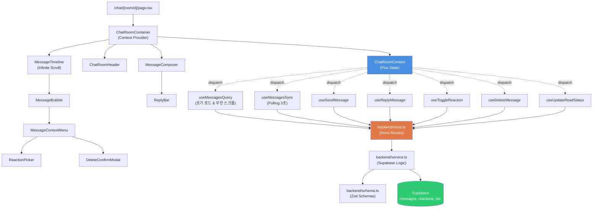
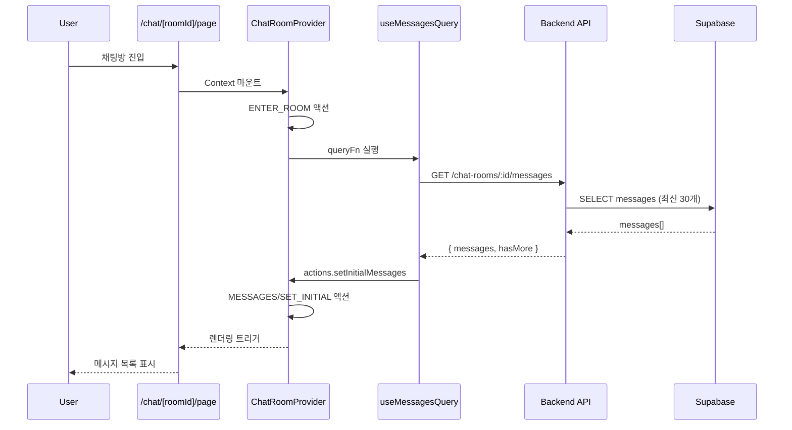
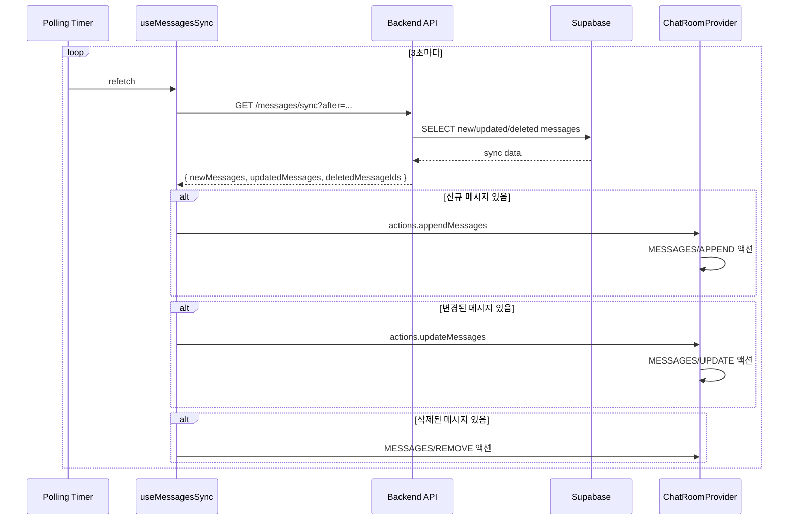
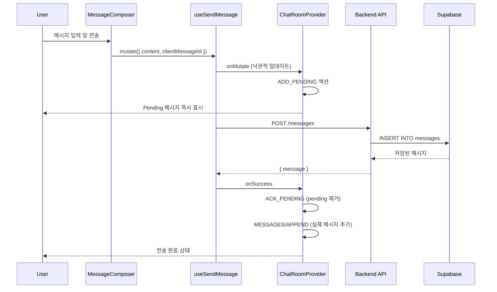
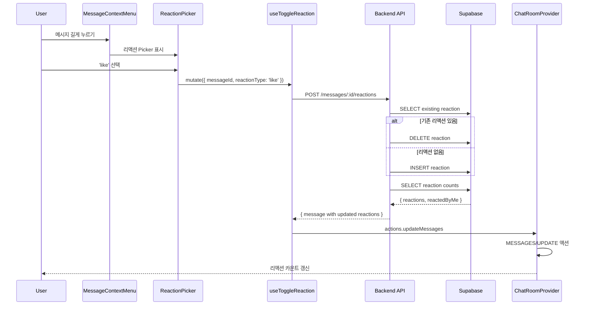

# 채팅방 페이지 모듈화 설계 (Chat Room Page)

## 1. 개요

### 1.1 목적
채팅방 페이지(`/chat/[roomId]`)는 사용자가 실시간으로 메시지를 주고받고, 과거 대화를 탐색하며, 메시지에 대한 답장/리액션/삭제 등의 상호작용을 수행하는 핵심 페이지입니다.

### 1.2 포함된 유스케이스
- **UC009**: 채팅방 진입 및 메시지 동기화 (Polling 기반, 3초 주기)
- **UC004**: 메시지 전송 (텍스트/이모지/파일)
- **UC005**: 메시지 답장
- **UC006**: 메시지 리액션 (like, bookmark, empathy)
- **UC007**: 메시지 삭제 (소프트 삭제)

### 1.3 핵심 기능
1. 채팅방 진입 및 초기 메시지 로드 (최신 30개)
2. Polling 기반 실시간 메시지 동기화 (3초 주기)
3. 무한 스크롤을 통한 과거 메시지 로드
4. 메시지 전송 (낙관적 UI 업데이트)
5. 메시지 답장 기능
6. 메시지 리액션 추가/제거 (토글)
7. 메시지 삭제 (본인 메시지만)
8. 읽음 상태 업데이트 (디바운스)

### 1.4 기술 스택
- **Page**: Next.js App Router (dynamic route)
- **State Management**: Context API + useReducer (Flux pattern)
- **Server State**: React Query (polling, mutations)
- **HTTP Client**: @/lib/remote/api-client
- **Backend**: Hono routes in src/features/chat-room/backend

---

## 2. 모듈 목록

### 2.1 Page & Layout
| 모듈 | 경로 | 설명 |
|------|------|------|
| Chat Room Page | `src/app/chat/[roomId]/page.tsx` | 채팅방 메인 페이지 (dynamic route) |

### 2.2 Backend (Hono)
| 모듈 | 경로 | 설명 |
|------|------|------|
| Route | `src/features/chat-room/backend/route.ts` | Hono 라우트 등록 |
| Service | `src/features/chat-room/backend/service.ts` | Supabase 비즈니스 로직 |
| Schema | `src/features/chat-room/backend/schema.ts` | Zod 요청/응답 스키마 |
| Error | `src/features/chat-room/backend/error.ts` | 에러 코드 정의 |

### 2.3 Context & State
| 모듈 | 경로 | 설명 |
|------|------|------|
| Chat Room Context | `src/features/chat-room/contexts/chat-room-context.tsx` | 채팅방 상태 Context (Flux 패턴) |
| Chat Room Provider | `src/features/chat-room/contexts/chat-room-provider.tsx` | Context Provider 구현 |
| Chat Room Types | `src/features/chat-room/contexts/types.ts` | State, Action 타입 정의 |
| Chat Room Reducer | `src/features/chat-room/contexts/reducer.ts` | Reducer 함수 |

### 2.4 Hooks (React Query)
| 모듈 | 경로 | 설명 |
|------|------|------|
| useMessagesQuery | `src/features/chat-room/hooks/useMessagesQuery.ts` | 초기 메시지 로드 & 무한 스크롤 |
| useMessagesSync | `src/features/chat-room/hooks/useMessagesSync.ts` | Polling 동기화 (3초 주기) |
| useSendMessage | `src/features/chat-room/hooks/useSendMessage.ts` | 메시지 전송 mutation |
| useReplyMessage | `src/features/chat-room/hooks/useReplyMessage.ts` | 답장 전송 mutation |
| useToggleReaction | `src/features/chat-room/hooks/useToggleReaction.ts` | 리액션 토글 mutation |
| useDeleteMessage | `src/features/chat-room/hooks/useDeleteMessage.ts` | 메시지 삭제 mutation |
| useUpdateReadStatus | `src/features/chat-room/hooks/useUpdateReadStatus.ts` | 읽음 상태 업데이트 (디바운스) |

### 2.5 Components
| 모듈 | 경로 | 설명 |
|------|------|------|
| ChatRoomContainer | `src/features/chat-room/components/chat-room-container.tsx` | 최상위 컨테이너 (Context Provider 포함) |
| ChatRoomHeader | `src/features/chat-room/components/chat-room-header.tsx` | 채팅방 헤더 (이름, 참여자 정보) |
| MessageTimeline | `src/features/chat-room/components/message-timeline.tsx` | 메시지 목록 (무한 스크롤) |
| MessageBubble | `src/features/chat-room/components/message-bubble.tsx` | 개별 메시지 버블 |
| MessageComposer | `src/features/chat-room/components/message-composer.tsx` | 메시지 입력창 |
| ReplyBar | `src/features/chat-room/components/reply-bar.tsx` | 답장 대상 미리보기 |
| ReactionPicker | `src/features/chat-room/components/reaction-picker.tsx` | 리액션 선택 UI |
| MessageContextMenu | `src/features/chat-room/components/message-context-menu.tsx` | 메시지 옵션 메뉴 (답장, 삭제 등) |
| DeleteConfirmModal | `src/features/chat-room/components/delete-confirm-modal.tsx` | 삭제 확인 모달 |
| LoadingIndicator | `src/features/chat-room/components/loading-indicator.tsx` | 로딩 스피너 (초기 로드, 무한 스크롤) |
| UnreadSeparator | `src/features/chat-room/components/unread-separator.tsx` | 읽지 않은 메시지 구분선 |
| NewMessageBadge | `src/features/chat-room/components/new-message-badge.tsx` | 새 메시지 알림 배지 |
| NetworkErrorBanner | `src/features/chat-room/components/network-error-banner.tsx` | 네트워크 오류 배너 |

### 2.6 Utilities
| 모듈 | 경로 | 설명 |
|------|------|------|
| Message Utils | `src/features/chat-room/lib/message-utils.ts` | 메시지 중복 제거, 병합 로직 |
| Scroll Utils | `src/features/chat-room/lib/scroll-utils.ts` | 스크롤 위치 제어 유틸 |
| DTO Export | `src/features/chat-room/lib/dto.ts` | 백엔드 스키마 재노출 |

### 2.7 Constants
| 모듈 | 경로 | 설명 |
|------|------|------|
| Constants | `src/features/chat-room/constants/index.ts` | Polling 주기, 메시지 limit 등 |

---

## 3. Diagram: 모듈 간 관계



---

## 4. Implementation Plan

### 4.1 Backend Layer

#### 4.1.1 Schema Definition (`backend/schema.ts`)
**목적**: 요청/응답 Zod 스키마 정의

**주요 스키마**:
```typescript
// 메시지 엔티티
export const MessageSchema = z.object({
  id: z.string().uuid(),
  chatRoomId: z.string().uuid(),
  senderId: z.string().uuid(),
  sender: z.object({
    nickname: z.string(),
    profileImageUrl: z.string().url(),
  }),
  messageType: z.enum(['text', 'emoji', 'file', 'system']),
  content: z.string(),
  replyToMessageId: z.string().uuid().nullable(),
  replyTo: z.object({
    id: z.string().uuid(),
    content: z.string(),
    sender: z.object({ nickname: z.string() }),
    isDeleted: z.boolean(),
  }).nullable(),
  isDeleted: z.boolean(),
  deletedAt: z.string().nullable(),
  reactions: z.array(z.object({
    reactionType: z.enum(['like', 'bookmark', 'empathy']),
    count: z.number(),
    reactedByMe: z.boolean(),
  })),
  attachments: z.array(z.object({
    id: z.string().uuid(),
    fileUrl: z.string(),
    fileType: z.string(),
    fileSizeBytes: z.number(),
  })),
  createdAt: z.string(),
  updatedAt: z.string(),
});

// 초기 메시지 로드 응답
export const InitialMessagesResponseSchema = z.object({
  messages: z.array(MessageSchema),
  hasMore: z.boolean(),
  oldestMessageId: z.string().uuid().nullable(),
  newestMessageId: z.string().uuid().nullable(),
});

// Polling 동기화 응답
export const SyncMessagesResponseSchema = z.object({
  newMessages: z.array(MessageSchema),
  updatedMessages: z.array(MessageSchema),
  deletedMessageIds: z.array(z.string().uuid()),
});

// 메시지 전송 요청
export const SendMessageRequestSchema = z.object({
  chatRoomId: z.string().uuid(),
  messageType: z.enum(['text', 'emoji', 'file']),
  content: z.string().min(1).max(10000),
  replyToMessageId: z.string().uuid().optional(),
  clientMessageId: z.string().uuid(), // 멱등성
  attachments: z.array(z.object({
    fileUrl: z.string(),
    fileType: z.string(),
    fileSizeBytes: z.number(),
  })).optional(),
});

// 리액션 토글 요청
export const ToggleReactionRequestSchema = z.object({
  messageId: z.string().uuid(),
  reactionType: z.enum(['like', 'bookmark', 'empathy']),
});

// 읽음 상태 업데이트 요청
export const UpdateReadStatusRequestSchema = z.object({
  chatRoomId: z.string().uuid(),
  lastReadMessageId: z.string().uuid(),
});
```

**Unit Test**:
- 각 스키마의 valid/invalid 케이스 검증
- Edge case: 빈 배열, null 값, 최대 길이 초과 등

---

#### 4.1.2 Service Layer (`backend/service.ts`)
**목적**: Supabase 쿼리 및 비즈니스 로직

**주요 함수**:

**1. getInitialMessages**
```typescript
export const getInitialMessages = async (
  client: SupabaseClient,
  userId: string,
  roomId: string,
  beforeTimestamp?: string,
  limit = 30,
): Promise<HandlerResult<InitialMessagesResponse, ChatRoomServiceError, unknown>>
```
- 채팅방 참여 권한 확인 (`chat_members`)
- 최신 메시지 30개 조회 (messages + reactions + attachments JOIN)
- 답장 정보 포함 (reply_to_message_id)
- `hasMore` 플래그 계산

**2. syncMessages**
```typescript
export const syncMessages = async (
  client: SupabaseClient,
  userId: string,
  roomId: string,
  afterMessageId: string,
  afterTimestamp: string,
): Promise<HandlerResult<SyncMessagesResponse, ChatRoomServiceError, unknown>>
```
- 신규 메시지 조회 (created_at > afterTimestamp)
- 변경된 메시지 조회 (삭제, 리액션 변경)
- 삭제된 메시지 ID 목록 반환

**3. sendMessage**
```typescript
export const sendMessage = async (
  client: SupabaseClient,
  userId: string,
  request: SendMessageRequest,
): Promise<HandlerResult<Message, ChatRoomServiceError, unknown>>
```
- 채팅방 참여 권한 확인
- `clientMessageId`로 중복 전송 방지 (멱등성)
- 트랜잭션: messages INSERT + attachments INSERT
- 답장인 경우 reply_to_message_id 존재 여부 확인

**4. toggleReaction**
```typescript
export const toggleReaction = async (
  client: SupabaseClient,
  userId: string,
  request: ToggleReactionRequest,
): Promise<HandlerResult<ReactionToggleResponse, ChatRoomServiceError, unknown>>
```
- 메시지 존재 및 삭제 상태 확인
- 기존 리액션 존재 여부 확인
- 존재하면 DELETE, 없으면 INSERT
- 전체 리액션 카운트 재계산 후 반환

**5. deleteMessage**
```typescript
export const deleteMessage = async (
  client: SupabaseClient,
  userId: string,
  messageId: string,
): Promise<HandlerResult<DeleteMessageResponse, ChatRoomServiceError, unknown>>
```
- 메시지 소유권 확인 (sender_id === userId)
- 소프트 삭제: is_deleted = true, deleted_at = NOW(), content = ''
- 멱등성 보장 (이미 삭제된 경우에도 성공 응답)

**6. updateReadStatus**
```typescript
export const updateReadStatus = async (
  client: SupabaseClient,
  userId: string,
  roomId: string,
  lastReadMessageId: string,
): Promise<HandlerResult<UpdateReadStatusResponse, ChatRoomServiceError, unknown>>
```
- chat_members 테이블 업데이트 (last_read_message_id, last_read_at)

**Unit Test**:
- 각 함수별 성공/실패 케이스
- 권한 검증 실패
- 중복 요청 멱등성
- 트랜잭션 롤백 시나리오

---

#### 4.1.3 Route Layer (`backend/route.ts`)
**목적**: Hono 라우트 등록 및 요청 검증

**주요 엔드포인트**:
```typescript
export const registerChatRoomRoutes = (app: Hono<AppEnv>) => {
  // 1. 초기 메시지 로드 & 무한 스크롤
  app.get('/api/chat-rooms/:roomId/messages', async (c) => {
    // Query: beforeTimestamp?, beforeMessageId?, limit?
    // Service: getInitialMessages
  });

  // 2. Polling 동기화
  app.get('/api/chat-rooms/:roomId/messages/sync', async (c) => {
    // Query: afterMessageId, afterTimestamp
    // Service: syncMessages
  });

  // 3. 메시지 전송
  app.post('/api/messages', async (c) => {
    // Body: SendMessageRequest
    // Service: sendMessage
  });

  // 4. 리액션 토글
  app.post('/api/messages/:messageId/reactions', async (c) => {
    // Body: { reactionType }
    // Service: toggleReaction
  });

  // 5. 메시지 삭제
  app.delete('/api/messages/:messageId', async (c) => {
    // Service: deleteMessage
  });

  // 6. 읽음 상태 업데이트
  app.post('/api/chat-rooms/:roomId/read', async (c) => {
    // Body: { lastReadMessageId }
    // Service: updateReadStatus
  });
};
```

**Integration Test**:
- 각 엔드포인트별 HTTP 요청/응답 테스트
- 인증 헤더 누락 시 401
- 잘못된 파라미터 시 400
- 권한 없음 시 403

---

### 4.2 Context & State Management

#### 4.2.1 State Type Definition (`contexts/types.ts`)
```typescript
export type MessageModel = {
  id: string;
  chatRoomId: string;
  senderId: string;
  sender: { nickname: string; profileImageUrl: string };
  messageType: 'text' | 'emoji' | 'file' | 'system';
  content: string;
  replyTo: { id: string; content: string; sender: { nickname: string }; isDeleted: boolean } | null;
  isDeleted: boolean;
  deletedAt: string | null;
  reactions: Array<{ reactionType: string; count: number; reactedByMe: boolean }>;
  attachments: Array<{ id: string; fileUrl: string; fileType: string; fileSizeBytes: number }>;
  createdAt: string;
  updatedAt: string;
};

export type PendingMessage = {
  clientId: string;
  status: 'sending' | 'failed';
  content: string;
  replyTo: string | null;
  errorMessage?: string;
};

export type ChatRoomState = {
  roomId: string | null;
  roomMeta: { name: string; participants: string[] } | null;

  // 메시지 타임라인
  messages: {
    byId: Record<string, MessageModel>;
    order: string[]; // 시간순 정렬된 메시지 ID
    pending: PendingMessage[];
  };

  // 무한 스크롤
  pagination: {
    cursor: string | null;
    isFetching: boolean;
    hasMore: boolean;
  };

  // Polling 동기화
  sync: {
    lastMessageId: string | null;
    lastTimestamp: string | null;
    isPolling: boolean;
  };

  // 컴포저
  composer: {
    draft: string;
    replyTo: string | null; // 메시지 ID
    validation: { isValid: boolean; message?: string };
  };

  // UI 상태
  ui: {
    reactionPicker: { isOpen: boolean; messageId: string | null };
    deleteModal: { isOpen: boolean; messageId: string | null };
    highlightedMessageId: string | null;
  };
};

export type ChatRoomAction =
  | { type: 'ENTER_ROOM'; payload: { roomId: string; meta: any } }
  | { type: 'EXIT_ROOM' }
  | { type: 'MESSAGES/SET_INITIAL'; payload: MessageModel[] }
  | { type: 'MESSAGES/APPEND'; payload: MessageModel[] }
  | { type: 'MESSAGES/PREPEND'; payload: MessageModel[] }
  | { type: 'MESSAGES/UPDATE'; payload: MessageModel[] }
  | { type: 'MESSAGES/REMOVE'; payload: string[] }
  | { type: 'MESSAGES/ADD_PENDING'; payload: PendingMessage }
  | { type: 'MESSAGES/ACK_PENDING'; payload: { clientId: string; serverId: string } }
  | { type: 'MESSAGES/FAIL_PENDING'; payload: { clientId: string; error: string } }
  | { type: 'PAGINATION/SET'; payload: Partial<ChatRoomState['pagination']> }
  | { type: 'SYNC/UPDATE'; payload: Partial<ChatRoomState['sync']> }
  | { type: 'COMPOSER/SET_DRAFT'; payload: string }
  | { type: 'COMPOSER/SET_REPLY_TO'; payload: string | null }
  | { type: 'UI/TOGGLE_REACTION_PICKER'; payload: { messageId: string | null } }
  | { type: 'UI/TOGGLE_DELETE_MODAL'; payload: { messageId: string | null } };
```

---

#### 4.2.2 Reducer (`contexts/reducer.ts`)
```typescript
export const chatRoomReducer: React.Reducer<ChatRoomState, ChatRoomAction> = (state, action) => {
  switch (action.type) {
    case 'ENTER_ROOM':
      return {
        ...initialState,
        roomId: action.payload.roomId,
        roomMeta: action.payload.meta,
      };

    case 'EXIT_ROOM':
      return initialState;

    case 'MESSAGES/SET_INITIAL': {
      const byId: Record<string, MessageModel> = {};
      const order: string[] = [];

      action.payload.forEach((msg) => {
        byId[msg.id] = msg;
        order.push(msg.id);
      });

      return {
        ...state,
        messages: { ...state.messages, byId, order: order.sort((a, b) =>
          byId[a].createdAt.localeCompare(byId[b].createdAt)
        ) },
      };
    }

    case 'MESSAGES/APPEND': {
      const newById = { ...state.messages.byId };
      const newOrder = [...state.messages.order];

      action.payload.forEach((msg) => {
        if (!newById[msg.id]) {
          newById[msg.id] = msg;
          newOrder.push(msg.id);
        }
      });

      newOrder.sort((a, b) => newById[a].createdAt.localeCompare(newById[b].createdAt));

      return {
        ...state,
        messages: { ...state.messages, byId: newById, order: newOrder },
      };
    }

    case 'MESSAGES/UPDATE': {
      const updatedById = { ...state.messages.byId };

      action.payload.forEach((msg) => {
        if (updatedById[msg.id]) {
          updatedById[msg.id] = msg;
        }
      });

      return {
        ...state,
        messages: { ...state.messages, byId: updatedById },
      };
    }

    case 'MESSAGES/REMOVE': {
      const filteredById = { ...state.messages.byId };
      const filteredOrder = state.messages.order.filter((id) => !action.payload.includes(id));

      action.payload.forEach((id) => delete filteredById[id]);

      return {
        ...state,
        messages: { ...state.messages, byId: filteredById, order: filteredOrder },
      };
    }

    case 'MESSAGES/ADD_PENDING':
      return {
        ...state,
        messages: {
          ...state.messages,
          pending: [...state.messages.pending, action.payload],
        },
      };

    case 'MESSAGES/ACK_PENDING': {
      const pendingFiltered = state.messages.pending.filter(
        (p) => p.clientId !== action.payload.clientId
      );

      return {
        ...state,
        messages: { ...state.messages, pending: pendingFiltered },
      };
    }

    case 'COMPOSER/SET_REPLY_TO':
      return {
        ...state,
        composer: { ...state.composer, replyTo: action.payload },
      };

    // ... 기타 액션 처리

    default:
      return state;
  }
};
```

---

#### 4.2.3 Context Provider (`contexts/chat-room-provider.tsx`)
```typescript
export const ChatRoomProvider = ({ children, roomId }: { children: React.ReactNode; roomId: string }) => {
  const [state, dispatch] = React.useReducer(chatRoomReducer, initialState);

  // 방 진입 시 초기화
  React.useEffect(() => {
    dispatch({ type: 'ENTER_ROOM', payload: { roomId, meta: null } });

    return () => {
      dispatch({ type: 'EXIT_ROOM' });
    };
  }, [roomId]);

  const actions = React.useMemo(() => ({
    setInitialMessages: (messages: MessageModel[]) =>
      dispatch({ type: 'MESSAGES/SET_INITIAL', payload: messages }),

    appendMessages: (messages: MessageModel[]) =>
      dispatch({ type: 'MESSAGES/APPEND', payload: messages }),

    updateMessages: (messages: MessageModel[]) =>
      dispatch({ type: 'MESSAGES/UPDATE', payload: messages }),

    setReplyTo: (messageId: string | null) =>
      dispatch({ type: 'COMPOSER/SET_REPLY_TO', payload: messageId }),

    toggleReactionPicker: (messageId: string | null) =>
      dispatch({ type: 'UI/TOGGLE_REACTION_PICKER', payload: { messageId } }),

    toggleDeleteModal: (messageId: string | null) =>
      dispatch({ type: 'UI/TOGGLE_DELETE_MODAL', payload: { messageId } }),
  }), []);

  const value = React.useMemo(() => ({ state, dispatch, actions }), [state, actions]);

  return <ChatRoomContext.Provider value={value}>{children}</ChatRoomContext.Provider>;
};

export const useChatRoom = () => {
  const context = React.useContext(ChatRoomContext);
  if (!context) throw new Error('useChatRoom must be used within ChatRoomProvider');
  return context;
};
```

**Unit Test**:
- Reducer 각 액션별 상태 변경 검증
- 메시지 중복 제거 로직
- Pending 메시지 ACK 처리

---

### 4.3 Hooks Layer (React Query)

#### 4.3.1 useMessagesQuery (초기 로드 & 무한 스크롤)
```typescript
export const useMessagesQuery = (roomId: string) => {
  const { actions } = useChatRoom();

  return useInfiniteQuery({
    queryKey: ['chat-room-messages', roomId],
    queryFn: async ({ pageParam }) => {
      const { data } = await apiClient.get(`/api/chat-rooms/${roomId}/messages`, {
        params: {
          beforeMessageId: pageParam,
          limit: 30,
        },
      });
      return InitialMessagesResponseSchema.parse(data);
    },
    getNextPageParam: (lastPage) =>
      lastPage.hasMore ? lastPage.oldestMessageId : undefined,
    onSuccess: (data) => {
      const allMessages = data.pages.flatMap((page) => page.messages);
      actions.setInitialMessages(allMessages);
    },
    staleTime: 0, // 항상 최신 데이터
  });
};
```

---

#### 4.3.2 useMessagesSync (Polling 동기화)
```typescript
export const useMessagesSync = (roomId: string, enabled: boolean) => {
  const { state, actions } = useChatRoom();

  return useQuery({
    queryKey: ['chat-room-sync', roomId, state.sync.lastMessageId],
    queryFn: async () => {
      if (!state.sync.lastMessageId || !state.sync.lastTimestamp) {
        return null;
      }

      const { data } = await apiClient.get(`/api/chat-rooms/${roomId}/messages/sync`, {
        params: {
          afterMessageId: state.sync.lastMessageId,
          afterTimestamp: state.sync.lastTimestamp,
        },
      });
      return SyncMessagesResponseSchema.parse(data);
    },
    enabled: enabled && Boolean(state.sync.lastMessageId),
    refetchInterval: 3000, // 3초 주기
    onSuccess: (data) => {
      if (!data) return;

      if (data.newMessages.length > 0) {
        actions.appendMessages(data.newMessages);
      }

      if (data.updatedMessages.length > 0) {
        actions.updateMessages(data.updatedMessages);
      }

      if (data.deletedMessageIds.length > 0) {
        dispatch({ type: 'MESSAGES/REMOVE', payload: data.deletedMessageIds });
      }
    },
  });
};
```

---

#### 4.3.3 useSendMessage (메시지 전송)
```typescript
export const useSendMessage = (roomId: string) => {
  const { state, dispatch, actions } = useChatRoom();
  const queryClient = useQueryClient();

  return useMutation({
    mutationFn: async (request: SendMessageRequest) => {
      const { data } = await apiClient.post('/api/messages', request);
      return MessageSchema.parse(data);
    },
    onMutate: async (request) => {
      const clientId = request.clientMessageId;

      // 낙관적 업데이트: pending 메시지 추가
      dispatch({
        type: 'MESSAGES/ADD_PENDING',
        payload: {
          clientId,
          status: 'sending',
          content: request.content,
          replyTo: request.replyToMessageId ?? null,
        },
      });

      // 컴포저 초기화
      dispatch({ type: 'COMPOSER/SET_DRAFT', payload: '' });
      dispatch({ type: 'COMPOSER/SET_REPLY_TO', payload: null });
    },
    onSuccess: (message, request) => {
      // Pending 메시지 제거 및 실제 메시지 추가
      dispatch({
        type: 'MESSAGES/ACK_PENDING',
        payload: { clientId: request.clientMessageId, serverId: message.id },
      });

      actions.appendMessages([message]);

      // Sync 상태 업데이트
      dispatch({
        type: 'SYNC/UPDATE',
        payload: {
          lastMessageId: message.id,
          lastTimestamp: message.createdAt,
        },
      });
    },
    onError: (error, request) => {
      dispatch({
        type: 'MESSAGES/FAIL_PENDING',
        payload: {
          clientId: request.clientMessageId,
          error: extractApiErrorMessage(error, 'Failed to send message'),
        },
      });
    },
  });
};
```

---

#### 4.3.4 useToggleReaction (리액션 토글)
```typescript
export const useToggleReaction = () => {
  const { actions } = useChatRoom();

  return useMutation({
    mutationFn: async ({ messageId, reactionType }: { messageId: string; reactionType: string }) => {
      const { data } = await apiClient.post(`/api/messages/${messageId}/reactions`, {
        reactionType,
      });
      return data;
    },
    onSuccess: (data, { messageId }) => {
      // 메시지 리액션 정보 업데이트
      actions.updateMessages([data.message]);
    },
  });
};
```

---

#### 4.3.5 useDeleteMessage (메시지 삭제)
```typescript
export const useDeleteMessage = () => {
  const { actions } = useChatRoom();

  return useMutation({
    mutationFn: async (messageId: string) => {
      const { data } = await apiClient.delete(`/api/messages/${messageId}`);
      return data;
    },
    onSuccess: (data, messageId) => {
      // 메시지 삭제 상태 업데이트
      actions.updateMessages([{
        ...data.message,
        isDeleted: true,
        deletedAt: data.deletedAt,
        content: '',
      }]);

      // 모달 닫기
      actions.toggleDeleteModal(null);
    },
  });
};
```

---

### 4.4 Component Layer

#### 4.4.1 ChatRoomContainer (최상위 컨테이너)
**QA Sheet**:
| Test Case | Input | Expected Output |
|-----------|-------|-----------------|
| 채팅방 진입 시 Context Provider 마운트 | roomId="123" | ChatRoomProvider가 자식 컴포넌트를 감쌈 |
| 채팅방 이탈 시 정리 | 다른 페이지로 이동 | Context 상태 초기화 (EXIT_ROOM 액션) |
| 네트워크 오류 시 배너 표시 | Polling 실패 | NetworkErrorBanner 렌더링 |

---

#### 4.4.2 MessageTimeline (메시지 목록)
**QA Sheet**:
| Test Case | Input | Expected Output |
|-----------|-------|-----------------|
| 초기 로드 시 스켈레톤 표시 | isLoading=true | LoadingIndicator 표시 |
| 메시지 없음 | messages=[] | "메시지가 없습니다" 텍스트 |
| 메시지 렌더링 | messages=[{...}] | MessageBubble 목록 표시 |
| 무한 스크롤 상단 도달 | onScroll | fetchNextPage 호출 |
| 읽지 않은 메시지 구분선 | lastReadMessageId="abc" | UnreadSeparator 표시 |
| 신규 메시지 도착 (하단 스크롤) | 신규 메시지 + 하단 위치 | 자동 스크롤 |
| 신규 메시지 도착 (중간 스크롤) | 신규 메시지 + 중간 위치 | NewMessageBadge 표시 |

---

#### 4.4.3 MessageBubble (개별 메시지 버블)
**QA Sheet**:
| Test Case | Input | Expected Output |
|-----------|-------|-----------------|
| 텍스트 메시지 렌더링 | messageType="text" | 텍스트 콘텐츠 표시 |
| 이모지 메시지 렌더링 | messageType="emoji" | 큰 이모지 표시 |
| 삭제된 메시지 | isDeleted=true | "삭제된 메시지입니다" 표시 |
| 답장 메시지 | replyTo={...} | ReplyBar 미리보기 표시 |
| 리액션 표시 | reactions=[{like: 3}] | 리액션 아이콘 + 카운트 |
| 본인 메시지 | senderId === currentUserId | 오른쪽 정렬 |
| 타인 메시지 | senderId !== currentUserId | 왼쪽 정렬 + 프로필 이미지 |
| 메시지 길게 누르기 | onLongPress | MessageContextMenu 표시 |

---

#### 4.4.4 MessageComposer (메시지 입력창)
**QA Sheet**:
| Test Case | Input | Expected Output |
|-----------|-------|-----------------|
| 텍스트 입력 | onChange | draft 상태 업데이트 |
| Enter 키 | keyDown=Enter | sendMessage 호출 |
| Shift+Enter 키 | keyDown=Shift+Enter | 줄바꿈 |
| 답장 모드 | replyTo="abc" | ReplyBar 표시 |
| 답장 취소 | replyTo="abc" → X 버튼 | replyTo=null, ReplyBar 숨김 |
| 전송 버튼 활성화 | draft.trim().length > 0 | 버튼 활성화 |
| 전송 버튼 비활성화 | draft="" | 버튼 비활성화 |
| 메시지 전송 성공 | sendMessage 성공 | draft 초기화, replyTo=null |

---

#### 4.4.5 MessageContextMenu (옵션 메뉴)
**QA Sheet**:
| Test Case | Input | Expected Output |
|-----------|-------|-----------------|
| 본인 메시지 옵션 | senderId === currentUserId | 답장, 리액션, 삭제 버튼 표시 |
| 타인 메시지 옵션 | senderId !== currentUserId | 답장, 리액션 버튼만 표시 (삭제 숨김) |
| 답장 버튼 클릭 | onClick | setReplyTo 호출, 메뉴 닫기 |
| 리액션 버튼 클릭 | onClick | ReactionPicker 표시 |
| 삭제 버튼 클릭 | onClick | DeleteConfirmModal 표시 |
| 삭제된 메시지 | isDeleted=true | 모든 옵션 비활성화 |

---

#### 4.4.6 ReactionPicker (리액션 선택 UI)
**QA Sheet**:
| Test Case | Input | Expected Output |
|-----------|-------|-----------------|
| 리액션 목록 표시 | isOpen=true | like, bookmark, empathy 아이콘 |
| 리액션 클릭 | onClick=like | toggleReaction 호출, Picker 닫기 |
| 이미 추가한 리액션 | reactedByMe=true | 아이콘 강조 표시 |
| 외부 클릭 | onClickOutside | Picker 닫기 |

---

#### 4.4.7 DeleteConfirmModal (삭제 확인 모달)
**QA Sheet**:
| Test Case | Input | Expected Output |
|-----------|-------|-----------------|
| 모달 표시 | isOpen=true | 모달 렌더링 |
| 확인 버튼 클릭 | onClick | deleteMessage 호출 |
| 취소 버튼 클릭 | onClick | 모달 닫기 |
| ESC 키 | keyDown=Escape | 모달 닫기 |
| 삭제 성공 | mutation 성공 | 토스트 "메시지가 삭제되었습니다", 모달 닫기 |
| 삭제 실패 | mutation 실패 | 에러 토스트 표시 |

---

### 4.5 Utilities

#### 4.5.1 Message Utils (`lib/message-utils.ts`)
**목적**: 메시지 중복 제거, 병합 로직

```typescript
export const mergeMessages = (
  existing: MessageModel[],
  incoming: MessageModel[],
): MessageModel[] => {
  const merged = new Map<string, MessageModel>();

  existing.forEach((msg) => merged.set(msg.id, msg));
  incoming.forEach((msg) => merged.set(msg.id, msg));

  return Array.from(merged.values()).sort((a, b) =>
    a.createdAt.localeCompare(b.createdAt)
  );
};

export const deduplicateMessages = (messages: MessageModel[]): MessageModel[] => {
  const seen = new Set<string>();
  return messages.filter((msg) => {
    if (seen.has(msg.id)) return false;
    seen.add(msg.id);
    return true;
  });
};
```

**Unit Test**:
- 중복 메시지 제거 검증
- 시간순 정렬 검증
- 빈 배열 처리

---

#### 4.5.2 Scroll Utils (`lib/scroll-utils.ts`)
**목적**: 스크롤 위치 제어

```typescript
export const scrollToBottom = (containerRef: React.RefObject<HTMLDivElement>, smooth = true) => {
  if (!containerRef.current) return;

  containerRef.current.scrollTo({
    top: containerRef.current.scrollHeight,
    behavior: smooth ? 'smooth' : 'auto',
  });
};

export const isScrolledToBottom = (containerRef: React.RefObject<HTMLDivElement>, threshold = 100) => {
  if (!containerRef.current) return false;

  const { scrollTop, scrollHeight, clientHeight } = containerRef.current;
  return scrollHeight - scrollTop - clientHeight < threshold;
};

export const scrollToMessage = (messageId: string, smooth = true) => {
  const element = document.getElementById(`message-${messageId}`);
  if (!element) return;

  element.scrollIntoView({ behavior: smooth ? 'smooth' : 'auto', block: 'center' });

  // 강조 효과
  element.classList.add('highlight');
  setTimeout(() => element.classList.remove('highlight'), 2000);
};
```

---

### 4.6 Constants (`constants/index.ts`)
```typescript
export const CHAT_ROOM_CONSTANTS = {
  POLLING_INTERVAL: 3000, // 3초
  MESSAGE_LIMIT: 30,
  READ_STATUS_DEBOUNCE: 1000, // 1초
  MAX_MESSAGE_LENGTH: 10000,
  SCROLL_THRESHOLD: 100, // 하단 스크롤 판정 임계값
} as const;

export const REACTION_TYPES = ['like', 'bookmark', 'empathy'] as const;

export const MESSAGE_TYPES = ['text', 'emoji', 'file', 'system'] as const;
```

---

## 5. 데이터 플로우

### 5.1 초기 진입 플로우


---

### 5.2 Polling 동기화 플로우


---

### 5.3 메시지 전송 플로우 (낙관적 UI)


---

### 5.4 리액션 토글 플로우


---

## 6. 테스트 전략

### 6.1 Backend Unit Test
- **Service Layer**: 각 함수별 성공/실패 케이스, 권한 검증, 멱등성
- **Schema Validation**: Zod 스키마 valid/invalid 케이스
- **Error Handling**: 각 에러 코드별 응답 검증

### 6.2 Frontend Unit Test
- **Reducer**: 각 액션별 상태 변경 검증
- **Utilities**: 메시지 병합, 중복 제거, 스크롤 로직
- **Hooks**: React Query mutation 성공/실패 처리

### 6.3 Integration Test
- **API Endpoints**: 각 엔드포인트별 HTTP 요청/응답
- **Polling 동기화**: 3초 주기 검증
- **낙관적 UI**: Pending → Success → UI 업데이트 플로우

### 6.4 Component QA Sheet
- 각 컴포넌트별 Input/Output 검증
- 사용자 인터랙션 시나리오 (클릭, 스크롤, 키보드 입력)
- Edge case: 빈 데이터, 네트워크 오류, 권한 부족

---

## 7. 성능 최적화

### 7.1 메시지 목록 가상화
- `react-window` 또는 `react-virtuoso` 사용
- 대량 메시지 렌더링 성능 향상

### 7.2 메모이제이션
- MessageBubble: `React.memo`로 불필요한 리렌더링 방지
- Context actions: `useMemo`로 참조 안정성 확보

### 7.3 Polling 최적화
- 백그라운드 상태 시 polling 중단 또는 주기 연장
- 변경사항 없을 시 빈 응답 처리

### 7.4 이미지 Lazy Loading
- 첨부파일 썸네일 lazy loading
- Intersection Observer 활용

---

## 8. 에러 핸들링

### 8.1 네트워크 오류
- Polling 실패 시 exponential backoff
- 재연결 시 즉시 sync 요청
- NetworkErrorBanner 표시

### 8.2 권한 오류
- 403 응답 시 채팅 목록으로 리다이렉트
- "채팅방에 접근할 수 없습니다" 모달

### 8.3 서버 오류
- 500 응답 시 재시도 (최대 3회)
- 토스트 메시지로 사용자 안내

---

## 9. 마이그레이션 & 배포

### 9.1 데이터베이스 마이그레이션
- 기존 `messages`, `message_reactions`, `message_attachments`, `chat_members` 테이블 사용
- 추가 인덱스:
  - `messages(chat_room_id, created_at DESC)`
  - `message_reactions(message_id)`

### 9.2 Feature Flag
- 채팅방 페이지 점진적 배포
- 특정 사용자 그룹에만 먼저 공개

### 9.3 모니터링
- Polling 성공/실패율 추적
- 메시지 전송 지연 시간 측정
- 에러 로그 수집 (Sentry 등)

---

## 10. 향후 개선 사항

### 10.1 WebSocket 전환
- Polling 대신 WebSocket 실시간 동기화
- 서버 푸시로 지연 시간 최소화

### 10.2 읽음 표시 (Read Receipts)
- 다른 참여자가 메시지를 읽은 시점 표시
- "김철수님이 읽음" UI

### 10.3 타이핑 인디케이터
- "김철수님이 입력 중..." 표시

### 10.4 메시지 검색
- 채팅방 내 메시지 전문 검색
- 키워드 하이라이트

### 10.5 미디어 갤러리
- 채팅방 내 공유된 이미지/파일 모아보기

---

## 11. 참고 문서

- [PRD: 실시간 채팅 서비스](../../prd.md)
- [유저플로우: 채팅방 진입 및 메시지 동기화](../../userflow.md#9-채팅방-진입-및-메시지-동기화)
- [데이터베이스 스키마](../../database.md)
- [상태 관리 설계](../../state-management.md)
- [UC009: 채팅방 진입 및 메시지 동기화](../../usecases/009/spec.md)
- [UC004: 메시지 전송](../../usecases/004/spec.md)
- [UC005: 메시지 답장](../../usecases/005/spec.md)
- [UC006: 메시지 리액션](../../usecases/006/spec.md)
- [UC007: 메시지 삭제](../../usecases/007/spec.md)

---

**문서 버전**: 1.0
**작성일**: 2025-10-17
**최종 수정일**: 2025-10-17
**작성자**: Claude Code Agent
