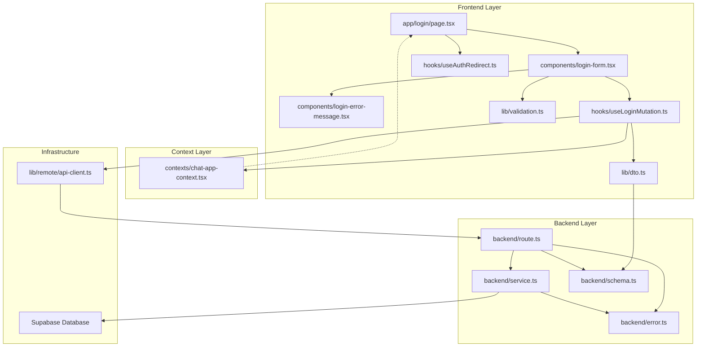
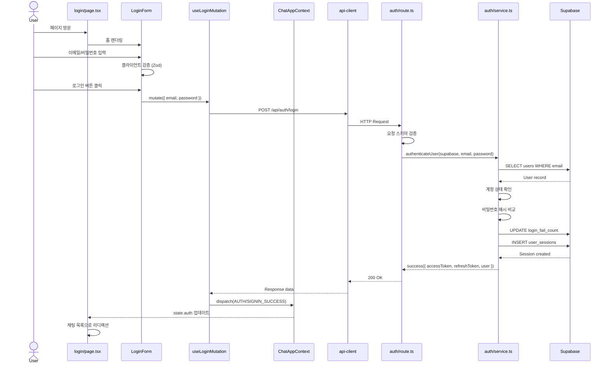
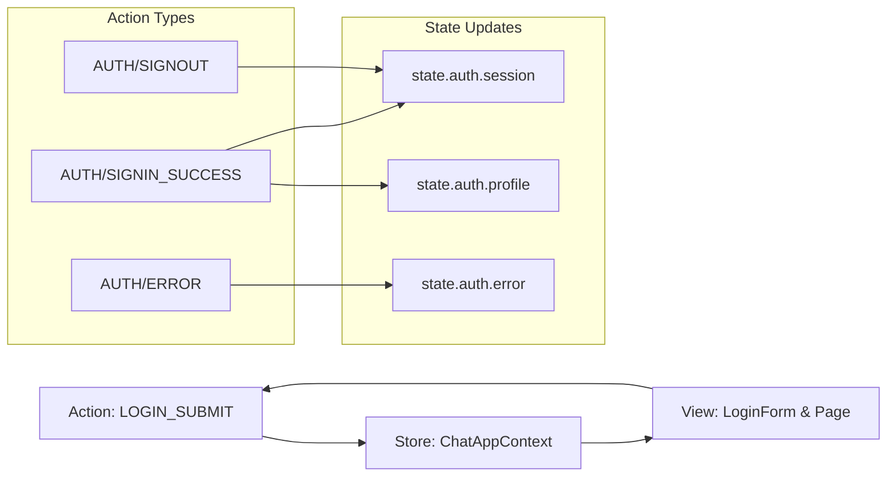

# 로그인 페이지 모듈화 설계 (Login Page Module Design)

## 개요 (Overview)

로그인 페이지(`/login`)는 이메일/비밀번호 인증을 통해 사용자가 서비스에 접근할 수 있도록 하는 페이지입니다. 이 문서는 UC002 로그인 유스케이스를 구현하기 위한 최소한의 모듈화 설계를 제공합니다.

### 핵심 기능
- 이메일/비밀번호 입력 폼 제공
- 클라이언트 측 입력 검증 (이메일 형식, 필수 필드)
- 로그인 API 호출 및 세션 관리
- 로그인 실패 처리 (5회 제한, 계정 상태 확인)
- MFA 지원 (선택적)
- 자동 로그인 (remember me)
- 에러 핸들링 및 사용자 피드백

### 설계 원칙
- Flux 아키텍처: Context를 통한 상태 중앙화
- Client Component 기반 구현 (`"use client"`)
- React Hook Form + Zod를 통한 폼 검증
- React Query를 통한 서버 상태 관리
- Backend: Hono 라우터 + Supabase 서비스 레이어
- 에러 코드 기반 세분화된 오류 처리

---

## 모듈 목록 (Module List)

### Backend Layer

| 모듈 경로 | 설명 |
|----------|------|
| `src/features/auth/backend/route.ts` | 로그인 API 라우트 정의 (`POST /api/auth/login`) |
| `src/features/auth/backend/service.ts` | 로그인 비즈니스 로직 및 Supabase 쿼리 |
| `src/features/auth/backend/schema.ts` | 로그인 요청/응답 Zod 스키마 정의 |
| `src/features/auth/backend/error.ts` | 로그인 관련 에러 코드 정의 |

### Frontend Layer

| 모듈 경로 | 설명 |
|----------|------|
| `src/app/login/page.tsx` | 로그인 페이지 컴포넌트 (Next.js App Router) |
| `src/features/auth/components/login-form.tsx` | 로그인 폼 UI 컴포넌트 |
| `src/features/auth/components/login-error-message.tsx` | 로그인 에러 메시지 표시 컴포넌트 |
| `src/features/auth/hooks/useLoginMutation.ts` | 로그인 요청 React Query mutation hook |
| `src/features/auth/hooks/useAuthRedirect.ts` | 인증 상태 기반 리디렉션 훅 |
| `src/features/auth/lib/dto.ts` | 프론트엔드에서 사용할 DTO 재노출 |
| `src/features/auth/lib/validation.ts` | 클라이언트 측 폼 검증 스키마 |

### Context Integration

| 모듈 경로 | 설명 |
|----------|------|
| `src/contexts/chat-app-context.tsx` (수정) | 로그인 성공 시 `AUTH/SIGNIN_SUCCESS` 액션 디스패치 |

---

## 다이어그램 (Diagrams)

### 모듈 관계도 (Module Relationship)



### 데이터 플로우 (Data Flow)



### Flux 아키텍처 흐름 (Flux Pattern)



---

## Implementation Plan

### 1. Backend Layer

#### 1.1. `src/features/auth/backend/error.ts`

**목적**: 로그인 관련 에러 코드 정의

**구현 내용**:
```typescript
export const authErrorCodes = {
  invalidCredentials: 'AUTH_INVALID_CREDENTIALS',
  accountInactive: 'AUTH_ACCOUNT_INACTIVE',
  accountSuspended: 'AUTH_ACCOUNT_SUSPENDED',
  accountWithdrawn: 'AUTH_ACCOUNT_WITHDRAWN',
  accountLocked: 'AUTH_ACCOUNT_LOCKED',
  mfaRequired: 'AUTH_MFA_REQUIRED',
  mfaFailed: 'AUTH_MFA_FAILED',
  validationError: 'AUTH_VALIDATION_ERROR',
  sessionCreationFailed: 'AUTH_SESSION_CREATION_FAILED',
  databaseError: 'AUTH_DATABASE_ERROR',
} as const;

type AuthErrorValue = (typeof authErrorCodes)[keyof typeof authErrorCodes];

export type AuthServiceError = AuthErrorValue;
```

**Unit Test**:
```typescript
describe('authErrorCodes', () => {
  it('should have unique error codes', () => {
    const values = Object.values(authErrorCodes);
    const uniqueValues = new Set(values);
    expect(uniqueValues.size).toBe(values.length);
  });

  it('should have AUTH_ prefix for all codes', () => {
    Object.values(authErrorCodes).forEach((code) => {
      expect(code).toMatch(/^AUTH_/);
    });
  });
});
```

---

#### 1.2. `src/features/auth/backend/schema.ts`

**목적**: 로그인 요청/응답 Zod 스키마 정의

**구현 내용**:
```typescript
import { z } from 'zod';

export const LoginRequestSchema = z.object({
  email: z
    .string()
    .email('유효한 이메일 형식이 아닙니다')
    .max(255, '이메일은 최대 255자입니다'),
  password: z
    .string()
    .min(8, '비밀번호는 최소 8자입니다')
    .max(128, '비밀번호는 최대 128자입니다'),
  rememberMe: z.boolean().optional().default(false),
});

export type LoginRequest = z.infer<typeof LoginRequestSchema>;

export const LoginResponseSchema = z.object({
  accessToken: z.string(),
  refreshToken: z.string(),
  user: z.object({
    id: z.string().uuid(),
    email: z.string().email(),
    nickname: z.string(),
    profileImageUrl: z.string().url(),
    accountStatus: z.enum(['active', 'inactive', 'suspended', 'withdrawn']),
  }),
  redirectTo: z.string().default('/chat'),
  mfaRequired: z.boolean().optional(),
});

export type LoginResponse = z.infer<typeof LoginResponseSchema>;

// 데이터베이스 Row 스키마
export const UserRowSchema = z.object({
  id: z.string().uuid(),
  email: z.string(),
  password_hash: z.string(),
  nickname: z.string(),
  profile_image_url: z.string().nullable(),
  account_status: z.enum(['active', 'inactive', 'suspended', 'withdrawn']),
  login_fail_count: z.number().int().min(0),
  mfa_required: z.boolean(),
  created_at: z.string(),
  updated_at: z.string(),
});

export type UserRow = z.infer<typeof UserRowSchema>;

export const UserSessionRowSchema = z.object({
  id: z.string().uuid(),
  user_id: z.string().uuid(),
  refresh_token: z.string(),
  expires_at: z.string(),
  created_at: z.string(),
});

export type UserSessionRow = z.infer<typeof UserSessionRowSchema>;
```

**Unit Test**:
```typescript
describe('LoginRequestSchema', () => {
  it('should validate correct login request', () => {
    const validRequest = {
      email: 'test@example.com',
      password: 'password123',
      rememberMe: true,
    };
    expect(() => LoginRequestSchema.parse(validRequest)).not.toThrow();
  });

  it('should reject invalid email format', () => {
    const invalidRequest = {
      email: 'invalid-email',
      password: 'password123',
    };
    expect(() => LoginRequestSchema.parse(invalidRequest)).toThrow();
  });

  it('should reject short password', () => {
    const invalidRequest = {
      email: 'test@example.com',
      password: '1234567', // 7자
    };
    expect(() => LoginRequestSchema.parse(invalidRequest)).toThrow();
  });

  it('should default rememberMe to false', () => {
    const request = {
      email: 'test@example.com',
      password: 'password123',
    };
    const parsed = LoginRequestSchema.parse(request);
    expect(parsed.rememberMe).toBe(false);
  });
});

describe('LoginResponseSchema', () => {
  it('should validate correct login response', () => {
    const validResponse = {
      accessToken: 'eyJhbGciOiJIUzI1NiIsInR5cCI6IkpXVCJ9...',
      refreshToken: 'refresh_token_value',
      user: {
        id: '123e4567-e89b-12d3-a456-426614174000',
        email: 'test@example.com',
        nickname: 'testuser',
        profileImageUrl: 'https://picsum.photos/200',
        accountStatus: 'active' as const,
      },
      redirectTo: '/chat',
    };
    expect(() => LoginResponseSchema.parse(validResponse)).not.toThrow();
  });

  it('should default redirectTo to /chat', () => {
    const response = {
      accessToken: 'token',
      refreshToken: 'refresh',
      user: {
        id: '123e4567-e89b-12d3-a456-426614174000',
        email: 'test@example.com',
        nickname: 'testuser',
        profileImageUrl: 'https://picsum.photos/200',
        accountStatus: 'active' as const,
      },
    };
    const parsed = LoginResponseSchema.parse(response);
    expect(parsed.redirectTo).toBe('/chat');
  });
});
```

---

#### 1.3. `src/features/auth/backend/service.ts`

**목적**: 로그인 비즈니스 로직 및 Supabase 쿼리

**구현 내용**:
```typescript
import type { SupabaseClient } from '@supabase/supabase-js';
import bcrypt from 'bcryptjs';
import jwt from 'jsonwebtoken';
import {
  failure,
  success,
  type HandlerResult,
} from '@/backend/http/response';
import {
  UserRowSchema,
  type LoginResponse,
  type UserRow,
} from './schema';
import { authErrorCodes, type AuthServiceError } from './error';

const USERS_TABLE = 'users';
const USER_SESSIONS_TABLE = 'user_sessions';
const MAX_LOGIN_ATTEMPTS = 5;
const ACCESS_TOKEN_EXPIRY = '1h';
const REFRESH_TOKEN_EXPIRY_DAYS = 7;

const generateAccessToken = (userId: string): string => {
  const secret = process.env.JWT_SECRET;
  if (!secret) {
    throw new Error('JWT_SECRET is not defined');
  }
  return jwt.sign({ userId, type: 'access' }, secret, {
    expiresIn: ACCESS_TOKEN_EXPIRY,
  });
};

const generateRefreshToken = (): string => {
  return `refresh_${Date.now()}_${Math.random().toString(36).substring(2)}`;
};

const fallbackAvatar = (id: string) =>
  `https://picsum.photos/seed/${encodeURIComponent(id)}/200/200`;

export const authenticateUser = async (
  client: SupabaseClient,
  email: string,
  password: string,
  rememberMe = false,
): Promise<HandlerResult<LoginResponse, AuthServiceError, unknown>> => {
  // 1. 이메일을 소문자로 정규화하여 사용자 조회
  const normalizedEmail = email.toLowerCase();

  const { data: userData, error: fetchError } = await client
    .from(USERS_TABLE)
    .select('*')
    .ilike('email', normalizedEmail)
    .maybeSingle<UserRow>();

  if (fetchError) {
    return failure(
      500,
      authErrorCodes.databaseError,
      'Failed to fetch user data',
      fetchError,
    );
  }

  // 2. 계정 미존재 (보안상 동일 메시지)
  if (!userData) {
    return failure(
      401,
      authErrorCodes.invalidCredentials,
      '이메일 또는 비밀번호가 일치하지 않습니다',
    );
  }

  // 3. Row 스키마 검증
  const userParse = UserRowSchema.safeParse(userData);
  if (!userParse.success) {
    return failure(
      500,
      authErrorCodes.validationError,
      'User data validation failed',
      userParse.error.format(),
    );
  }

  const user = userParse.data;

  // 4. 계정 상태 확인
  if (user.account_status === 'inactive') {
    return failure(
      403,
      authErrorCodes.accountInactive,
      '비활성 계정입니다. 계정을 활성화하세요',
    );
  }

  if (user.account_status === 'suspended') {
    return failure(
      403,
      authErrorCodes.accountSuspended,
      '계정이 일시 정지되었습니다. 고객센터에 문의하세요',
    );
  }

  if (user.account_status === 'withdrawn') {
    return failure(
      403,
      authErrorCodes.accountWithdrawn,
      '탈퇴한 계정입니다. 재가입이 필요합니다',
    );
  }

  // 5. 로그인 실패 횟수 확인
  if (user.login_fail_count >= MAX_LOGIN_ATTEMPTS) {
    // 계정 잠금 처리
    await client
      .from(USERS_TABLE)
      .update({ account_status: 'suspended' })
      .eq('id', user.id);

    return failure(
      403,
      authErrorCodes.accountLocked,
      '로그인 시도 횟수 초과로 계정이 일시 잠금되었습니다. 고객센터에 문의하거나 비밀번호 재설정을 진행하세요',
    );
  }

  // 6. 비밀번호 검증
  const isPasswordValid = await bcrypt.compare(password, user.password_hash);

  if (!isPasswordValid) {
    // 실패 카운트 증가
    const newFailCount = user.login_fail_count + 1;
    await client
      .from(USERS_TABLE)
      .update({ login_fail_count: newFailCount })
      .eq('id', user.id);

    const remainingAttempts = MAX_LOGIN_ATTEMPTS - newFailCount;
    const message =
      remainingAttempts > 0
        ? `이메일 또는 비밀번호가 일치하지 않습니다 (${remainingAttempts}회 남음)`
        : '이메일 또는 비밀번호가 일치하지 않습니다';

    return failure(401, authErrorCodes.invalidCredentials, message);
  }

  // 7. 로그인 성공 - 실패 카운트 초기화
  await client
    .from(USERS_TABLE)
    .update({ login_fail_count: 0 })
    .eq('id', user.id);

  // 8. MFA 필요 여부 확인
  if (user.mfa_required) {
    return success(
      {
        accessToken: '',
        refreshToken: '',
        user: {
          id: user.id,
          email: user.email,
          nickname: user.nickname,
          profileImageUrl: user.profile_image_url ?? fallbackAvatar(user.id),
          accountStatus: user.account_status,
        },
        redirectTo: '/auth/mfa',
        mfaRequired: true,
      } as LoginResponse,
      200,
    );
  }

  // 9. 토큰 생성
  const accessToken = generateAccessToken(user.id);
  const refreshToken = generateRefreshToken();

  // 10. 세션 생성
  const expiresAt = new Date();
  expiresAt.setDate(expiresAt.getDate() + REFRESH_TOKEN_EXPIRY_DAYS);

  const { error: sessionError } = await client
    .from(USER_SESSIONS_TABLE)
    .insert({
      user_id: user.id,
      refresh_token: refreshToken,
      expires_at: expiresAt.toISOString(),
    });

  if (sessionError) {
    return failure(
      500,
      authErrorCodes.sessionCreationFailed,
      'Failed to create session',
      sessionError,
    );
  }

  // 11. 응답 반환
  return success(
    {
      accessToken,
      refreshToken,
      user: {
        id: user.id,
        email: user.email,
        nickname: user.nickname,
        profileImageUrl: user.profile_image_url ?? fallbackAvatar(user.id),
        accountStatus: user.account_status,
      },
      redirectTo: '/chat',
      mfaRequired: false,
    } as LoginResponse,
    200,
  );
};
```

**Unit Test**:
```typescript
import { describe, it, expect, vi, beforeEach } from 'vitest';
import type { SupabaseClient } from '@supabase/supabase-js';
import bcrypt from 'bcryptjs';
import { authenticateUser } from './service';
import { authErrorCodes } from './error';

describe('authenticateUser', () => {
  let mockClient: Partial<SupabaseClient>;

  beforeEach(() => {
    vi.clearAllMocks();
    process.env.JWT_SECRET = 'test-secret';
  });

  it('should return error for non-existent user', async () => {
    mockClient = {
      from: vi.fn().mockReturnValue({
        select: vi.fn().mockReturnValue({
          ilike: vi.fn().mockReturnValue({
            maybeSingle: vi.fn().mockResolvedValue({ data: null, error: null }),
          }),
        }),
      }),
    } as any;

    const result = await authenticateUser(
      mockClient as SupabaseClient,
      'nonexistent@example.com',
      'password123',
    );

    expect(result.ok).toBe(false);
    if (!result.ok) {
      expect(result.error.code).toBe(authErrorCodes.invalidCredentials);
    }
  });

  it('should return error for suspended account', async () => {
    const mockUser = {
      id: '123e4567-e89b-12d3-a456-426614174000',
      email: 'test@example.com',
      password_hash: await bcrypt.hash('password123', 10),
      nickname: 'testuser',
      profile_image_url: null,
      account_status: 'suspended',
      login_fail_count: 0,
      mfa_required: false,
      created_at: new Date().toISOString(),
      updated_at: new Date().toISOString(),
    };

    mockClient = {
      from: vi.fn().mockReturnValue({
        select: vi.fn().mockReturnValue({
          ilike: vi.fn().mockReturnValue({
            maybeSingle: vi.fn().mockResolvedValue({ data: mockUser, error: null }),
          }),
        }),
      }),
    } as any;

    const result = await authenticateUser(
      mockClient as SupabaseClient,
      'test@example.com',
      'password123',
    );

    expect(result.ok).toBe(false);
    if (!result.ok) {
      expect(result.error.code).toBe(authErrorCodes.accountSuspended);
    }
  });

  it('should increment fail count on wrong password', async () => {
    const mockUser = {
      id: '123e4567-e89b-12d3-a456-426614174000',
      email: 'test@example.com',
      password_hash: await bcrypt.hash('correctpassword', 10),
      nickname: 'testuser',
      profile_image_url: null,
      account_status: 'active',
      login_fail_count: 2,
      mfa_required: false,
      created_at: new Date().toISOString(),
      updated_at: new Date().toISOString(),
    };

    const mockUpdate = vi.fn().mockReturnValue({
      eq: vi.fn().mockResolvedValue({ data: null, error: null }),
    });

    mockClient = {
      from: vi.fn((table) => {
        if (table === 'users') {
          return {
            select: vi.fn().mockReturnValue({
              ilike: vi.fn().mockReturnValue({
                maybeSingle: vi.fn().mockResolvedValue({ data: mockUser, error: null }),
              }),
            }),
            update: mockUpdate,
          };
        }
        return {};
      }),
    } as any;

    const result = await authenticateUser(
      mockClient as SupabaseClient,
      'test@example.com',
      'wrongpassword',
    );

    expect(result.ok).toBe(false);
    if (!result.ok) {
      expect(result.error.code).toBe(authErrorCodes.invalidCredentials);
      expect(result.error.message).toContain('2회 남음');
    }
    expect(mockUpdate).toHaveBeenCalledWith({ login_fail_count: 3 });
  });

  it('should return success with tokens for valid credentials', async () => {
    const mockUser = {
      id: '123e4567-e89b-12d3-a456-426614174000',
      email: 'test@example.com',
      password_hash: await bcrypt.hash('password123', 10),
      nickname: 'testuser',
      profile_image_url: 'https://picsum.photos/200',
      account_status: 'active',
      login_fail_count: 0,
      mfa_required: false,
      created_at: new Date().toISOString(),
      updated_at: new Date().toISOString(),
    };

    const mockUpdate = vi.fn().mockReturnValue({
      eq: vi.fn().mockResolvedValue({ data: null, error: null }),
    });

    const mockInsert = vi.fn().mockResolvedValue({ data: null, error: null });

    mockClient = {
      from: vi.fn((table) => {
        if (table === 'users') {
          return {
            select: vi.fn().mockReturnValue({
              ilike: vi.fn().mockReturnValue({
                maybeSingle: vi.fn().mockResolvedValue({ data: mockUser, error: null }),
              }),
            }),
            update: mockUpdate,
          };
        }
        if (table === 'user_sessions') {
          return {
            insert: mockInsert,
          };
        }
        return {};
      }),
    } as any;

    const result = await authenticateUser(
      mockClient as SupabaseClient,
      'test@example.com',
      'password123',
    );

    expect(result.ok).toBe(true);
    if (result.ok) {
      expect(result.data.accessToken).toBeTruthy();
      expect(result.data.refreshToken).toBeTruthy();
      expect(result.data.user.email).toBe('test@example.com');
      expect(result.data.redirectTo).toBe('/chat');
      expect(result.data.mfaRequired).toBe(false);
    }
    expect(mockUpdate).toHaveBeenCalledWith({ login_fail_count: 0 });
    expect(mockInsert).toHaveBeenCalled();
  });

  it('should handle MFA required scenario', async () => {
    const mockUser = {
      id: '123e4567-e89b-12d3-a456-426614174000',
      email: 'test@example.com',
      password_hash: await bcrypt.hash('password123', 10),
      nickname: 'testuser',
      profile_image_url: null,
      account_status: 'active',
      login_fail_count: 0,
      mfa_required: true,
      created_at: new Date().toISOString(),
      updated_at: new Date().toISOString(),
    };

    const mockUpdate = vi.fn().mockReturnValue({
      eq: vi.fn().mockResolvedValue({ data: null, error: null }),
    });

    mockClient = {
      from: vi.fn((table) => {
        if (table === 'users') {
          return {
            select: vi.fn().mockReturnValue({
              ilike: vi.fn().mockReturnValue({
                maybeSingle: vi.fn().mockResolvedValue({ data: mockUser, error: null }),
              }),
            }),
            update: mockUpdate,
          };
        }
        return {};
      }),
    } as any;

    const result = await authenticateUser(
      mockClient as SupabaseClient,
      'test@example.com',
      'password123',
    );

    expect(result.ok).toBe(true);
    if (result.ok) {
      expect(result.data.mfaRequired).toBe(true);
      expect(result.data.redirectTo).toBe('/auth/mfa');
    }
  });
});
```

---

#### 1.4. `src/features/auth/backend/route.ts`

**목적**: 로그인 API 라우트 정의

**구현 내용**:
```typescript
import type { Hono } from 'hono';
import {
  failure,
  respond,
  type ErrorResult,
} from '@/backend/http/response';
import {
  getLogger,
  getSupabase,
  type AppEnv,
} from '@/backend/hono/context';
import { LoginRequestSchema } from './schema';
import { authenticateUser } from './service';
import { authErrorCodes, type AuthServiceError } from './error';

export const registerAuthRoutes = (app: Hono<AppEnv>) => {
  app.post('/api/auth/login', async (c) => {
    const body = await c.req.json();
    const parsedBody = LoginRequestSchema.safeParse(body);

    if (!parsedBody.success) {
      return respond(
        c,
        failure(
          400,
          authErrorCodes.validationError,
          'Invalid login request',
          parsedBody.error.format(),
        ),
      );
    }

    const supabase = getSupabase(c);
    const logger = getLogger(c);

    const { email, password, rememberMe } = parsedBody.data;

    const result = await authenticateUser(supabase, email, password, rememberMe);

    if (!result.ok) {
      const errorResult = result as ErrorResult<AuthServiceError, unknown>;

      // 중요 에러는 로깅
      if (
        errorResult.error.code === authErrorCodes.databaseError ||
        errorResult.error.code === authErrorCodes.sessionCreationFailed
      ) {
        logger.error('Login failed', {
          code: errorResult.error.code,
          message: errorResult.error.message,
        });
      }

      // 감사 로그 (선택적)
      logger.info('Login attempt', {
        email,
        success: false,
        code: errorResult.error.code,
      });

      return respond(c, result);
    }

    // 성공 로그
    logger.info('Login successful', {
      email,
      userId: result.data.user.id,
    });

    return respond(c, result);
  });
};
```

**Integration Test** (선택적, E2E 테스트로 대체 가능):
```typescript
import { describe, it, expect, beforeAll, afterAll } from 'vitest';
import { testClient } from 'hono/testing';
import { createHonoApp } from '@/backend/hono/app';

describe('POST /api/auth/login', () => {
  let app: ReturnType<typeof createHonoApp>;
  let client: ReturnType<typeof testClient>;

  beforeAll(() => {
    app = createHonoApp();
    client = testClient(app);
  });

  it('should return 400 for invalid request body', async () => {
    const res = await client.auth.login.$post({
      json: {
        email: 'invalid-email',
        password: '123',
      },
    });

    expect(res.status).toBe(400);
    const body = await res.json();
    expect(body.error.code).toBe('AUTH_VALIDATION_ERROR');
  });

  it('should return 401 for invalid credentials', async () => {
    const res = await client.auth.login.$post({
      json: {
        email: 'nonexistent@example.com',
        password: 'wrongpassword',
      },
    });

    expect(res.status).toBe(401);
    const body = await res.json();
    expect(body.error.code).toBe('AUTH_INVALID_CREDENTIALS');
  });

  it('should return 200 and tokens for valid credentials', async () => {
    // 사전에 테스트 계정 생성 필요
    const res = await client.auth.login.$post({
      json: {
        email: 'test@example.com',
        password: 'password123',
        rememberMe: true,
      },
    });

    expect(res.status).toBe(200);
    const body = await res.json();
    expect(body.accessToken).toBeTruthy();
    expect(body.refreshToken).toBeTruthy();
    expect(body.user).toBeTruthy();
    expect(body.redirectTo).toBe('/chat');
  });
});
```

---

### 2. Frontend Layer

#### 2.1. `src/features/auth/lib/dto.ts`

**목적**: 프론트엔드에서 사용할 DTO 재노출

**구현 내용**:
```typescript
export {
  LoginRequestSchema,
  LoginResponseSchema,
  type LoginRequest,
  type LoginResponse,
} from '@/features/auth/backend/schema';
```

---

#### 2.2. `src/features/auth/lib/validation.ts`

**목적**: 클라이언트 측 폼 검증 스키마 (React Hook Form 통합)

**구현 내용**:
```typescript
import { z } from 'zod';

export const loginFormSchema = z.object({
  email: z
    .string()
    .min(1, '이메일을 입력해주세요')
    .email('이메일 형식이 올바르지 않습니다')
    .max(255, '이메일은 최대 255자입니다'),
  password: z
    .string()
    .min(1, '비밀번호를 입력해주세요')
    .min(8, '비밀번호는 최소 8자입니다')
    .max(128, '비밀번호는 최대 128자입니다'),
  rememberMe: z.boolean().optional(),
});

export type LoginFormValues = z.infer<typeof loginFormSchema>;
```

---

#### 2.3. `src/features/auth/hooks/useLoginMutation.ts`

**목적**: 로그인 요청 React Query mutation hook

**구현 내용**:
```typescript
'use client';

import { useMutation } from '@tanstack/react-query';
import { apiClient, extractApiErrorMessage } from '@/lib/remote/api-client';
import { LoginResponseSchema, type LoginRequest } from '../lib/dto';
import { useChatApp } from '@/contexts/chat-app-context';

const loginUser = async (request: LoginRequest) => {
  try {
    const { data } = await apiClient.post('/api/auth/login', request);
    return LoginResponseSchema.parse(data);
  } catch (error) {
    const message = extractApiErrorMessage(error, '로그인에 실패했습니다');
    throw new Error(message);
  }
};

export const useLoginMutation = () => {
  const { actions } = useChatApp();

  return useMutation({
    mutationFn: loginUser,
    onSuccess: (data) => {
      // Context에 인증 정보 저장
      actions.signInSuccess({
        session: {
          accessToken: data.accessToken,
          refreshToken: data.refreshToken,
          expiresAt: new Date(Date.now() + 3600 * 1000).toISOString(), // 1시간 후
          mfaRequired: data.mfaRequired ?? false,
        },
        profile: {
          id: data.user.id,
          nickname: data.user.nickname,
          profileImageUrl: data.user.profileImageUrl,
          accountStatus: data.user.accountStatus,
        },
      });

      // 로컬 스토리지에 리프레시 토큰 저장 (rememberMe 옵션 고려)
      if (typeof window !== 'undefined') {
        localStorage.setItem('refreshToken', data.refreshToken);
      }
    },
    onError: (error) => {
      console.error('Login failed:', error.message);
    },
  });
};
```

**Unit Test**:
```typescript
import { describe, it, expect, vi, beforeEach } from 'vitest';
import { renderHook, waitFor } from '@testing-library/react';
import { QueryClient, QueryClientProvider } from '@tanstack/react-query';
import { useLoginMutation } from './useLoginMutation';
import { apiClient } from '@/lib/remote/api-client';

vi.mock('@/lib/remote/api-client');
vi.mock('@/contexts/chat-app-context', () => ({
  useChatApp: () => ({
    actions: {
      signInSuccess: vi.fn(),
    },
  }),
}));

describe('useLoginMutation', () => {
  let queryClient: QueryClient;

  beforeEach(() => {
    queryClient = new QueryClient({
      defaultOptions: {
        queries: { retry: false },
        mutations: { retry: false },
      },
    });
    vi.clearAllMocks();
  });

  const wrapper = ({ children }: { children: React.ReactNode }) => (
    <QueryClientProvider client={queryClient}>{children}</QueryClientProvider>
  );

  it('should call loginUser and update context on success', async () => {
    const mockResponse = {
      accessToken: 'access_token',
      refreshToken: 'refresh_token',
      user: {
        id: '123e4567-e89b-12d3-a456-426614174000',
        email: 'test@example.com',
        nickname: 'testuser',
        profileImageUrl: 'https://picsum.photos/200',
        accountStatus: 'active',
      },
      redirectTo: '/chat',
    };

    vi.mocked(apiClient.post).mockResolvedValue({ data: mockResponse });

    const { result } = renderHook(() => useLoginMutation(), { wrapper });

    result.current.mutate({
      email: 'test@example.com',
      password: 'password123',
    });

    await waitFor(() => expect(result.current.isSuccess).toBe(true));
    expect(apiClient.post).toHaveBeenCalledWith('/api/auth/login', {
      email: 'test@example.com',
      password: 'password123',
    });
  });

  it('should handle error on login failure', async () => {
    vi.mocked(apiClient.post).mockRejectedValue(
      new Error('Invalid credentials')
    );

    const { result } = renderHook(() => useLoginMutation(), { wrapper });

    result.current.mutate({
      email: 'test@example.com',
      password: 'wrongpassword',
    });

    await waitFor(() => expect(result.current.isError).toBe(true));
    expect(result.current.error?.message).toContain('로그인에 실패했습니다');
  });
});
```

---

#### 2.4. `src/features/auth/hooks/useAuthRedirect.ts`

**목적**: 인증 상태 기반 리디렉션 훅

**구현 내용**:
```typescript
'use client';

import { useEffect } from 'react';
import { useRouter, useSearchParams } from 'next/navigation';
import { useChatApp } from '@/contexts/chat-app-context';

export const useAuthRedirect = () => {
  const router = useRouter();
  const searchParams = useSearchParams();
  const { state } = useChatApp();

  useEffect(() => {
    if (state.auth.session) {
      const redirectTo = searchParams.get('redirectedFrom') ?? '/chat';
      router.replace(redirectTo);
    }
  }, [state.auth.session, router, searchParams]);

  return {
    isAuthenticated: Boolean(state.auth.session),
  };
};
```

---

#### 2.5. `src/features/auth/components/login-error-message.tsx`

**목적**: 로그인 에러 메시지 표시 컴포넌트

**구현 내용**:
```typescript
'use client';

import { AlertCircle } from 'lucide-react';

type LoginErrorMessageProps = {
  message: string | null;
};

export const LoginErrorMessage = ({ message }: LoginErrorMessageProps) => {
  if (!message) return null;

  return (
    <div className="flex items-start gap-2 rounded-lg border border-rose-400/30 bg-rose-500/10 p-3 text-sm text-rose-300">
      <AlertCircle className="h-4 w-4 flex-shrink-0 mt-0.5" />
      <p>{message}</p>
    </div>
  );
};
```

**QA Sheet**:

| Test Case | Input | Expected Output | Pass/Fail |
|-----------|-------|-----------------|-----------|
| 에러 메시지가 없을 때 | `message: null` | 컴포넌트가 렌더링되지 않음 | ☐ |
| 에러 메시지가 있을 때 | `message: "로그인 실패"` | 빨간색 박스에 메시지 표시 | ☐ |
| 긴 에러 메시지 | `message: "이메일 또는 비밀번호가 일치하지 않습니다. 5회 남았습니다"` | 텍스트가 줄바꿈되어 표시 | ☐ |
| 아이콘 렌더링 | `message: "에러"` | AlertCircle 아이콘이 표시됨 | ☐ |

---

#### 2.6. `src/features/auth/components/login-form.tsx`

**목적**: 로그인 폼 UI 컴포넌트 (React Hook Form 통합)

**구현 내용**:
```typescript
'use client';

import { useForm } from 'react-hook-form';
import { zodResolver } from '@hookform/resolvers/zod';
import Link from 'next/link';
import { useRouter } from 'next/navigation';
import { Button } from '@/components/ui/button';
import { Input } from '@/components/ui/input';
import { Checkbox } from '@/components/ui/checkbox';
import { loginFormSchema, type LoginFormValues } from '../lib/validation';
import { useLoginMutation } from '../hooks/useLoginMutation';
import { LoginErrorMessage } from './login-error-message';

export const LoginForm = () => {
  const router = useRouter();
  const loginMutation = useLoginMutation();

  const {
    register,
    handleSubmit,
    formState: { errors, isSubmitting },
  } = useForm<LoginFormValues>({
    resolver: zodResolver(loginFormSchema),
    defaultValues: {
      email: '',
      password: '',
      rememberMe: false,
    },
  });

  const onSubmit = (values: LoginFormValues) => {
    loginMutation.mutate(values, {
      onSuccess: (data) => {
        if (data.mfaRequired) {
          router.push('/auth/mfa');
        } else {
          router.push(data.redirectTo);
        }
      },
    });
  };

  const errorMessage = loginMutation.error?.message ?? null;

  return (
    <form
      onSubmit={handleSubmit(onSubmit)}
      className="flex flex-col gap-4 rounded-xl border border-slate-800 bg-slate-950/60 p-6"
    >
      <div className="space-y-2">
        <label htmlFor="email" className="text-sm font-medium text-slate-200">
          이메일
        </label>
        <Input
          id="email"
          type="email"
          autoComplete="email"
          placeholder="example@email.com"
          className="bg-slate-900/70 text-slate-100"
          {...register('email')}
        />
        {errors.email && (
          <p className="text-xs text-rose-400">{errors.email.message}</p>
        )}
      </div>

      <div className="space-y-2">
        <label htmlFor="password" className="text-sm font-medium text-slate-200">
          비밀번호
        </label>
        <Input
          id="password"
          type="password"
          autoComplete="current-password"
          placeholder="••••••••"
          className="bg-slate-900/70 text-slate-100"
          {...register('password')}
        />
        {errors.password && (
          <p className="text-xs text-rose-400">{errors.password.message}</p>
        )}
      </div>

      <div className="flex items-center gap-2">
        <Checkbox id="rememberMe" {...register('rememberMe')} />
        <label htmlFor="rememberMe" className="text-sm text-slate-300">
          로그인 상태 유지
        </label>
      </div>

      <LoginErrorMessage message={errorMessage} />

      <Button
        type="submit"
        disabled={isSubmitting || loginMutation.isPending}
        className="w-full"
      >
        {isSubmitting || loginMutation.isPending ? '로그인 중...' : '로그인'}
      </Button>

      <div className="flex flex-col gap-2 text-xs text-slate-400">
        <Link href="/auth/forgot-password" className="hover:text-slate-200 underline">
          비밀번호를 잊으셨나요?
        </Link>
        <p>
          계정이 없으신가요?{' '}
          <Link href="/signup" className="text-slate-200 hover:underline">
            회원가입
          </Link>
        </p>
      </div>
    </form>
  );
};
```

**QA Sheet**:

| Test Case | Input | Expected Output | Pass/Fail |
|-----------|-------|-----------------|-----------|
| 빈 폼 제출 | 모든 필드 공백 | "이메일을 입력해주세요" 에러 표시 | ☐ |
| 잘못된 이메일 형식 | `email: "invalid"` | "이메일 형식이 올바르지 않습니다" 에러 표시 | ☐ |
| 짧은 비밀번호 | `password: "1234567"` | "비밀번호는 최소 8자입니다" 에러 표시 | ☐ |
| 유효한 입력 + 로그인 성공 | 올바른 이메일/비밀번호 | 로딩 표시 후 `/chat`으로 리디렉션 | ☐ |
| 유효한 입력 + 로그인 실패 | 잘못된 자격증명 | 에러 메시지 표시, 폼 재입력 가능 | ☐ |
| MFA 필수 계정 로그인 | MFA 설정된 계정 | `/auth/mfa`로 리디렉션 | ☐ |
| Remember Me 체크 | 체크박스 선택 후 로그인 | 로컬 스토리지에 리프레시 토큰 저장 | ☐ |
| 비밀번호 표시/숨김 토글 | 비밀번호 필드 클릭 | 비밀번호 텍스트 표시/숨김 전환 | ☐ |
| 회원가입 링크 클릭 | 링크 클릭 | `/signup`으로 이동 | ☐ |
| 비밀번호 찾기 링크 클릭 | 링크 클릭 | `/auth/forgot-password`로 이동 | ☐ |
| 로딩 중 버튼 비활성화 | 제출 중 | 버튼 비활성화 및 "로그인 중..." 텍스트 표시 | ☐ |
| 엔터 키 제출 | 입력 후 엔터 키 | 폼 제출 실행 | ☐ |

---

#### 2.7. `src/app/login/page.tsx`

**목적**: 로그인 페이지 컴포넌트 (Next.js App Router)

**구현 내용**:
```typescript
'use client';

import Image from 'next/image';
import { LoginForm } from '@/features/auth/components/login-form';
import { useAuthRedirect } from '@/features/auth/hooks/useAuthRedirect';

type LoginPageProps = {
  params: Promise<Record<string, never>>;
};

export default function LoginPage({ params }: LoginPageProps) {
  void params;
  const { isAuthenticated } = useAuthRedirect();

  // 이미 로그인된 경우 리디렉션 처리 (useAuthRedirect에서 처리)
  if (isAuthenticated) {
    return null;
  }

  return (
    <div className="mx-auto flex min-h-screen w-full max-w-5xl flex-col items-center justify-center gap-10 px-6 py-16">
      <header className="flex flex-col items-center gap-3 text-center">
        <h1 className="text-4xl font-bold text-slate-100">로그인</h1>
        <p className="text-slate-400">
          계정에 로그인하고 채팅을 시작하세요
        </p>
      </header>

      <div className="grid w-full gap-8 md:grid-cols-2">
        <LoginForm />

        <figure className="hidden md:block overflow-hidden rounded-xl border border-slate-800">
          <Image
            src="https://picsum.photos/seed/login/640/640"
            alt="로그인 이미지"
            width={640}
            height={640}
            className="h-full w-full object-cover"
            priority
          />
        </figure>
      </div>
    </div>
  );
}
```

**QA Sheet**:

| Test Case | Input | Expected Output | Pass/Fail |
|-----------|-------|-----------------|-----------|
| 비로그인 상태 접근 | 로그인하지 않은 사용자 | 로그인 폼과 이미지 표시 | ☐ |
| 로그인 상태 접근 | 이미 로그인한 사용자 | `/chat`으로 자동 리디렉션 | ☐ |
| 반응형 레이아웃 (모바일) | 화면 너비 < 768px | 이미지 숨김, 폼만 표시 | ☐ |
| 반응형 레이아웃 (데스크톱) | 화면 너비 >= 768px | 폼과 이미지가 나란히 표시 | ☐ |
| 헤더 텍스트 표시 | 페이지 로드 | "로그인" 제목과 설명 표시 | ☐ |
| 이미지 로딩 | 페이지 로드 | picsum.photos 이미지 정상 표시 | ☐ |

---

### 3. Context Integration

#### 3.1. `src/contexts/chat-app-context.tsx` (수정)

**목적**: 로그인 성공 시 `AUTH/SIGNIN_SUCCESS` 액션 처리

**구현 내용** (기존 파일에 추가):
```typescript
// ... 기존 코드 ...

// Action 타입에 이미 정의되어 있으므로 Reducer에서만 처리 확인
const chatAppReducer: React.Reducer<ChatAppState, ChatAppAction> = (state, action) => {
  switch (action.type) {
    case "AUTH/SIGNIN_SUCCESS": {
      return {
        ...state,
        auth: {
          session: action.payload.session,
          profile: action.payload.profile,
          error: null,
        },
      };
    }

    case "AUTH/ERROR": {
      return {
        ...state,
        auth: {
          ...state.auth,
          error: action.payload,
        },
      };
    }

    // ... 기타 케이스 ...

    default:
      return state;
  }
};

// ... 기존 코드 ...
```

**Unit Test**:
```typescript
describe('chatAppReducer - AUTH actions', () => {
  it('should handle AUTH/SIGNIN_SUCCESS', () => {
    const initialState = {
      auth: {
        session: null,
        profile: null,
        error: null,
      },
      // ... 기타 상태
    } as ChatAppState;

    const action: ChatAppAction = {
      type: 'AUTH/SIGNIN_SUCCESS',
      payload: {
        session: {
          accessToken: 'token',
          refreshToken: 'refresh',
          expiresAt: '2025-01-01T00:00:00Z',
          mfaRequired: false,
        },
        profile: {
          id: '123',
          nickname: 'testuser',
          profileImageUrl: 'https://picsum.photos/200',
          accountStatus: 'active',
        },
      },
    };

    const newState = chatAppReducer(initialState, action);

    expect(newState.auth.session).toEqual(action.payload.session);
    expect(newState.auth.profile).toEqual(action.payload.profile);
    expect(newState.auth.error).toBeNull();
  });

  it('should handle AUTH/ERROR', () => {
    const initialState = {
      auth: {
        session: null,
        profile: null,
        error: null,
      },
      // ... 기타 상태
    } as ChatAppState;

    const action: ChatAppAction = {
      type: 'AUTH/ERROR',
      payload: {
        code: 'AUTH_INVALID_CREDENTIALS',
        message: '이메일 또는 비밀번호가 일치하지 않습니다',
      },
    };

    const newState = chatAppReducer(initialState, action);

    expect(newState.auth.error).toEqual(action.payload);
  });
});
```

---

## 추가 고려사항

### 보안
1. **HTTPS 필수**: 모든 인증 요청은 HTTPS로만 허용
2. **Rate Limiting**: IP당 로그인 시도 제한 (분당 5회) - Hono 미들웨어로 구현
3. **CSRF 방어**: CSRF 토큰 검증 - Next.js 기본 제공
4. **SQL Injection 방어**: Supabase Prepared Statement 자동 사용
5. **브루트포스 공격 방어**: 로그인 실패 카운트 및 계정 잠금

### 성능
1. **이메일 조회 인덱스**: `users` 테이블의 `LOWER(email)` 인덱스 활용
2. **비밀번호 해싱**: bcrypt (cost factor 12)
3. **세션 조회 최적화**: `user_id` 인덱스

### 접근성
1. **키보드 네비게이션**: 모든 폼 요소 Tab 키로 접근 가능
2. **스크린 리더 지원**: `aria-label`, `aria-describedby` 속성 추가
3. **에러 메시지 명확성**: 구체적이고 실행 가능한 안내

### 향후 확장
1. **소셜 로그인**: OAuth 통합 (Google, GitHub 등)
2. **비밀번호 재설정**: 이메일 인증 기반 재설정 플로우
3. **MFA 구현**: TOTP 기반 2단계 인증
4. **감사 로그**: 모든 로그인 시도 기록 (IP, User-Agent 등)

---

## 구현 순서

1. **Backend Layer**
   1. `error.ts` 작성 및 테스트
   2. `schema.ts` 작성 및 테스트
   3. `service.ts` 작성 및 테스트
   4. `route.ts` 작성 및 통합 테스트

2. **Frontend Layer**
   1. `dto.ts` 작성
   2. `validation.ts` 작성
   3. `useLoginMutation.ts` 작성 및 테스트
   4. `useAuthRedirect.ts` 작성
   5. `login-error-message.tsx` 작성 및 QA
   6. `login-form.tsx` 작성 및 QA
   7. `login/page.tsx` 작성 및 QA

3. **Context Integration**
   1. `chat-app-context.tsx` 수정 및 테스트

4. **E2E 테스트**
   1. 정상 로그인 플로우
   2. 에러 케이스 (잘못된 자격증명, 계정 상태 등)
   3. MFA 플로우 (선택적)
   4. Remember Me 기능

---

## 완성 기준

### Backend
- [ ] 모든 에러 코드가 정의되고 테스트됨
- [ ] 모든 스키마가 정의되고 검증 테스트 통과
- [ ] 로그인 서비스 로직이 모든 엣지 케이스를 처리
- [ ] API 라우트가 요청/응답을 올바르게 처리
- [ ] 통합 테스트 또는 E2E 테스트 통과

### Frontend
- [ ] 폼 검증이 클라이언트 측에서 작동
- [ ] 로그인 mutation이 성공/실패 케이스를 처리
- [ ] 에러 메시지가 사용자 친화적으로 표시
- [ ] 인증 상태 기반 리디렉션이 작동
- [ ] 모든 컴포넌트 QA Sheet 통과

### Context
- [ ] 로그인 성공 시 Context 상태가 올바르게 업데이트
- [ ] 인증 상태가 전역적으로 공유됨

### E2E
- [ ] 실제 환경에서 로그인 플로우가 정상 작동
- [ ] 모든 엣지 케이스가 사용자 관점에서 검증됨
