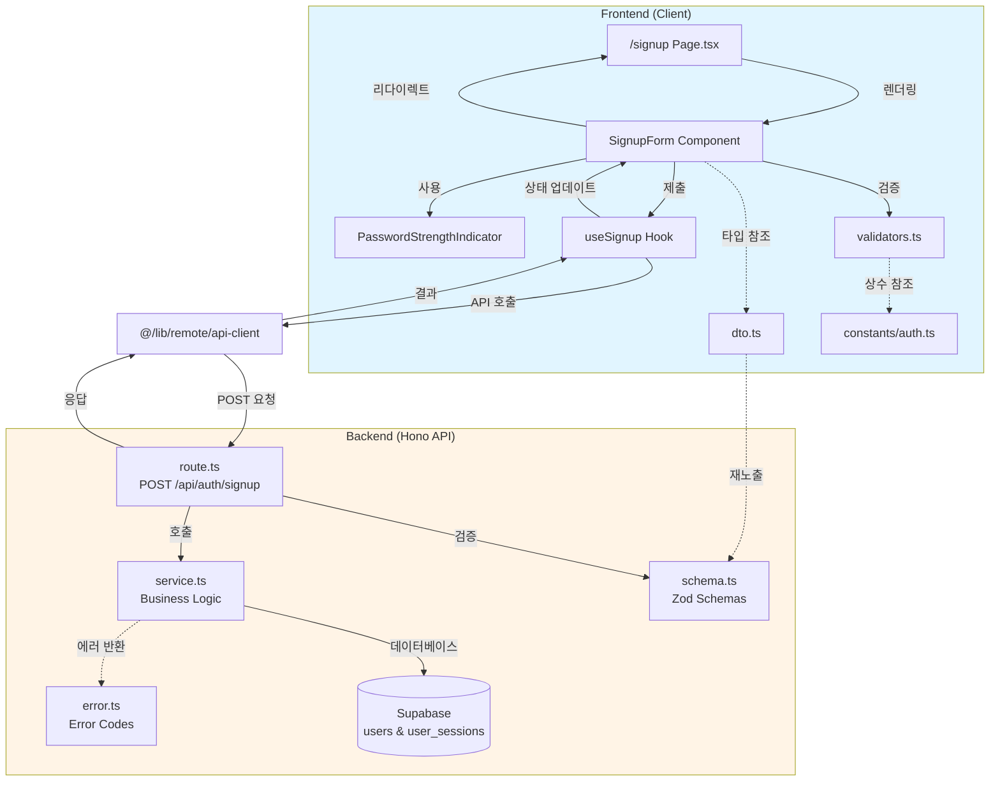
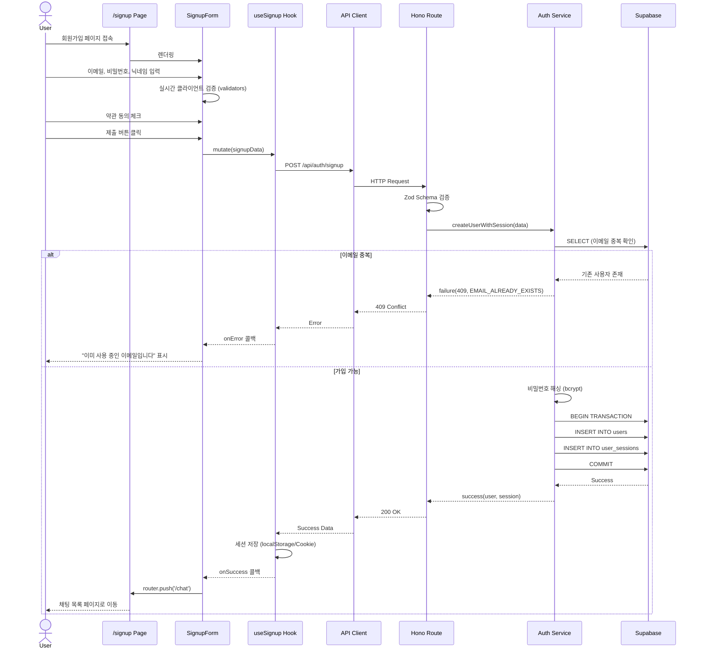

# 회원가입 페이지 모듈화 설계

## 개요

회원가입 페이지(/signup)를 위한 모듈 목록 및 구현 위치입니다.

### 1. Backend Modules (서버)

| 모듈명 | 위치 | 설명 |
|--------|------|------|
| `schema.ts` | `src/features/auth/backend/schema.ts` | 회원가입 요청/응답 Zod 스키마 정의 |
| `service.ts` | `src/features/auth/backend/service.ts` | 회원가입 비즈니스 로직 (이메일 중복 확인, 사용자 생성, 세션 발급) |
| `error.ts` | `src/features/auth/backend/error.ts` | 회원가입 관련 에러 코드 상수 정의 |
| `route.ts` | `src/features/auth/backend/route.ts` | Hono 라우터 정의 (`POST /api/auth/signup`) |

### 2. Frontend Modules (클라이언트)

| 모듈명 | 위치 | 설명 |
|--------|------|------|
| `dto.ts` | `src/features/auth/lib/dto.ts` | Backend 스키마 재노출 (클라이언트에서 타입 재사용) |
| `useSignup.ts` | `src/features/auth/hooks/useSignup.ts` | React Query 기반 회원가입 mutation 훅 |
| `validators.ts` | `src/features/auth/lib/validators.ts` | 클라이언트 측 실시간 검증 유틸리티 함수 |
| `signup-form.tsx` | `src/features/auth/components/signup-form.tsx` | 회원가입 폼 컴포넌트 (React Hook Form + Zod) |
| `password-strength-indicator.tsx` | `src/features/auth/components/password-strength-indicator.tsx` | 비밀번호 강도 인디케이터 컴포넌트 |
| `page.tsx` | `src/app/signup/page.tsx` | 회원가입 페이지 엔트리 포인트 |

### 3. Shared Utilities (공통)

| 모듈명 | 위치 | 설명 |
|--------|------|------|
| `auth.ts` | `src/constants/auth.ts` | 비밀번호 정책, 닉네임 규칙 등 공통 상수 |

---

## Diagram

### 모듈 간 관계



### 데이터 플로우



---

## Implementation Plan

### 1. Backend Modules

#### 1.1. `src/features/auth/backend/error.ts`

**목적**: 회원가입 관련 에러 코드 상수 정의

**구현**:
```typescript
export const signupErrorCodes = {
  emailAlreadyExists: 'EMAIL_ALREADY_EXISTS',
  invalidEmailFormat: 'INVALID_EMAIL_FORMAT',
  weakPassword: 'WEAK_PASSWORD',
  invalidNickname: 'INVALID_NICKNAME',
  termsNotAgreed: 'TERMS_NOT_AGREED',
  databaseError: 'SIGNUP_DATABASE_ERROR',
  sessionCreationFailed: 'SESSION_CREATION_FAILED',
  validationError: 'SIGNUP_VALIDATION_ERROR',
  accountWithdrawn: 'ACCOUNT_WITHDRAWN',
} as const;

type SignupErrorValue = (typeof signupErrorCodes)[keyof typeof signupErrorCodes];
export type SignupServiceError = SignupErrorValue;
```

**Unit Test**:
```typescript
describe('signupErrorCodes', () => {
  it('모든 에러 코드가 고유해야 한다', () => {
    const codes = Object.values(signupErrorCodes);
    const uniqueCodes = new Set(codes);
    expect(codes.length).toBe(uniqueCodes.size);
  });

  it('타입 체크: SignupServiceError는 에러 코드 중 하나여야 한다', () => {
    const validError: SignupServiceError = signupErrorCodes.emailAlreadyExists;
    expect(validError).toBe('EMAIL_ALREADY_EXISTS');
  });
});
```

---

#### 1.2. `src/features/auth/backend/schema.ts`

**목적**: 회원가입 요청/응답 Zod 스키마 정의

**구현**:
```typescript
import { z } from 'zod';

// 요청 스키마
export const SignupRequestSchema = z.object({
  email: z
    .string()
    .email({ message: '유효한 이메일 주소를 입력해주세요.' })
    .max(254, { message: '이메일은 최대 254자까지 입력 가능합니다.' })
    .transform((val) => val.toLowerCase()),
  password: z
    .string()
    .min(8, { message: '비밀번호는 최소 8자 이상이어야 합니다.' })
    .max(100, { message: '비밀번호는 최대 100자까지 입력 가능합니다.' })
    .regex(
      /^(?=.*[a-z])(?=.*[A-Z])(?=.*\d)|(?=.*[a-z])(?=.*[A-Z])(?=.*[!@#$%^&*])|(?=.*[a-z])(?=.*\d)(?=.*[!@#$%^&*])|(?=.*[A-Z])(?=.*\d)(?=.*[!@#$%^&*])/,
      { message: '영문 대소문자, 숫자, 특수문자 중 3가지 이상 조합이 필요합니다.' }
    ),
  passwordConfirm: z.string(),
  nickname: z
    .string()
    .min(2, { message: '닉네임은 최소 2자 이상이어야 합니다.' })
    .max(50, { message: '닉네임은 최대 50자까지 입력 가능합니다.' })
    .regex(/^[가-힣a-zA-Z0-9\s_-]+$/, {
      message: '닉네임은 한글, 영문, 숫자, 공백, -, _ 만 사용 가능합니다.',
    }),
  termsAgreed: z.boolean().refine((val) => val === true, {
    message: '서비스 이용약관에 동의해주세요.',
  }),
  privacyAgreed: z.boolean().refine((val) => val === true, {
    message: '개인정보 처리방침에 동의해주세요.',
  }),
  marketingAgreed: z.boolean().optional(),
}).refine((data) => data.password === data.passwordConfirm, {
  message: '비밀번호가 일치하지 않습니다.',
  path: ['passwordConfirm'],
});

export type SignupRequest = z.infer<typeof SignupRequestSchema>;

// 응답 스키마
export const SignupResponseSchema = z.object({
  user: z.object({
    id: z.string().uuid(),
    email: z.string(),
    nickname: z.string(),
    profileImageUrl: z.string(),
    accountStatus: z.enum(['active', 'inactive', 'suspended', 'withdrawn']),
    createdAt: z.string(),
  }),
  session: z.object({
    accessToken: z.string(),
    refreshToken: z.string(),
    expiresAt: z.string(),
  }),
});

export type SignupResponse = z.infer<typeof SignupResponseSchema>;

// DB Row Schema
export const UserRowSchema = z.object({
  id: z.string().uuid(),
  email: z.string(),
  password_hash: z.string(),
  nickname: z.string(),
  profile_image_url: z.string().nullable(),
  account_status: z.string(),
  login_fail_count: z.number(),
  terms_agreed_at: z.string().nullable(),
  mfa_required: z.boolean(),
  created_at: z.string(),
  updated_at: z.string(),
});

export type UserRow = z.infer<typeof UserRowSchema>;

export const SessionRowSchema = z.object({
  id: z.string().uuid(),
  user_id: z.string().uuid(),
  refresh_token: z.string(),
  expires_at: z.string(),
  created_at: z.string(),
  last_seen_at: z.string().nullable(),
  revoked_at: z.string().nullable(),
  updated_at: z.string(),
});

export type SessionRow = z.infer<typeof SessionRowSchema>;
```

**Unit Test**:
```typescript
describe('SignupRequestSchema', () => {
  const validRequest = {
    email: 'test@example.com',
    password: 'Test1234!',
    passwordConfirm: 'Test1234!',
    nickname: '테스트사용자',
    termsAgreed: true,
    privacyAgreed: true,
    marketingAgreed: false,
  };

  it('유효한 요청 데이터를 파싱해야 한다', () => {
    const result = SignupRequestSchema.safeParse(validRequest);
    expect(result.success).toBe(true);
    if (result.success) {
      expect(result.data.email).toBe('test@example.com');
    }
  });

  it('이메일을 소문자로 변환해야 한다', () => {
    const result = SignupRequestSchema.safeParse({
      ...validRequest,
      email: 'Test@Example.COM',
    });
    expect(result.success).toBe(true);
    if (result.success) {
      expect(result.data.email).toBe('test@example.com');
    }
  });

  it('잘못된 이메일 형식을 거부해야 한다', () => {
    const result = SignupRequestSchema.safeParse({
      ...validRequest,
      email: 'invalid-email',
    });
    expect(result.success).toBe(false);
  });

  it('8자 미만의 비밀번호를 거부해야 한다', () => {
    const result = SignupRequestSchema.safeParse({
      ...validRequest,
      password: 'Test1!',
      passwordConfirm: 'Test1!',
    });
    expect(result.success).toBe(false);
  });

  it('비밀번호 정책 위반을 거부해야 한다 (대소문자, 숫자, 특수문자 중 3가지 미만)', () => {
    const result = SignupRequestSchema.safeParse({
      ...validRequest,
      password: 'testtest',
      passwordConfirm: 'testtest',
    });
    expect(result.success).toBe(false);
  });

  it('비밀번호 불일치를 거부해야 한다', () => {
    const result = SignupRequestSchema.safeParse({
      ...validRequest,
      password: 'Test1234!',
      passwordConfirm: 'Different1234!',
    });
    expect(result.success).toBe(false);
  });

  it('닉네임이 2자 미만이면 거부해야 한다', () => {
    const result = SignupRequestSchema.safeParse({
      ...validRequest,
      nickname: '김',
    });
    expect(result.success).toBe(false);
  });

  it('약관 미동의 시 거부해야 한다', () => {
    const result = SignupRequestSchema.safeParse({
      ...validRequest,
      termsAgreed: false,
    });
    expect(result.success).toBe(false);
  });
});

describe('SignupResponseSchema', () => {
  it('유효한 응답을 파싱해야 한다', () => {
    const response = {
      user: {
        id: '123e4567-e89b-12d3-a456-426614174000',
        email: 'test@example.com',
        nickname: '테스트사용자',
        profileImageUrl: 'https://picsum.photos/seed/123/200/200',
        accountStatus: 'active' as const,
        createdAt: '2025-01-01T00:00:00Z',
      },
      session: {
        accessToken: 'access_token_here',
        refreshToken: 'refresh_token_here',
        expiresAt: '2025-02-01T00:00:00Z',
      },
    };
    const result = SignupResponseSchema.safeParse(response);
    expect(result.success).toBe(true);
  });
});
```

---

#### 1.3. `src/features/auth/backend/service.ts`

**목적**: 회원가입 비즈니스 로직 구현 (이메일 중복 확인, 사용자 생성, 세션 발급)

**구현**:
```typescript
import type { SupabaseClient } from '@supabase/supabase-js';
import bcrypt from 'bcrypt';
import { randomUUID } from 'crypto';
import {
  failure,
  success,
  type HandlerResult,
} from '@/backend/http/response';
import {
  signupErrorCodes,
  type SignupServiceError,
} from '@/features/auth/backend/error';
import type {
  SignupRequest,
  SignupResponse,
  UserRow,
  SessionRow,
} from '@/features/auth/backend/schema';

const USERS_TABLE = 'users';
const SESSIONS_TABLE = 'user_sessions';
const SALT_ROUNDS = 10;
const SESSION_EXPIRES_DAYS = 30;
const ACCESS_TOKEN_EXPIRES_HOURS = 1;

const fallbackProfileImage = (userId: string) =>
  `https://picsum.photos/seed/${encodeURIComponent(userId)}/200/200`;

const generateAccessToken = (userId: string): string => {
  // 실제로는 JWT 라이브러리 사용 (jsonwebtoken 등)
  // 여기서는 간단히 placeholder 반환
  return `access_${userId}_${Date.now()}`;
};

const generateRefreshToken = (): string => {
  return `refresh_${randomUUID()}`;
};

export const createUserWithSession = async (
  client: SupabaseClient,
  request: SignupRequest,
): Promise<HandlerResult<SignupResponse, SignupServiceError, unknown>> => {
  // 1. 이메일 중복 확인
  const { data: existingUser, error: checkError } = await client
    .from(USERS_TABLE)
    .select('id, account_status')
    .eq('email', request.email)
    .maybeSingle();

  if (checkError) {
    return failure(
      500,
      signupErrorCodes.databaseError,
      'Failed to check email availability.',
      checkError,
    );
  }

  if (existingUser) {
    // 탈퇴한 계정인 경우
    if (existingUser.account_status === 'withdrawn') {
      return failure(
        409,
        signupErrorCodes.accountWithdrawn,
        '탈퇴한 이메일입니다. 고객 지원에 문의해주세요.',
      );
    }

    // 이미 존재하는 계정
    return failure(
      409,
      signupErrorCodes.emailAlreadyExists,
      '이미 사용 중인 이메일입니다.',
    );
  }

  // 2. 비밀번호 이메일 중복 검증 (비밀번호와 이메일이 동일하면 안됨)
  if (request.password.toLowerCase() === request.email.toLowerCase()) {
    return failure(
      400,
      signupErrorCodes.weakPassword,
      '비밀번호는 이메일과 동일할 수 없습니다.',
    );
  }

  // 3. 비밀번호 해싱
  let passwordHash: string;
  try {
    passwordHash = await bcrypt.hash(request.password, SALT_ROUNDS);
  } catch (error) {
    return failure(
      500,
      signupErrorCodes.databaseError,
      'Password hashing failed.',
      error,
    );
  }

  const userId = randomUUID();
  const now = new Date().toISOString();

  // 4. 사용자 생성
  const { data: newUser, error: insertError } = await client
    .from(USERS_TABLE)
    .insert({
      id: userId,
      email: request.email,
      password_hash: passwordHash,
      nickname: request.nickname,
      profile_image_url: fallbackProfileImage(userId),
      account_status: 'active',
      login_fail_count: 0,
      terms_agreed_at: now,
      mfa_required: false,
      created_at: now,
      updated_at: now,
    })
    .select()
    .single<UserRow>();

  if (insertError || !newUser) {
    return failure(
      500,
      signupErrorCodes.databaseError,
      'Failed to create user.',
      insertError,
    );
  }

  // 5. 세션 생성
  const refreshToken = generateRefreshToken();
  const expiresAt = new Date();
  expiresAt.setDate(expiresAt.getDate() + SESSION_EXPIRES_DAYS);

  const { data: newSession, error: sessionError } = await client
    .from(SESSIONS_TABLE)
    .insert({
      id: randomUUID(),
      user_id: userId,
      refresh_token: refreshToken,
      expires_at: expiresAt.toISOString(),
      created_at: now,
      last_seen_at: now,
      updated_at: now,
    })
    .select()
    .single<SessionRow>();

  if (sessionError || !newSession) {
    // Rollback 필요: 사용자 레코드 삭제
    await client.from(USERS_TABLE).delete().eq('id', userId);

    return failure(
      500,
      signupErrorCodes.sessionCreationFailed,
      'Failed to create session.',
      sessionError,
    );
  }

  // 6. Access Token 생성
  const accessToken = generateAccessToken(userId);
  const accessExpiresAt = new Date();
  accessExpiresAt.setHours(accessExpiresAt.getHours() + ACCESS_TOKEN_EXPIRES_HOURS);

  // 7. 응답 데이터 구성
  const response: SignupResponse = {
    user: {
      id: newUser.id,
      email: newUser.email,
      nickname: newUser.nickname,
      profileImageUrl: newUser.profile_image_url ?? fallbackProfileImage(newUser.id),
      accountStatus: newUser.account_status as 'active',
      createdAt: newUser.created_at,
    },
    session: {
      accessToken,
      refreshToken: newSession.refresh_token,
      expiresAt: newSession.expires_at,
    },
  };

  return success(response);
};
```

**Unit Test**:
```typescript
import { createUserWithSession } from './service';
import { signupErrorCodes } from './error';
import type { SupabaseClient } from '@supabase/supabase-js';

// Mock Supabase Client
const mockSupabaseClient = () => {
  const mockFrom = jest.fn();
  const mockSelect = jest.fn();
  const mockEq = jest.fn();
  const mockMaybeSingle = jest.fn();
  const mockInsert = jest.fn();
  const mockSingle = jest.fn();
  const mockDelete = jest.fn();

  mockFrom.mockReturnValue({
    select: mockSelect,
    insert: mockInsert,
    delete: mockDelete,
  });

  mockSelect.mockReturnValue({
    eq: mockEq,
    single: mockSingle,
  });

  mockEq.mockReturnValue({
    maybeSingle: mockMaybeSingle,
  });

  mockInsert.mockReturnValue({
    select: mockSelect,
  });

  mockDelete.mockReturnValue({
    eq: mockEq,
  });

  const client = {
    from: mockFrom,
  } as unknown as SupabaseClient;

  return {
    client,
    mocks: {
      from: mockFrom,
      select: mockSelect,
      eq: mockEq,
      maybeSingle: mockMaybeSingle,
      insert: mockInsert,
      single: mockSingle,
      delete: mockDelete,
    },
  };
};

describe('createUserWithSession', () => {
  const validRequest = {
    email: 'test@example.com',
    password: 'Test1234!',
    passwordConfirm: 'Test1234!',
    nickname: '테스트사용자',
    termsAgreed: true,
    privacyAgreed: true,
  };

  it('신규 사용자 생성 및 세션 발급 성공', async () => {
    const { client, mocks } = mockSupabaseClient();

    // 이메일 중복 확인: 없음
    mocks.maybeSingle.mockResolvedValueOnce({ data: null, error: null });

    // 사용자 생성 성공
    mocks.single.mockResolvedValueOnce({
      data: {
        id: 'user-uuid',
        email: 'test@example.com',
        nickname: '테스트사용자',
        profile_image_url: 'https://picsum.photos/seed/user-uuid/200/200',
        account_status: 'active',
        created_at: '2025-01-01T00:00:00Z',
      },
      error: null,
    });

    // 세션 생성 성공
    mocks.single.mockResolvedValueOnce({
      data: {
        id: 'session-uuid',
        user_id: 'user-uuid',
        refresh_token: 'refresh_token',
        expires_at: '2025-02-01T00:00:00Z',
        created_at: '2025-01-01T00:00:00Z',
      },
      error: null,
    });

    const result = await createUserWithSession(client, validRequest);

    expect(result.ok).toBe(true);
    if (result.ok) {
      expect(result.data.user.email).toBe('test@example.com');
      expect(result.data.session.refreshToken).toBe('refresh_token');
    }
  });

  it('이메일 중복 시 실패', async () => {
    const { client, mocks } = mockSupabaseClient();

    // 이메일 중복 확인: 존재
    mocks.maybeSingle.mockResolvedValueOnce({
      data: { id: 'existing-user', account_status: 'active' },
      error: null,
    });

    const result = await createUserWithSession(client, validRequest);

    expect(result.ok).toBe(false);
    if (!result.ok) {
      expect(result.error.code).toBe(signupErrorCodes.emailAlreadyExists);
      expect(result.status).toBe(409);
    }
  });

  it('탈퇴한 계정으로 가입 시도 시 실패', async () => {
    const { client, mocks } = mockSupabaseClient();

    // 이메일 중복 확인: 탈퇴 계정 존재
    mocks.maybeSingle.mockResolvedValueOnce({
      data: { id: 'withdrawn-user', account_status: 'withdrawn' },
      error: null,
    });

    const result = await createUserWithSession(client, validRequest);

    expect(result.ok).toBe(false);
    if (!result.ok) {
      expect(result.error.code).toBe(signupErrorCodes.accountWithdrawn);
      expect(result.status).toBe(409);
    }
  });

  it('비밀번호와 이메일이 동일하면 실패', async () => {
    const { client, mocks } = mockSupabaseClient();

    mocks.maybeSingle.mockResolvedValueOnce({ data: null, error: null });

    const result = await createUserWithSession(client, {
      ...validRequest,
      email: 'test1234!',
      password: 'Test1234!',
    });

    expect(result.ok).toBe(false);
    if (!result.ok) {
      expect(result.error.code).toBe(signupErrorCodes.weakPassword);
    }
  });

  it('사용자 생성 실패 시 에러 반환', async () => {
    const { client, mocks } = mockSupabaseClient();

    mocks.maybeSingle.mockResolvedValueOnce({ data: null, error: null });
    mocks.single.mockResolvedValueOnce({
      data: null,
      error: { message: 'DB insert failed' },
    });

    const result = await createUserWithSession(client, validRequest);

    expect(result.ok).toBe(false);
    if (!result.ok) {
      expect(result.error.code).toBe(signupErrorCodes.databaseError);
    }
  });
});
```

---

#### 1.4. `src/features/auth/backend/route.ts`

**목적**: Hono 라우터 정의 (`POST /api/auth/signup`)

**구현**:
```typescript
import type { Hono } from 'hono';
import {
  failure,
  respond,
  type ErrorResult,
} from '@/backend/http/response';
import {
  getLogger,
  getSupabase,
  type AppEnv,
} from '@/backend/hono/context';
import { SignupRequestSchema } from '@/features/auth/backend/schema';
import { createUserWithSession } from './service';
import {
  signupErrorCodes,
  type SignupServiceError,
} from './error';

export const registerAuthRoutes = (app: Hono<AppEnv>) => {
  app.post('/api/auth/signup', async (c) => {
    const body = await c.req.json();
    const parsedRequest = SignupRequestSchema.safeParse(body);

    if (!parsedRequest.success) {
      return respond(
        c,
        failure(
          400,
          signupErrorCodes.validationError,
          'The provided signup data is invalid.',
          parsedRequest.error.format(),
        ),
      );
    }

    const supabase = getSupabase(c);
    const logger = getLogger(c);

    const result = await createUserWithSession(supabase, parsedRequest.data);

    if (!result.ok) {
      const errorResult = result as ErrorResult<SignupServiceError, unknown>;

      // 로깅 (민감 정보 제외)
      if (errorResult.error.code === signupErrorCodes.databaseError) {
        logger.error('Signup database error', errorResult.error.message);
      } else if (errorResult.error.code === signupErrorCodes.sessionCreationFailed) {
        logger.error('Session creation failed during signup', errorResult.error.message);
      }

      return respond(c, result);
    }

    logger.info('User signup successful', { userId: result.data.user.id });

    // redirectTo 필드 추가
    return c.json({
      success: true,
      data: result.data,
      redirectTo: '/chat',
    });
  });
};
```

**Integration Test**:
```typescript
import { createHonoApp } from '@/backend/hono/app';
import { signupErrorCodes } from './error';

describe('POST /api/auth/signup', () => {
  let app: ReturnType<typeof createHonoApp>;

  beforeAll(() => {
    app = createHonoApp();
  });

  it('유효한 요청으로 회원가입 성공', async () => {
    const response = await app.request('/api/auth/signup', {
      method: 'POST',
      headers: { 'Content-Type': 'application/json' },
      body: JSON.stringify({
        email: 'newuser@example.com',
        password: 'Test1234!',
        passwordConfirm: 'Test1234!',
        nickname: '신규사용자',
        termsAgreed: true,
        privacyAgreed: true,
      }),
    });

    expect(response.status).toBe(200);
    const json = await response.json();
    expect(json.success).toBe(true);
    expect(json.data.user.email).toBe('newuser@example.com');
    expect(json.redirectTo).toBe('/chat');
  });

  it('잘못된 요청 데이터로 400 에러', async () => {
    const response = await app.request('/api/auth/signup', {
      method: 'POST',
      headers: { 'Content-Type': 'application/json' },
      body: JSON.stringify({
        email: 'invalid-email',
        password: 'short',
        nickname: 'A',
        termsAgreed: false,
      }),
    });

    expect(response.status).toBe(400);
    const json = await response.json();
    expect(json.success).toBe(false);
    expect(json.error.code).toBe(signupErrorCodes.validationError);
  });

  it('이메일 중복으로 409 에러', async () => {
    // 첫 번째 회원가입
    await app.request('/api/auth/signup', {
      method: 'POST',
      headers: { 'Content-Type': 'application/json' },
      body: JSON.stringify({
        email: 'duplicate@example.com',
        password: 'Test1234!',
        passwordConfirm: 'Test1234!',
        nickname: '중복사용자',
        termsAgreed: true,
        privacyAgreed: true,
      }),
    });

    // 두 번째 중복 회원가입 시도
    const response = await app.request('/api/auth/signup', {
      method: 'POST',
      headers: { 'Content-Type': 'application/json' },
      body: JSON.stringify({
        email: 'duplicate@example.com',
        password: 'Different1234!',
        passwordConfirm: 'Different1234!',
        nickname: '다른사용자',
        termsAgreed: true,
        privacyAgreed: true,
      }),
    });

    expect(response.status).toBe(409);
    const json = await response.json();
    expect(json.error.code).toBe(signupErrorCodes.emailAlreadyExists);
  });
});
```

---

### 2. Frontend Modules

#### 2.1. `src/features/auth/lib/dto.ts`

**목적**: Backend 스키마 재노출 (클라이언트에서 타입 재사용)

**구현**:
```typescript
export {
  SignupRequestSchema,
  SignupResponseSchema,
  type SignupRequest,
  type SignupResponse,
} from '@/features/auth/backend/schema';
```

---

#### 2.2. `src/features/auth/lib/validators.ts`

**목적**: 클라이언트 측 실시간 검증 유틸리티 함수

**구현**:
```typescript
import { AUTH_CONSTANTS } from '@/constants/auth';

/**
 * 비밀번호 강도 계산
 * @returns 0 (약함), 1 (보통), 2 (강함)
 */
export const calculatePasswordStrength = (password: string): number => {
  if (!password || password.length < 8) {
    return 0;
  }

  let score = 0;

  // 영문 소문자
  if (/[a-z]/.test(password)) score++;
  // 영문 대문자
  if (/[A-Z]/.test(password)) score++;
  // 숫자
  if (/\d/.test(password)) score++;
  // 특수문자
  if (/[!@#$%^&*(),.?":{}|<>]/.test(password)) score++;

  // 3가지 이상 조합: 강함
  if (score >= 3 && password.length >= 12) return 2;
  // 3가지 조합이지만 짧음: 보통
  if (score >= 3) return 1;
  // 그 외: 약함
  return 0;
};

/**
 * 비밀번호 강도 레이블
 */
export const getPasswordStrengthLabel = (strength: number): string => {
  switch (strength) {
    case 0:
      return '약함';
    case 1:
      return '보통';
    case 2:
      return '강함';
    default:
      return '';
  }
};

/**
 * 비밀번호 강도 색상
 */
export const getPasswordStrengthColor = (strength: number): string => {
  switch (strength) {
    case 0:
      return 'text-red-500';
    case 1:
      return 'text-yellow-500';
    case 2:
      return 'text-green-500';
    default:
      return 'text-gray-400';
  }
};

/**
 * 닉네임 유효성 검사
 */
export const validateNickname = (nickname: string): boolean => {
  if (!nickname) return false;
  if (nickname.length < AUTH_CONSTANTS.NICKNAME_MIN_LENGTH) return false;
  if (nickname.length > AUTH_CONSTANTS.NICKNAME_MAX_LENGTH) return false;
  if (!AUTH_CONSTANTS.NICKNAME_REGEX.test(nickname)) return false;

  // 금지어 검사 (간단한 예시)
  const bannedWords = ['욕설', '비속어', 'admin'];
  return !bannedWords.some((word) => nickname.toLowerCase().includes(word));
};

/**
 * 이메일 형식 간단 검증 (브라우저 기본 검증 보완)
 */
export const validateEmailFormat = (email: string): boolean => {
  const emailRegex = /^[^\s@]+@[^\s@]+\.[^\s@]+$/;
  return emailRegex.test(email);
};
```

**Unit Test**:
```typescript
describe('validators', () => {
  describe('calculatePasswordStrength', () => {
    it('8자 미만은 약함(0)을 반환한다', () => {
      expect(calculatePasswordStrength('Test1!')).toBe(0);
    });

    it('3가지 조합이지만 12자 미만은 보통(1)을 반환한다', () => {
      expect(calculatePasswordStrength('Test1234!')).toBe(1);
    });

    it('3가지 이상 조합이고 12자 이상은 강함(2)을 반환한다', () => {
      expect(calculatePasswordStrength('Test1234!@#$')).toBe(2);
    });
  });

  describe('validateNickname', () => {
    it('유효한 닉네임을 통과시킨다', () => {
      expect(validateNickname('테스트사용자')).toBe(true);
      expect(validateNickname('User_123')).toBe(true);
    });

    it('2자 미만은 거부한다', () => {
      expect(validateNickname('김')).toBe(false);
    });

    it('특수문자 포함 시 거부한다', () => {
      expect(validateNickname('Test@User')).toBe(false);
    });

    it('금지어 포함 시 거부한다', () => {
      expect(validateNickname('admin_user')).toBe(false);
    });
  });

  describe('validateEmailFormat', () => {
    it('유효한 이메일을 통과시킨다', () => {
      expect(validateEmailFormat('test@example.com')).toBe(true);
    });

    it('잘못된 이메일을 거부한다', () => {
      expect(validateEmailFormat('invalid-email')).toBe(false);
      expect(validateEmailFormat('test@')).toBe(false);
    });
  });
});
```

---

#### 2.3. `src/features/auth/hooks/useSignup.ts`

**목적**: React Query 기반 회원가입 mutation 훅

**구현**:
```typescript
'use client';

import { useMutation } from '@tanstack/react-query';
import { useRouter } from 'next/navigation';
import { apiClient, extractApiErrorMessage } from '@/lib/remote/api-client';
import {
  SignupRequestSchema,
  SignupResponseSchema,
  type SignupRequest,
  type SignupResponse,
} from '@/features/auth/lib/dto';

const signup = async (request: SignupRequest): Promise<SignupResponse> => {
  try {
    const { data } = await apiClient.post('/api/auth/signup', request);
    return SignupResponseSchema.parse(data.data);
  } catch (error) {
    const message = extractApiErrorMessage(error, '회원가입에 실패했습니다.');
    throw new Error(message);
  }
};

type UseSignupOptions = {
  onSuccess?: (data: SignupResponse) => void;
  onError?: (error: Error) => void;
};

export const useSignup = (options?: UseSignupOptions) => {
  const router = useRouter();

  return useMutation({
    mutationFn: signup,
    onSuccess: (data) => {
      // 세션 저장 (localStorage 또는 쿠키)
      if (typeof window !== 'undefined') {
        localStorage.setItem('accessToken', data.session.accessToken);
        localStorage.setItem('refreshToken', data.session.refreshToken);
      }

      options?.onSuccess?.(data);

      // 채팅 목록 페이지로 리디렉션
      router.push('/chat');
    },
    onError: (error) => {
      options?.onError?.(error);
    },
  });
};
```

**Unit Test**:
```typescript
import { renderHook, waitFor } from '@testing-library/react';
import { QueryClient, QueryClientProvider } from '@tanstack/react-query';
import { useSignup } from './useSignup';
import { apiClient } from '@/lib/remote/api-client';

jest.mock('@/lib/remote/api-client');
jest.mock('next/navigation', () => ({
  useRouter: () => ({ push: jest.fn() }),
}));

const createWrapper = () => {
  const queryClient = new QueryClient({
    defaultOptions: { queries: { retry: false } },
  });
  return ({ children }: { children: React.ReactNode }) => (
    <QueryClientProvider client={queryClient}>{children}</QueryClientProvider>
  );
};

describe('useSignup', () => {
  it('성공 시 세션 저장 및 리디렉션', async () => {
    const mockResponse = {
      data: {
        data: {
          user: {
            id: 'user-uuid',
            email: 'test@example.com',
            nickname: '테스트',
            profileImageUrl: 'https://picsum.photos/200/200',
            accountStatus: 'active',
            createdAt: '2025-01-01T00:00:00Z',
          },
          session: {
            accessToken: 'access_token',
            refreshToken: 'refresh_token',
            expiresAt: '2025-02-01T00:00:00Z',
          },
        },
      },
    };

    (apiClient.post as jest.Mock).mockResolvedValue(mockResponse);

    const { result } = renderHook(() => useSignup(), { wrapper: createWrapper() });

    result.current.mutate({
      email: 'test@example.com',
      password: 'Test1234!',
      passwordConfirm: 'Test1234!',
      nickname: '테스트',
      termsAgreed: true,
      privacyAgreed: true,
    });

    await waitFor(() => expect(result.current.isSuccess).toBe(true));

    expect(localStorage.getItem('accessToken')).toBe('access_token');
    expect(localStorage.getItem('refreshToken')).toBe('refresh_token');
  });

  it('실패 시 에러 처리', async () => {
    const onError = jest.fn();
    (apiClient.post as jest.Mock).mockRejectedValue(new Error('이미 사용 중인 이메일입니다.'));

    const { result } = renderHook(() => useSignup({ onError }), { wrapper: createWrapper() });

    result.current.mutate({
      email: 'duplicate@example.com',
      password: 'Test1234!',
      passwordConfirm: 'Test1234!',
      nickname: '테스트',
      termsAgreed: true,
      privacyAgreed: true,
    });

    await waitFor(() => expect(result.current.isError).toBe(true));
    expect(onError).toHaveBeenCalled();
  });
});
```

---

#### 2.4. `src/features/auth/components/password-strength-indicator.tsx`

**목적**: 비밀번호 강도 인디케이터 컴포넌트

**구현**:
```typescript
'use client';

import { useMemo } from 'react';
import { cn } from '@/lib/utils';
import {
  calculatePasswordStrength,
  getPasswordStrengthLabel,
  getPasswordStrengthColor,
} from '@/features/auth/lib/validators';

type PasswordStrengthIndicatorProps = {
  password: string;
  className?: string;
};

export const PasswordStrengthIndicator = ({
  password,
  className,
}: PasswordStrengthIndicatorProps) => {
  const strength = useMemo(() => calculatePasswordStrength(password), [password]);
  const label = useMemo(() => getPasswordStrengthLabel(strength), [strength]);
  const color = useMemo(() => getPasswordStrengthColor(strength), [strength]);

  if (!password) {
    return null;
  }

  return (
    <div className={cn('mt-2', className)}>
      <div className="flex items-center gap-2">
        {/* Progress Bar */}
        <div className="flex-1 h-2 bg-gray-200 rounded-full overflow-hidden">
          <div
            className={cn(
              'h-full transition-all duration-300',
              strength === 0 && 'w-1/3 bg-red-500',
              strength === 1 && 'w-2/3 bg-yellow-500',
              strength === 2 && 'w-full bg-green-500',
            )}
          />
        </div>

        {/* Label */}
        <span className={cn('text-sm font-medium', color)}>{label}</span>
      </div>
    </div>
  );
};
```

**QA Sheet**:
```markdown
## PasswordStrengthIndicator QA

### 렌더링 조건
- [ ] password가 빈 문자열이면 아무것도 렌더링하지 않는다
- [ ] password가 입력되면 progress bar와 label을 표시한다

### 강도 계산
- [ ] 8자 미만: progress bar 1/3, 빨간색, "약함" 표시
- [ ] 8자 이상 + 3가지 조합 + 12자 미만: progress bar 2/3, 노란색, "보통" 표시
- [ ] 12자 이상 + 3가지 이상 조합: progress bar 전체, 초록색, "강함" 표시

### 접근성
- [ ] progress bar가 시각적으로 명확하게 구분된다
- [ ] label 텍스트가 읽기 쉽다
- [ ] 색상만으로 정보를 전달하지 않는다 (텍스트 레이블 함께 제공)

### 반응형
- [ ] 모바일 화면에서도 progress bar가 정상 표시된다
```

---

#### 2.5. `src/features/auth/components/signup-form.tsx`

**목적**: 회원가입 폼 컴포넌트 (React Hook Form + Zod)

**구현**:
```typescript
'use client';

import { useState } from 'react';
import { useForm } from 'react-hook-form';
import { zodResolver } from '@hookform/resolvers/zod';
import { Eye, EyeOff, Loader2 } from 'lucide-react';
import { Button } from '@/components/ui/button';
import { Input } from '@/components/ui/input';
import { Checkbox } from '@/components/ui/checkbox';
import {
  Form,
  FormControl,
  FormField,
  FormItem,
  FormLabel,
  FormMessage,
} from '@/components/ui/form';
import { useToast } from '@/hooks/use-toast';
import { SignupRequestSchema, type SignupRequest } from '@/features/auth/lib/dto';
import { useSignup } from '@/features/auth/hooks/useSignup';
import { PasswordStrengthIndicator } from './password-strength-indicator';

export const SignupForm = () => {
  const { toast } = useToast();
  const [showPassword, setShowPassword] = useState(false);
  const [showPasswordConfirm, setShowPasswordConfirm] = useState(false);

  const form = useForm<SignupRequest>({
    resolver: zodResolver(SignupRequestSchema),
    defaultValues: {
      email: '',
      password: '',
      passwordConfirm: '',
      nickname: '',
      termsAgreed: false,
      privacyAgreed: false,
      marketingAgreed: false,
    },
    mode: 'onBlur',
  });

  const { mutate: signup, isPending } = useSignup({
    onError: (error) => {
      toast({
        variant: 'destructive',
        title: '회원가입 실패',
        description: error.message,
      });
    },
  });

  const onSubmit = (data: SignupRequest) => {
    signup(data);
  };

  const passwordValue = form.watch('password');

  return (
    <Form {...form}>
      <form onSubmit={form.handleSubmit(onSubmit)} className="space-y-6">
        {/* 이메일 */}
        <FormField
          control={form.control}
          name="email"
          render={({ field }) => (
            <FormItem>
              <FormLabel>이메일</FormLabel>
              <FormControl>
                <Input
                  type="email"
                  placeholder="example@email.com"
                  disabled={isPending}
                  {...field}
                />
              </FormControl>
              <FormMessage />
            </FormItem>
          )}
        />

        {/* 비밀번호 */}
        <FormField
          control={form.control}
          name="password"
          render={({ field }) => (
            <FormItem>
              <FormLabel>비밀번호</FormLabel>
              <FormControl>
                <div className="relative">
                  <Input
                    type={showPassword ? 'text' : 'password'}
                    placeholder="영문 대소문자, 숫자, 특수문자 중 3가지 이상 조합 (8자 이상)"
                    disabled={isPending}
                    {...field}
                  />
                  <button
                    type="button"
                    onClick={() => setShowPassword((prev) => !prev)}
                    className="absolute right-3 top-1/2 -translate-y-1/2 text-gray-500 hover:text-gray-700"
                    aria-label={showPassword ? '비밀번호 숨기기' : '비밀번호 보기'}
                  >
                    {showPassword ? <EyeOff size={20} /> : <Eye size={20} />}
                  </button>
                </div>
              </FormControl>
              <PasswordStrengthIndicator password={passwordValue} />
              <FormMessage />
            </FormItem>
          )}
        />

        {/* 비밀번호 확인 */}
        <FormField
          control={form.control}
          name="passwordConfirm"
          render={({ field }) => (
            <FormItem>
              <FormLabel>비밀번호 확인</FormLabel>
              <FormControl>
                <div className="relative">
                  <Input
                    type={showPasswordConfirm ? 'text' : 'password'}
                    placeholder="비밀번호를 다시 입력해주세요"
                    disabled={isPending}
                    {...field}
                  />
                  <button
                    type="button"
                    onClick={() => setShowPasswordConfirm((prev) => !prev)}
                    className="absolute right-3 top-1/2 -translate-y-1/2 text-gray-500 hover:text-gray-700"
                    aria-label={showPasswordConfirm ? '비밀번호 숨기기' : '비밀번호 보기'}
                  >
                    {showPasswordConfirm ? <EyeOff size={20} /> : <Eye size={20} />}
                  </button>
                </div>
              </FormControl>
              <FormMessage />
            </FormItem>
          )}
        />

        {/* 닉네임 */}
        <FormField
          control={form.control}
          name="nickname"
          render={({ field }) => (
            <FormItem>
              <FormLabel>닉네임</FormLabel>
              <FormControl>
                <Input
                  type="text"
                  placeholder="2-50자 (한글, 영문, 숫자, 공백, -, _ 허용)"
                  disabled={isPending}
                  {...field}
                />
              </FormControl>
              <FormMessage />
            </FormItem>
          )}
        />

        {/* 약관 동의 */}
        <div className="space-y-3">
          <FormField
            control={form.control}
            name="termsAgreed"
            render={({ field }) => (
              <FormItem className="flex flex-row items-start space-x-3 space-y-0">
                <FormControl>
                  <Checkbox
                    checked={field.value}
                    onCheckedChange={field.onChange}
                    disabled={isPending}
                  />
                </FormControl>
                <div className="leading-none">
                  <FormLabel className="text-sm font-normal">
                    (필수) 서비스 이용약관에 동의합니다
                  </FormLabel>
                  <FormMessage />
                </div>
              </FormItem>
            )}
          />

          <FormField
            control={form.control}
            name="privacyAgreed"
            render={({ field }) => (
              <FormItem className="flex flex-row items-start space-x-3 space-y-0">
                <FormControl>
                  <Checkbox
                    checked={field.value}
                    onCheckedChange={field.onChange}
                    disabled={isPending}
                  />
                </FormControl>
                <div className="leading-none">
                  <FormLabel className="text-sm font-normal">
                    (필수) 개인정보 처리방침에 동의합니다
                  </FormLabel>
                  <FormMessage />
                </div>
              </FormItem>
            )}
          />

          <FormField
            control={form.control}
            name="marketingAgreed"
            render={({ field }) => (
              <FormItem className="flex flex-row items-start space-x-3 space-y-0">
                <FormControl>
                  <Checkbox
                    checked={field.value}
                    onCheckedChange={field.onChange}
                    disabled={isPending}
                  />
                </FormControl>
                <div className="leading-none">
                  <FormLabel className="text-sm font-normal">
                    (선택) 마케팅 정보 수신에 동의합니다
                  </FormLabel>
                </div>
              </FormItem>
            )}
          />
        </div>

        {/* 제출 버튼 */}
        <Button type="submit" className="w-full" disabled={isPending}>
          {isPending ? (
            <>
              <Loader2 className="mr-2 h-4 w-4 animate-spin" />
              가입 중...
            </>
          ) : (
            '회원가입'
          )}
        </Button>
      </form>
    </Form>
  );
};
```

**QA Sheet**:
```markdown
## SignupForm QA

### 렌더링
- [ ] 모든 필드가 정상 렌더링된다 (이메일, 비밀번호, 비밀번호 확인, 닉네임, 약관 체크박스 3개, 제출 버튼)
- [ ] 각 필드에 적절한 label이 표시된다

### 실시간 검증
- [ ] 이메일 필드에서 포커스 아웃 시 형식 검증이 수행된다
- [ ] 비밀번호 입력 중 강도 인디케이터가 실시간으로 업데이트된다
- [ ] 비밀번호 확인 필드에서 불일치 시 에러 메시지가 표시된다
- [ ] 닉네임 필드에서 2자 미만 또는 50자 초과 시 에러 메시지가 표시된다
- [ ] 필수 약관 미동의 시 제출 불가 및 에러 메시지 표시

### 비밀번호 표시/숨김
- [ ] 비밀번호 필드 우측 눈 아이콘 클릭 시 평문/마스킹 전환된다
- [ ] 비밀번호 확인 필드도 동일하게 전환 가능하다
- [ ] 아이콘 aria-label이 상태에 따라 변경된다

### 제출 동작
- [ ] 모든 검증 통과 시 제출 버튼이 활성화된다
- [ ] 제출 중에는 버튼이 비활성화되고 "가입 중..." 텍스트와 스피너가 표시된다
- [ ] 제출 중에는 모든 입력 필드가 비활성화된다

### 에러 처리
- [ ] 이메일 중복 시 toast 알림으로 에러 메시지가 표시된다
- [ ] 서버 에러 시 toast 알림으로 에러 메시지가 표시된다
- [ ] 네트워크 오류 시 적절한 에러 메시지가 표시된다

### 성공 처리
- [ ] 회원가입 성공 시 /chat 페이지로 리디렉션된다
- [ ] 세션 토큰이 로컬 스토리지에 저장된다

### 접근성
- [ ] Tab 키로 모든 필드를 순차적으로 이동 가능하다
- [ ] Enter 키로 제출 가능하다
- [ ] 에러 메시지가 스크린 리더에서 읽힌다 (aria-live)
- [ ] label과 input이 올바르게 연결되어 있다 (htmlFor/id)

### 모바일
- [ ] 이메일 필드에서 이메일 키보드가 표시된다 (type="email")
- [ ] 터치 영역이 최소 44x44px 이상이다
- [ ] 폰트 크기가 16px 이상이어서 자동 줌이 발생하지 않는다
```

---

#### 2.6. `src/app/signup/page.tsx`

**목적**: 회원가입 페이지 엔트리 포인트

**구현**:
```typescript
'use client';

import Link from 'next/link';
import { SignupForm } from '@/features/auth/components/signup-form';

export default function SignupPage() {
  return (
    <div className="min-h-screen flex items-center justify-center bg-gray-50 px-4">
      <div className="w-full max-w-md">
        {/* 헤더 */}
        <div className="text-center mb-8">
          <h1 className="text-3xl font-bold text-gray-900">회원가입</h1>
          <p className="mt-2 text-sm text-gray-600">
            새로운 계정을 만들어 채팅을 시작하세요
          </p>
        </div>

        {/* 회원가입 폼 */}
        <div className="bg-white rounded-lg shadow-md p-6">
          <SignupForm />
        </div>

        {/* 로그인 링크 */}
        <div className="mt-6 text-center text-sm text-gray-600">
          이미 계정이 있으신가요?{' '}
          <Link href="/login" className="text-blue-600 hover:underline font-medium">
            로그인
          </Link>
        </div>
      </div>
    </div>
  );
}
```

**QA Sheet**:
```markdown
## SignupPage QA

### 렌더링
- [ ] 페이지 제목 "회원가입"이 표시된다
- [ ] 설명 텍스트가 표시된다
- [ ] SignupForm이 중앙에 렌더링된다
- [ ] 로그인 페이지 링크가 하단에 표시된다

### 레이아웃
- [ ] 페이지가 세로 중앙 정렬된다
- [ ] 폼이 최대 너비 제한 (max-w-md)을 가진다
- [ ] 모바일에서도 좌우 padding이 적용된다

### 네비게이션
- [ ] "로그인" 링크 클릭 시 /login 페이지로 이동한다

### 반응형
- [ ] 모바일 화면에서도 레이아웃이 깨지지 않는다
- [ ] 태블릿/데스크톱에서도 중앙 정렬이 유지된다
```

---

### 3. Shared Utilities

#### 3.1. `src/constants/auth.ts` (수정)

**목적**: 비밀번호 정책, 닉네임 규칙 등 공통 상수

**구현**:
```typescript
export const AUTH_CONSTANTS = {
  // 비밀번호 정책
  PASSWORD_MIN_LENGTH: 8,
  PASSWORD_MAX_LENGTH: 100,
  PASSWORD_REGEX:
    /^(?=.*[a-z])(?=.*[A-Z])(?=.*\d)|(?=.*[a-z])(?=.*[A-Z])(?=.*[!@#$%^&*])|(?=.*[a-z])(?=.*\d)(?=.*[!@#$%^&*])|(?=.*[A-Z])(?=.*\d)(?=.*[!@#$%^&*])/,

  // 닉네임 정책
  NICKNAME_MIN_LENGTH: 2,
  NICKNAME_MAX_LENGTH: 50,
  NICKNAME_REGEX: /^[가-힣a-zA-Z0-9\s_-]+$/,

  // 이메일 정책
  EMAIL_MAX_LENGTH: 254,

  // 세션 정책
  SESSION_EXPIRES_DAYS: 30,
  ACCESS_TOKEN_EXPIRES_HOURS: 1,

  // bcrypt
  BCRYPT_SALT_ROUNDS: 10,
} as const;
```

**Unit Test**:
```typescript
describe('AUTH_CONSTANTS', () => {
  it('모든 상수가 정의되어 있다', () => {
    expect(AUTH_CONSTANTS.PASSWORD_MIN_LENGTH).toBeDefined();
    expect(AUTH_CONSTANTS.NICKNAME_MIN_LENGTH).toBeDefined();
    expect(AUTH_CONSTANTS.EMAIL_MAX_LENGTH).toBeDefined();
  });

  it('비밀번호 정책 정규식이 유효하다', () => {
    const validPassword = 'Test1234!';
    expect(AUTH_CONSTANTS.PASSWORD_REGEX.test(validPassword)).toBe(true);

    const invalidPassword = 'testtest';
    expect(AUTH_CONSTANTS.PASSWORD_REGEX.test(invalidPassword)).toBe(false);
  });

  it('닉네임 정규식이 유효하다', () => {
    expect(AUTH_CONSTANTS.NICKNAME_REGEX.test('테스트사용자')).toBe(true);
    expect(AUTH_CONSTANTS.NICKNAME_REGEX.test('User_123')).toBe(true);
    expect(AUTH_CONSTANTS.NICKNAME_REGEX.test('Test@User')).toBe(false);
  });
});
```

---

## 추가 고려사항

### 1. Hono App에 라우터 등록

`src/backend/hono/app.ts`에서 `registerAuthRoutes`를 등록해야 합니다.

```typescript
import { registerAuthRoutes } from '@/features/auth/backend/route';

export const createHonoApp = () => {
  // ... 기존 코드

  // 라우터 등록
  registerExampleRoutes(app);
  registerAuthRoutes(app); // 추가

  return app;
};
```

### 2. 데이터베이스 마이그레이션

`supabase/migrations/0002_create_auth_tables.sql` (이미 존재하는 경우 생략)

```sql
-- users 테이블은 이미 존재한다고 가정
-- user_sessions 테이블도 이미 존재한다고 가정
-- 필요 시 ALTER TABLE로 컬럼 추가
```

### 3. 환경 변수

`.env.local`에 다음 환경 변수가 필요합니다:

```bash
NEXT_PUBLIC_API_BASE_URL=http://localhost:3000
NEXT_PUBLIC_SUPABASE_URL=your_supabase_url
NEXT_PUBLIC_SUPABASE_ANON_KEY=your_supabase_anon_key
SUPABASE_SERVICE_ROLE_KEY=your_service_role_key
```

### 4. 보안 고려사항

- **HTTPS 필수**: 프로덕션 환경에서는 반드시 HTTPS를 사용하여 평문 비밀번호 전송을 보호합니다.
- **Rate Limiting**: Hono 미들웨어로 동일 IP에서 분당 5회 제한을 적용합니다.
- **CSRF 토큰**: 필요 시 CSRF 토큰 검증 로직을 추가합니다.
- **XSS 방지**: React는 기본적으로 XSS를 방지하지만, 사용자 입력을 HTML로 렌더링하지 않도록 주의합니다.

### 5. 성능 최적화

- **Debounce**: 이메일 중복 확인을 실시간으로 수행할 경우 debounce를 적용합니다.
- **Code Splitting**: 회원가입 페이지는 별도 청크로 분리하여 초기 로딩 성능을 개선합니다.
- **Lazy Loading**: 비밀번호 강도 인디케이터 등 무거운 컴포넌트는 필요 시에만 로드합니다.

### 6. 테스트 전략

- **단위 테스트**: validators, error codes, schema 등 순수 함수 위주로 작성
- **통합 테스트**: Hono 라우터, service 레이어 테스트
- **E2E 테스트**: Playwright 등으로 실제 사용자 흐름 검증

---

## 구현 순서 제안

1. **Backend 먼저 구현**: schema → error → service → route
2. **Frontend DTO 및 Hooks**: dto → validators → useSignup
3. **UI 컴포넌트**: password-strength-indicator → signup-form
4. **페이지 통합**: page.tsx
5. **테스트 작성**: Unit Test → Integration Test → QA Sheet 검증
6. **통합 및 배포**: Hono App 라우터 등록 → 환경 변수 설정 → 배포

---

## 체크리스트

### Backend
- [ ] `src/features/auth/backend/error.ts` 작성 완료
- [ ] `src/features/auth/backend/schema.ts` 작성 완료
- [ ] `src/features/auth/backend/service.ts` 작성 완료
- [ ] `src/features/auth/backend/route.ts` 작성 완료
- [ ] `src/backend/hono/app.ts`에 라우터 등록 완료
- [ ] Unit Test 작성 및 통과 확인

### Frontend
- [ ] `src/features/auth/lib/dto.ts` 작성 완료
- [ ] `src/features/auth/lib/validators.ts` 작성 완료
- [ ] `src/features/auth/hooks/useSignup.ts` 작성 완료
- [ ] `src/features/auth/components/password-strength-indicator.tsx` 작성 완료
- [ ] `src/features/auth/components/signup-form.tsx` 작성 완료
- [ ] `src/app/signup/page.tsx` 작성 완료
- [ ] QA Sheet 검증 완료

### Shared
- [ ] `src/constants/auth.ts` 업데이트 완료

### 배포
- [ ] 환경 변수 설정 완료
- [ ] Supabase 마이그레이션 적용 완료
- [ ] 프로덕션 배포 테스트 완료

---

**문서 버전**: v1.0
**작성일**: 2025-01-17
**최종 수정일**: 2025-01-17
