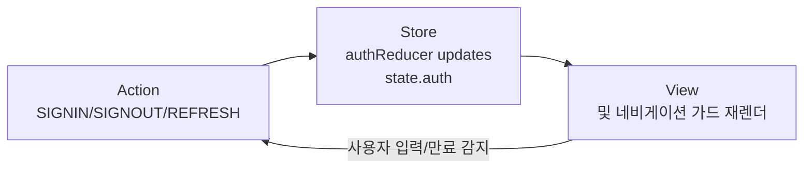
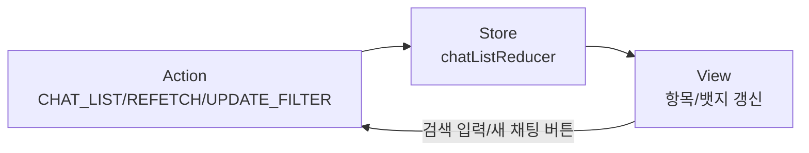
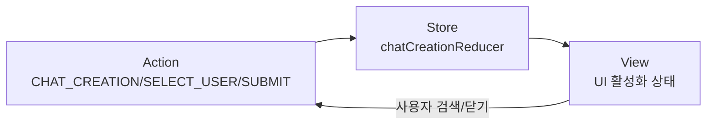
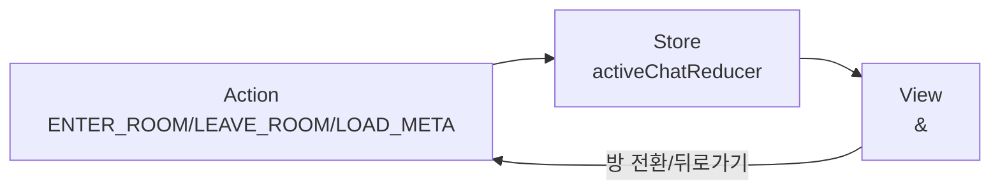
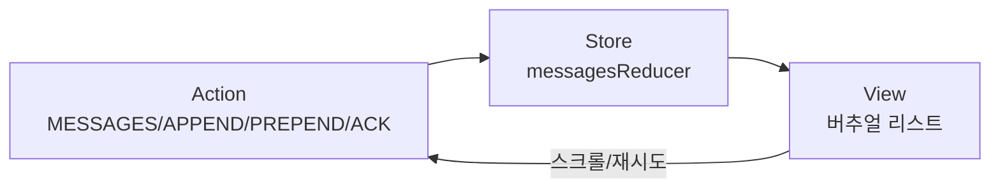
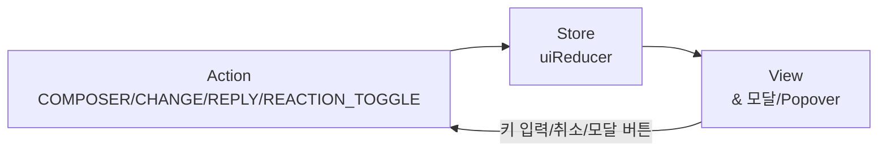

# 실시간 채팅 서비스 상태 관리 설계

## 요구사항 재정의
- 실시간 채팅 제품(회원가입, 로그인, 채팅 목록, 채팅방, 메시지 상호작용)에 필요한 클라이언트 상태를 Context + `useReducer` 패턴으로 통합 관리한다.
- 서버 상태는 `@tanstack/react-query`로 조달하되, UI 상호작용과 비동기 요청 제어는 로컬 스토어에서 관리하고 `@/lib/remote/api-client`를 통해 원격 호출을 수행한다.
- 상태 정의 시 Flux 흐름(Action → Store → View)을 명확히 하고, 하위 컴포넌트에 노출될 인터페이스와 데이터 흐름을 시각화한다.

## 관리 대상 상태 데이터
- **인증 영역**
  - `auth.session`: 인증 토큰, 세션 만료 시각, MFA 요구 여부.
  - `auth.profile`: 사용자 닉네임, 프로필 이미지, 계정 상태(`active/inactive/...`).
  - `auth.error`: 로그인/회원가입 실패 코드 및 메시지.
- **채팅 목록 영역**
  - `chatList.rooms`: 사용자가 속한 채팅방 배열(최근 메시지, 읽지 않은 개수, 마지막 동기화 시각 포함).
  - `chatList.filters`: 검색어, 정렬 기준, 필터(예: 읽지 않은 방만).
  - `chatList.syncStatus`: polling 주기, 마지막 성공/실패 시각, 로딩 플래그.
- **채팅 생성 영역**
  - `chatCreation.selectedUsers`: 신규 방에 초대된 사용자 ID 목록.
  - `chatCreation.groupName`: 그룹 채팅 이름.
  - `chatCreation.requestState`: `idle | submitting | success | error`, 에러 상세 포함.
- **활성 채팅방 영역**
  - `activeChat.roomId`: 현재 진입한 채팅방 ID.
  - `activeChat.roomMeta`: 방 이름, 참여자 목록, 읽지 않은 경계.
  - `activeChat.pagination`: 과거 메시지 페이지 커서, 로딩 상태, 더 불러올 수 있는지 여부.
  - `activeChat.syncStatus`: 주기적 polling 상태, 마지막 메시지 ID.
- **메시지 타임라인 영역**
  - `messages.byId`: 메시지 ID 기반 맵(본문, 타입, 삭제/답장/리액션 메타 포함).
  - `messages.order`: 시간 순 메시지 ID 배열.
  - `messages.pending`: 낙관적 전송 중 메시지 목록(멱등 키 포함).
  - `messages.replyTargets`: 답장 대상(원본 메시지 ID, 발신자 표시용 메타).
- **메시지 컴포저/반응 UI 영역**
  - `composer.draft`: 텍스트 입력값, 선택된 이모지, 첨부 대기 파일 메타.
  - `composer.replyTo`: 현재 인용 중인 메시지 ID.
  - `composer.validation`: 길이/금지어 검증 결과.
  - `ui.highlightedMessageId`: 답장·검색 결과 강조 메시지 ID.
  - `ui.reactionPicker`: 열림 여부, 기준 메시지 ID, anchoring 좌표.
  - `ui.modals`: 삭제 확인, 신고 등 모달 열림 상태 및 대상 메시지.

## 화면 데이터지만 상태가 아닌 항목
- `formatTime(created_at)`: 서버 시각을 로컬 포맷으로 변환한 문자열.
- 정렬된 채팅방 목록(기본 데이터 + `chatList.filters`로부터 계산되는 파생 결과).
- 메시지 버블의 정렬 방향(현재 사용자 ID와 메시지 발신자 비교로 즉시 계산).
- 읽지 않은 뱃지 숫자 합계(각 방의 `unreadCount` 합산).
- 썸네일 이미지의 `picsum.photos` URL(사용자 ID 시드로 매번 동일하게 생성 가능).
- 입력창 플레이스홀더 텍스트(상태 값이 아닌 상수 또는 조건부 렌더링).

## 상태 변경 조건 및 UI 영향
| 상태 키 | 변경 조건 | 화면 반응 |
| --- | --- | --- |
| `auth.session` | 로그인/로그아웃, 토큰 갱신 성공, 세션 만료 감지 | 전역 보호 라우트 재계산, 게이트드 컴포넌트 마운트/언마운트 |
| `chatList.rooms` | 채팅 목록 fetch 성공, polling 업데이트, 방 생성/삭제 이벤트 | 리스트 항목 재렌더링, 읽음/미리보기 갱신, 뱃지 업데이트 |
| `chatCreation.selectedUsers` | 사용자 선택/제거, 방 생성 완료 후 초기화 | 선택 칩 UI 변경, 생성 버튼 활성/비활성 토글 |
| `activeChat.pagination` | 과거 메시지 무한 스크롤 요청, 요청 실패/성공 | 로딩 스피너 표출, 더 보기 버튼 상태 변경, 스크롤 유지 |
| `messages.pending` | 메시지 전송 요청 시작/성공/실패, 재전송 | 낙관적 버블 표시, 실패 시 경고 배지, 성공 시 pending 제거 |
| `composer.replyTo` | 답장 액션 클릭, 취소 액션, 대상 메시지 삭제 | 입력창 상단 reply bar 표시/숨김, 관련 메시지 하이라이트 업데이트 |
| `ui.reactionPicker` | 메시지 길게 누르기/아이콘 클릭, 외부 영역 클릭 | 리액션 팝오버 위치 조정, 키보드 포커스 이동 |

## Flux 패턴 흐름 (Mermaid)
### 인증 상태


### 채팅 목록 상태


### 채팅 생성 상태


### 활성 채팅방 상태


### 메시지 타임라인 상태


### 컴포저 및 UI 오버레이 상태


## Context + useReducer 설계
### State & Action 인터페이스
```typescript:src/contexts/chat-app-context.tsx
"use client";

export type AuthState = {
  session: {
    accessToken: string;
    refreshToken: string;
    expiresAt: string;
    mfaRequired: boolean;
  } | null;
  profile: {
    id: string;
    nickname: string;
    profileImageUrl: string;
    accountStatus: "active" | "inactive" | "suspended" | "withdrawn";
  } | null;
  error: { code: string; message: string } | null;
};

export type ChatRoomSummary = {
  id: string;
  name: string;
  roomType: "direct" | "group";
  lastMessageId: string | null;
  lastMessagePreview: string | null;
  unreadCount: number;
  lastSyncedAt: string;
};

export type ChatAppState = {
  auth: AuthState;
  chatList: {
    rooms: Record<string, ChatRoomSummary>;
    roomOrder: string[];
    filters: { search: string; showUnreadOnly: boolean; sortBy: "recent" | "alphabetical" };
    syncStatus: { loading: boolean; lastSuccessAt: string | null; lastError: string | null };
  };
  chatCreation: {
    selectedUsers: string[];
    groupName: string;
    requestState: { status: "idle" | "submitting" | "success" | "error"; errorMessage?: string };
  };
  activeChat: {
    roomId: string | null;
    roomMeta: ChatRoomSummary | null;
    pagination: { cursor: string | null; isFetching: boolean; hasMore: boolean };
    syncStatus: { polling: boolean; lastMessageId: string | null; lastPolledAt: string | null };
  };
  messages: {
    byId: Record<string, MessageModel>;
    order: string[];
    pending: PendingMessageModel[];
    replyTargets: Record<string, ReplyTargetModel>;
  };
  ui: {
    composer: {
      draft: string;
      replyTo: string | null;
      validation: { isValid: boolean; message?: string };
      attachments: AttachmentDraftModel[];
    };
    highlightedMessageId: string | null;
    reactionPicker: { isOpen: boolean; anchorMessageId: string | null; anchorRect?: DOMRectLike };
    modals: { deleteConfirm: string | null; report: string | null };
  };
};

export type ChatAppAction =
  | { type: "AUTH/SIGNIN_SUCCESS"; payload: { session: AuthState["session"]; profile: AuthState["profile"] } }
  | { type: "AUTH/SIGNOUT" }
  | { type: "AUTH/ERROR"; payload: { code: string; message: string } }
  | { type: "CHAT_LIST/UPSERT_ROOMS"; payload: ChatRoomSummary[] }
  | { type: "CHAT_LIST/SET_FILTER"; payload: Partial<ChatAppState["chatList"]["filters"]> }
  | { type: "CHAT_CREATION/TOGGLE_USER"; payload: { userId: string } }
  | { type: "CHAT_CREATION/SET_GROUP_NAME"; payload: { groupName: string } }
  | { type: "CHAT_CREATION/SET_STATUS"; payload: ChatAppState["chatCreation"]["requestState"] }
  | { type: "ACTIVE_CHAT/ENTER"; payload: { roomId: string; meta: ChatRoomSummary } }
  | { type: "ACTIVE_CHAT/EXIT" }
  | { type: "ACTIVE_CHAT/SET_PAGINATION"; payload: Partial<ChatAppState["activeChat"]["pagination"]> }
  | { type: "MESSAGES/APPEND"; payload: MessageModel[] }
  | { type: "MESSAGES/PREPEND"; payload: MessageModel[] }
  | { type: "MESSAGES/ACK_PENDING"; payload: { clientId: string; serverId: string } }
  | { type: "MESSAGES/MARK_FAILED"; payload: { clientId: string; errorMessage: string } }
  | { type: "UI/SET_COMPOSER_DRAFT"; payload: { draft: string } }
  | { type: "UI/SET_REPLY_TO"; payload: { messageId: string | null } }
  | { type: "UI/TOGGLE_REACTION_PICKER"; payload: { messageId: string | null; anchorRect?: DOMRectLike } }
  | { type: "UI/SET_MODAL"; payload: Partial<ChatAppState["ui"]["modals"]> };
```

### Reducer 스케치
```typescript
const chatAppReducer: React.Reducer<ChatAppState, ChatAppAction> = (state, action) => {
  switch (action.type) {
    case "AUTH/SIGNIN_SUCCESS": {
      return {
        ...state,
        auth: { session: action.payload.session, profile: action.payload.profile, error: null },
      };
    }
    case "AUTH/SIGNOUT":
      return {
        ...state,
        auth: { session: null, profile: null, error: null },
        chatList: { ...initialState.chatList },
        activeChat: { ...initialState.activeChat },
        messages: { ...initialState.messages },
      };
    case "CHAT_LIST/UPSERT_ROOMS": {
      const nextRooms = { ...state.chatList.rooms };
      const nextOrder = new Set(state.chatList.roomOrder);
      action.payload.forEach((room) => {
        nextRooms[room.id] = room;
        nextOrder.add(room.id);
      });
      return {
        ...state,
        chatList: {
          ...state.chatList,
          rooms: nextRooms,
          roomOrder: Array.from(nextOrder).sort((a, b) => {
            const left = nextRooms[a]?.lastSyncedAt ?? "";
            const right = nextRooms[b]?.lastSyncedAt ?? "";
            return right.localeCompare(left);
          }),
        },
      };
    }
    // ... 나머지 액션 처리 (낙관적 전송, 모달 토글 등)
    default:
      return state;
  }
};
```

### Provider 구조 및 데이터 플로우
```typescript
export const ChatAppContext = React.createContext<ChatAppContextValue | undefined>(undefined);

export const ChatAppProvider = ({ children }: { children: React.ReactNode }) => {
  const [state, dispatch] = React.useReducer(chatAppReducer, initialState);
  const queryClient = useQueryClient();

  const fetchChatRooms = React.useCallback(async () => {
    const response = await apiClient.GET("/chat/rooms");
    dispatch({ type: "CHAT_LIST/UPSERT_ROOMS", payload: response.rooms });
  }, []);

  useQuery({ queryKey: ["chatRooms"], queryFn: fetchChatRooms, refetchInterval: POLL_INTERVAL });

  const actions = React.useMemo(
    () => ({
      signInSuccess: (payload: ExtractPayload<"AUTH/SIGNIN_SUCCESS">) =>
        dispatch({ type: "AUTH/SIGNIN_SUCCESS", payload }),
      signOut: () => dispatch({ type: "AUTH/SIGNOUT" }),
      selectRoom: (room: ChatRoomSummary) => dispatch({ type: "ACTIVE_CHAT/ENTER", payload: { roomId: room.id, meta: room } }),
      setComposerDraft: (draft: string) => dispatch({ type: "UI/SET_COMPOSER_DRAFT", payload: { draft } }),
      toggleReply: (messageId: string | null) => dispatch({ type: "UI/SET_REPLY_TO", payload: { messageId } }),
      toggleReactionPicker: (messageId: string | null, anchorRect?: DOMRectLike) =>
        dispatch({ type: "UI/TOGGLE_REACTION_PICKER", payload: { messageId, anchorRect } }),
      // 기타 composite action 정의
    }),
    []
  );

  const value = React.useMemo<ChatAppContextValue>(() => ({ state, dispatch, actions }), [state, actions]);

  return <ChatAppContext.Provider value={value}>{children}</ChatAppContext.Provider>;
};
```

### Context 데이터 로딩 흐름 시각화
```mermaid
flowchart TD
    UI[Child Component] -->|useChatApp()| CTX[ChatAppContext]
    CTX -->|dispatch(Action)| RED[chatAppReducer]
    RED -->|state 변경| CTX
    CTX -->|state 전달| UI
    CTX -->|React Query 구독| RQ[@tanstack/react-query]
    RQ -->|apiClient 요청| API[@/lib/remote/api-client]
    API -->|HTTP| BE[Hono /api routes]
    BE --> DB[(Supabase)]
    DB --> BE --> API --> RQ --> CTX
```

### 하위 컴포넌트 노출 항목
- `state.auth`: 보호 라우트, 헤더 프로필, 계정 상태 경고 표시.
- `state.chatList.roomOrder` + `state.chatList.rooms`: 리스트 렌더링, 검색 필터 반영.
- `state.activeChat`: 현재 방 헤더, 참여자 정보, unread 경계 표시.
- `state.messages`: 타임라인 컴포넌트, 낙관적 메시지 버블, 실패 메시지 재전송 UI.
- `state.ui.composer`: 입력창 값, reply bar, 첨부 미리보기.
- `state.ui.reactionPicker` / `state.ui.modals`: 팝오버, 모달 컨트롤.
- `actions.signInSuccess`, `actions.signOut`, `actions.selectRoom`, `actions.setComposerDraft`, `actions.toggleReply`, `actions.toggleReactionPicker`.
- `dispatch`: 세밀한 액션 디스패치(예: 메시지 ACK, pagination 상태 업데이트).
- `queryClient`: 필요한 경우 하위에서 캐시 무효화/리패치 수행(Provider에서 메모이제이션하여 전달).

### 검증 및 추후 고려 사항
- 세션 만료 자동 갱신을 위해 `auth.session.expiresAt` 기준으로 사전 갱신 Action을 예약한다.
- 채팅방/메시지 대용량을 위해 가상 스크롤과 ID 기반 정규화를 유지하고, `messages.order`는 최대 보존 개수 초과 시 슬라이딩 윈도우 전략을 검토한다.
- 오류 상태(`auth.error`, `chatCreation.requestState.errorMessage`, `messages.pending`)는 사용자 알림 시스템과 연동하여 일관된 피드백을 제공한다.
- 테스트: reducer 단위 테스트, Context hook 통합 테스트, React Query mocking을 통한 API 상호작용 검증.
