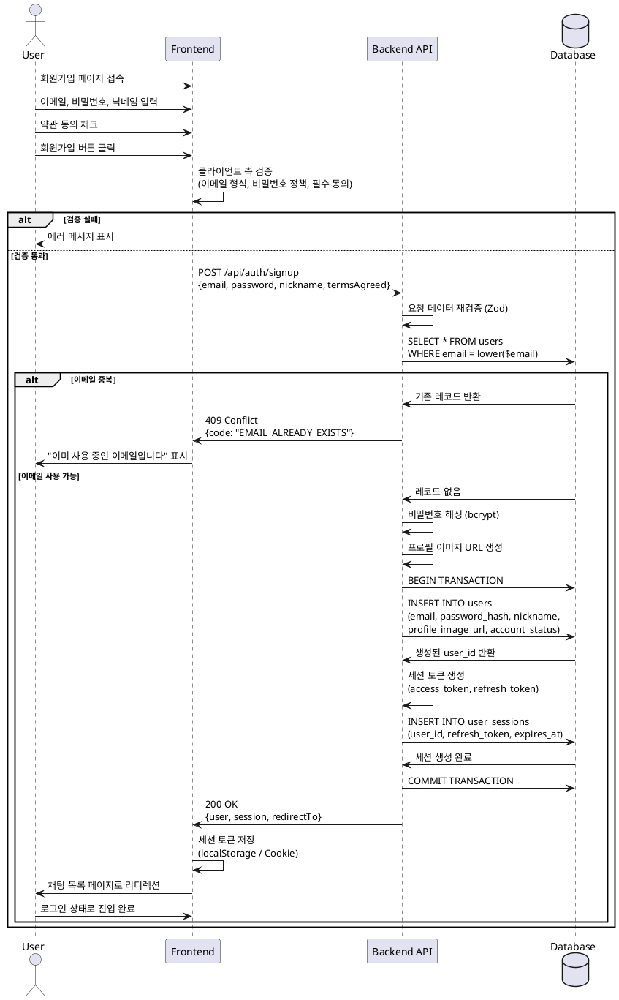

# 회원가입 (Sign Up) 유스케이스

## 기능 개요
사용자가 이메일, 비밀번호, 닉네임을 입력하여 새로운 계정을 생성하고 서비스에 접근할 수 있는 기능입니다. 회원가입 완료 시 자동으로 세션이 발급되어 로그인 상태로 초기 화면에 진입합니다.

## Primary Actor
- 신규 사용자 (미가입 상태의 방문자)

## Precondition
- 사용자가 회원가입 페이지에 접근할 수 있어야 함
- 사용자가 유효한 이메일 주소를 보유하고 있어야 함
- 브라우저가 JavaScript를 지원하고 네트워크 연결이 활성화되어 있어야 함

## Trigger
- 사용자가 회원가입 페이지에서 회원가입 양식을 작성하고 제출 버튼을 클릭함

## Main Scenario

### 단계별 흐름

1. **사용자**: 회원가입 페이지에서 이메일, 비밀번호, 비밀번호 확인, 닉네임을 입력함
2. **사용자**: 서비스 약관 및 필수 동의 항목을 체크함
3. **사용자**: 회원가입 제출 버튼을 클릭함
4. **FE**: 입력값 클라이언트 측 검증 수행
   - 이메일 형식 검증 (RFC 5322 기준)
   - 비밀번호 정책 검증 (최소 8자, 영문/숫자/특수문자 조합)
   - 비밀번호 확인 일치 여부 검증
   - 닉네임 길이 검증 (2-50자)
   - 필수 동의 항목 체크 여부 확인
5. **FE**: 검증 통과 시 `/api/auth/signup` 엔드포인트로 POST 요청 전송
6. **BE**: 요청 데이터 재검증 (Zod 스키마)
7. **BE**: 이메일 중복 여부 확인 (`users` 테이블 조회)
8. **BE**: 계정 상태 확인 (기존 탈퇴/비활성 계정 체크)
9. **BE**: 비밀번호 해싱 처리 (bcrypt 또는 argon2)
10. **BE**: 트랜잭션 시작
11. **Database**: `users` 테이블에 신규 사용자 레코드 생성
    - `email`: 입력된 이메일 (소문자 변환)
    - `password_hash`: 해싱된 비밀번호
    - `nickname`: 입력된 닉네임
    - `profile_image_url`: 기본 프로필 이미지 URL (picsum.photos)
    - `account_status`: `active`
    - `terms_agreed_at`: 현재 시각
    - `login_fail_count`: 0
    - `mfa_required`: false
12. **Database**: `user_sessions` 테이블에 초기 세션 레코드 생성
    - `user_id`: 생성된 사용자 ID
    - `refresh_token`: 생성된 리프레시 토큰
    - `expires_at`: 토큰 만료 시각 (기본 30일)
13. **BE**: 트랜잭션 커밋
14. **BE**: 성공 응답 반환 (사용자 정보 + 세션 토큰)
15. **FE**: 세션 토큰을 로컬 스토리지/쿠키에 저장
16. **FE**: 채팅 목록 페이지로 리디렉션
17. **사용자**: 로그인 상태로 초기 화면 진입 완료

## Edge Cases

### 1. 이메일 중복
- **시나리오**: 이미 가입된 이메일로 회원가입 시도
- **처리**:
  - BE에서 409 Conflict 응답 반환
  - FE에서 이메일 입력 필드에 "이미 사용 중인 이메일입니다" 에러 메시지 표시
  - 로그인 페이지로 이동하는 링크 제공

### 2. 클라이언트 측 검증 실패
- **시나리오**: 입력값이 정책을 만족하지 못함
- **처리**:
  - 해당 필드 하단에 실시간 에러 메시지 표시
  - 제출 버튼 비활성화
  - 사용자 입력값 유지하여 수정 유도

### 3. 비밀번호 정책 위반
- **시나리오**: 비밀번호가 최소 요구사항을 충족하지 않음
- **처리**:
  - FE 단계에서 실시간 피드백 제공 (강도 인디케이터)
  - BE에서 재검증 실패 시 400 Bad Request 응답
  - 구체적인 정책 위반 사항을 안내

### 4. 네트워크 타임아웃
- **시나리오**: 요청 중 네트워크 연결 끊김 또는 서버 응답 지연
- **처리**:
  - 로딩 상태 표시 (최대 30초)
  - 타임아웃 시 "네트워크 오류가 발생했습니다. 다시 시도해주세요" 메시지
  - 재시도 버튼 제공
  - 입력값 보존

### 5. 중복 요청 방지
- **시나리오**: 사용자가 제출 버튼을 여러 번 클릭
- **처리**:
  - FE에서 제출 버튼을 요청 처리 중 비활성화
  - 멱등 키(idempotency key) 사용하여 서버에서 중복 요청 차단
  - 동일 요청은 최초 응답 재사용

### 6. 탈퇴한 계정 재가입
- **시나리오**: 이전에 탈퇴한 이메일로 재가입 시도
- **처리**:
  - BE에서 `account_status`가 `withdrawn`인 계정 확인
  - 409 Conflict 응답과 함께 계정 복구 절차 안내
  - 고객 지원 연락처 제공

### 7. 서버 내부 오류
- **시나리오**: 데이터베이스 연결 실패, 트랜잭션 롤백 등
- **처리**:
  - 500 Internal Server Error 응답
  - FE에서 일반적인 오류 메시지 표시
  - 재시도 안내 및 지원 연락 경로 제공
  - BE에서 상세 에러 로깅 (사용자 식별 정보 제외)

### 8. 필수 동의 미체크
- **시나리오**: 사용자가 약관 동의를 하지 않고 제출 시도
- **처리**:
  - FE에서 동의 체크박스에 에러 상태 표시
  - "필수 약관에 동의해주세요" 메시지 노출
  - 제출 버튼 비활성화

## Business Rules

### 1. 이메일 규칙
- RFC 5322 표준 형식을 따라야 함
- 대소문자 구분 없이 저장 (모두 소문자로 변환)
- 최대 254자 제한
- 고유해야 함 (중복 불가)

### 2. 비밀번호 정책
- 최소 8자 이상
- 영문 대문자, 소문자, 숫자, 특수문자 중 3가지 이상 조합
- 최대 100자 제한
- 이메일과 동일한 문자열 사용 불가
- bcrypt 또는 argon2로 해싱 후 저장
- 평문 비밀번호는 저장하지 않음

### 3. 닉네임 규칙
- 최소 2자, 최대 50자
- 한글, 영문, 숫자, 공백 허용
- 특수문자 제한 (일부 허용: -, _)
- 중복 허용 (고유하지 않아도 됨)
- 욕설 및 부적절한 단어 필터링

### 4. 계정 상태 정책
- 회원가입 시 기본 상태: `active`
- 이메일 인증 없이 즉시 사용 가능
- 탈퇴 계정(`withdrawn`)은 동일 이메일로 재가입 불가

### 5. 세션 정책
- 회원가입 성공 시 자동으로 세션 발급
- 리프레시 토큰 유효기간: 30일
- 액세스 토큰 유효기간: 1시간
- 동시 로그인 제한 없음 (다중 디바이스 허용)

### 6. 약관 동의 정책
- 서비스 이용약관: 필수
- 개인정보 처리방침: 필수
- 마케팅 정보 수신: 선택
- 동의 시각을 `terms_agreed_at`에 기록

### 7. 프로필 이미지 정책
- 회원가입 시 기본 프로필 이미지 자동 할당
- picsum.photos를 활용한 랜덤 플레이스홀더 이미지
- 예: `https://picsum.photos/seed/{user_id}/200/200`

### 8. 보안 정책
- 비밀번호는 클라이언트에서 평문으로 전송 (HTTPS 필수)
- 서버에서 해싱 후 저장
- 로그인 실패 시 구체적인 실패 사유 노출 금지 ("이메일 또는 비밀번호가 올바르지 않습니다")
- Rate limiting 적용 (동일 IP에서 분당 5회 제한)

## UI/UX 고려사항

### 1. 실시간 검증
- 포커스 아웃 시점에 각 필드 검증 수행
- 에러 메시지는 필드 하단에 빨간색으로 표시
- 검증 통과 시 초록색 체크 아이콘 표시

### 2. 비밀번호 강도 인디케이터
- 입력 중 실시간으로 강도 표시 (약함/보통/강함)
- 진행 바와 색상으로 시각적 피드백

### 3. 비밀번호 표시/숨김 토글
- 입력 필드 우측에 눈 아이콘 버튼 제공
- 클릭 시 평문/마스킹 전환

### 4. 로딩 상태
- 제출 버튼에 스피너 표시
- 버튼 텍스트를 "가입 중..." 으로 변경
- 전체 폼을 비활성화하여 추가 입력 방지

### 5. 에러 메시지 표시
- 명확하고 구체적인 메시지 제공
- 해결 방법 함께 안내
- 전역 에러는 페이지 상단에 알림 배너로 표시

### 6. 접근성
- 모든 입력 필드에 적절한 label과 aria 속성 제공
- 키보드 네비게이션 지원 (Tab, Enter)
- 에러 발생 시 스크린 리더에서 읽을 수 있도록 aria-live 영역 설정

### 7. 모바일 최적화
- 이메일 입력 필드에 `type="email"` 설정 (모바일 키보드 최적화)
- 터치 영역 크기 최소 44x44px 보장
- 자동 줌 방지를 위한 폰트 크기 16px 이상

## 데이터 요구사항

### 입력 데이터
```typescript
{
  email: string;          // 이메일 주소 (RFC 5322 형식)
  password: string;       // 비밀번호 (8-100자, 정책 준수)
  passwordConfirm: string; // 비밀번호 확인
  nickname: string;       // 닉네임 (2-50자)
  termsAgreed: boolean;   // 서비스 이용약관 동의
  privacyAgreed: boolean; // 개인정보 처리방침 동의
  marketingAgreed?: boolean; // 마케팅 수신 동의 (선택)
}
```

### 출력 데이터 (성공 시)
```typescript
{
  success: true;
  data: {
    user: {
      id: string;              // UUID
      email: string;           // 소문자 변환된 이메일
      nickname: string;        // 닉네임
      profileImageUrl: string; // 프로필 이미지 URL
      accountStatus: 'active'; // 계정 상태
      createdAt: string;       // ISO 8601 형식
    };
    session: {
      accessToken: string;     // JWT 액세스 토큰
      refreshToken: string;    // JWT 리프레시 토큰
      expiresAt: string;       // 토큰 만료 시각 (ISO 8601)
    };
  };
  redirectTo: '/chat';  // 리디렉션 경로
}
```

### 출력 데이터 (실패 시)
```typescript
{
  success: false;
  error: {
    code: string;        // 에러 코드 (예: EMAIL_ALREADY_EXISTS)
    message: string;     // 사용자 친화적 에러 메시지
    field?: string;      // 에러가 발생한 필드명 (있는 경우)
    details?: object;    // 추가 상세 정보 (선택)
  };
}
```

### 데이터베이스 변경사항

#### users 테이블 INSERT
```sql
INSERT INTO users (
  id,
  email,
  password_hash,
  nickname,
  profile_image_url,
  account_status,
  login_fail_count,
  terms_agreed_at,
  mfa_required,
  created_at,
  updated_at
) VALUES (
  gen_random_uuid(),
  lower('user@example.com'),
  '$2b$10$...',  -- bcrypt 해시
  '사용자닉네임',
  'https://picsum.photos/seed/{uuid}/200/200',
  'active',
  0,
  NOW(),
  false,
  NOW(),
  NOW()
);
```

#### user_sessions 테이블 INSERT
```sql
INSERT INTO user_sessions (
  id,
  user_id,
  refresh_token,
  expires_at,
  created_at,
  last_seen_at,
  updated_at
) VALUES (
  gen_random_uuid(),
  '{user_id}',
  '{refresh_token_hash}',
  NOW() + INTERVAL '30 days',
  NOW(),
  NOW(),
  NOW()
);
```

## Sequence Diagram



## 참고 문서
- PRD: `/docs/prd.md` - 1.1. 배경 및 문제 정의, 3. 포함 페이지
- User Flow: `/docs/userflow.md` - 1. 회원가입
- Database Schema: `/docs/database.md` - users, user_sessions 테이블
