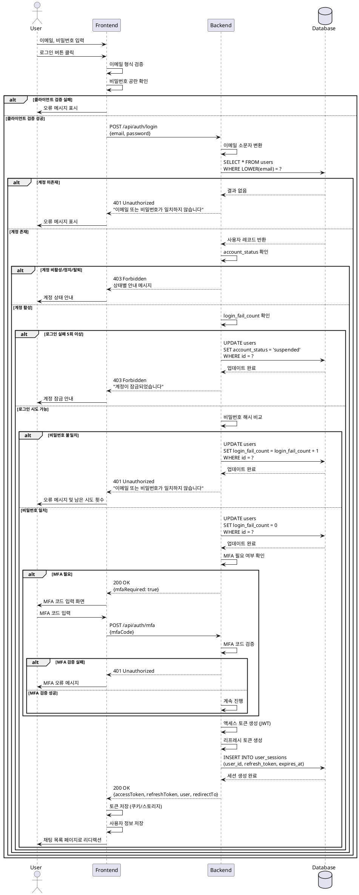

# 로그인 (Login) 유스케이스

## Primary Actor
- 등록된 사용자 (기존 회원)

## Precondition
- 사용자가 이미 회원가입을 완료한 상태
- 사용자가 로그인 페이지에 접근 가능
- 계정이 활성 상태(`active`)이거나 일시 정지되지 않음

## Trigger
- 사용자가 로그인 페이지에서 이메일과 비밀번호를 입력하고 로그인 버튼을 클릭
- 또는 저장된 자격 증명으로 자동 로그인 시도

## Main Scenario

### 1. 사용자 입력
1. 사용자가 로그인 페이지를 방문
2. 이메일 입력 필드에 등록된 이메일 주소 입력
3. 비밀번호 입력 필드에 비밀번호 입력
4. (선택) "로그인 상태 유지" 옵션 선택
5. 로그인 버튼 클릭 또는 엔터 키 입력

### 2. 클라이언트 검증
1. 이메일 형식 유효성 검사 (올바른 이메일 포맷)
2. 비밀번호 공란 여부 확인
3. 검증 실패 시 즉시 오류 메시지 표시
4. 검증 통과 시 서버로 로그인 요청 전송

### 3. 서버 인증 처리
1. 이메일을 소문자로 정규화하여 `users` 테이블에서 계정 조회
2. 계정 존재 여부 확인
3. 계정 상태(`account_status`) 검증
   - `active`: 정상 처리 진행
   - `inactive`: 비활성 계정 안내
   - `suspended`: 계정 정지 안내
   - `withdrawn`: 탈퇴 계정 안내
4. `login_fail_count` 확인 (5회 이상이면 계정 잠금)
5. 입력된 비밀번호와 `password_hash` 비교
6. 비밀번호 일치 시:
   - `login_fail_count`를 0으로 초기화
   - MFA 설정 여부(`mfa_required`) 확인
   - 세션/토큰 생성
7. `user_sessions` 테이블에 새 세션 레코드 삽입
   - `refresh_token` 생성 및 저장
   - `expires_at` 설정 (예: 7일 후)
   - `created_at`, `last_seen_at` 기록

### 4. 응답 및 리디렉션
1. 클라이언트에 인증 토큰(액세스 토큰, 리프레시 토큰) 전달
2. 클라이언트가 토큰을 안전하게 저장 (httpOnly 쿠키 또는 보안 스토리지)
3. 사용자를 채팅 목록 페이지로 리디렉션
4. 로그인 입력 필드 초기화

## Edge Cases

### 1. 이메일 미등록
- **상황**: 입력한 이메일이 `users` 테이블에 존재하지 않음
- **처리**: "이메일 또는 비밀번호가 일치하지 않습니다" 메시지 표시 (보안상 계정 존재 여부 노출 방지)

### 2. 비밀번호 불일치
- **상황**: 비밀번호 검증 실패
- **처리**:
  - `login_fail_count` 1 증가
  - "이메일 또는 비밀번호가 일치하지 않습니다" 메시지 표시
  - 남은 시도 횟수 안내 (예: "4회 남았습니다")

### 3. 계정 잠금
- **상황**: `login_fail_count`가 5회 이상
- **처리**:
  - `account_status`를 `suspended`로 변경
  - "로그인 시도 횟수 초과로 계정이 일시 잠금되었습니다. 고객센터에 문의하거나 비밀번호 재설정을 진행하세요" 안내
  - 로그인 차단

### 4. 비활성/정지/탈퇴 계정
- **상황**: `account_status`가 `active`가 아님
- **처리**:
  - `inactive`: "비활성 계정입니다. 계정을 활성화하세요"
  - `suspended`: "계정이 일시 정지되었습니다. 고객센터에 문의하세요"
  - `withdrawn`: "탈퇴한 계정입니다. 재가입이 필요합니다"

### 5. MFA 필수
- **상황**: `mfa_required`가 `true`
- **처리**:
  - 1차 인증(이메일/비밀번호) 성공 후 MFA 입력 페이지로 이동
  - 사용자가 MFA 코드 입력
  - MFA 검증 성공 시 세션 발급 및 로그인 완료
  - MFA 검증 실패 시 재입력 요청 (최대 3회)

### 6. 네트워크 오류
- **상황**: 클라이언트-서버 통신 중 타임아웃 또는 연결 실패
- **처리**:
  - "네트워크 오류가 발생했습니다. 다시 시도해주세요" 메시지 표시
  - 입력값 유지하여 재시도 가능하도록 함
  - 자동 재시도 옵션 제공 (백오프 알고리즘 적용)

### 7. 중복 로그인 요청
- **상황**: 사용자가 로그인 버튼을 연속으로 클릭
- **처리**:
  - 첫 요청 처리 중 후속 요청 차단
  - 로그인 버튼 비활성화 및 로딩 인디케이터 표시

### 8. 동시 세션 정책
- **상황**: 사용자가 여러 기기/브라우저에서 동시 로그인 시도
- **처리**:
  - 기본 정책: 다중 세션 허용 (각 기기마다 별도 `user_sessions` 레코드 생성)
  - (선택) 단일 세션 정책: 기존 세션 무효화(`revoked_at` 갱신) 후 새 세션 발급

### 9. 서버 오류
- **상황**: 데이터베이스 연결 실패, 서버 내부 오류
- **처리**:
  - "일시적인 오류가 발생했습니다. 잠시 후 다시 시도해주세요" 메시지 표시
  - 에러 로그 기록 및 모니터링 알림

## Business Rules

### BR-L01: 비밀번호 보안
- 비밀번호는 반드시 해시 처리되어 저장됨 (`password_hash`)
- 평문 비밀번호는 서버에 저장하거나 로그에 남기지 않음

### BR-L02: 로그인 실패 제한
- 연속 로그인 실패 5회 시 계정 자동 잠금
- 잠금 해제는 관리자 승인 또는 비밀번호 재설정 후 가능

### BR-L03: 세션 유효 기간
- 리프레시 토큰 유효 기간: 7일
- 액세스 토큰 유효 기간: 1시간
- 만료 시 리프레시 토큰으로 갱신 가능

### BR-L04: 보안 메시지
- 계정 미등록/비밀번호 오류 시 동일한 메시지 표시
- 이유: 계정 존재 여부 노출 방지 (보안 강화)

### BR-L05: MFA 정책
- 관리자 계정 또는 민감한 작업 수행 시 MFA 필수
- MFA 코드는 시간 기반 일회용 비밀번호(TOTP) 또는 SMS/이메일 인증 사용

### BR-L06: 자동 로그인
- "로그인 상태 유지" 선택 시 리프레시 토큰을 영구 쿠키에 저장
- 앱 재실행 시 유효한 토큰으로 자동 로그인

### BR-L07: 세션 만료 처리
- 세션 만료 시 사용자를 로그인 페이지로 리디렉션
- 만료 전 갱신 알림 제공 (선택)

### BR-L08: 감사 로그
- 모든 로그인 시도(성공/실패)는 감사 로그에 기록
- IP 주소, 타임스탬프, User-Agent 정보 포함

## Data Requirements

### 입력 데이터
| 필드 | 타입 | 필수 | 제약 조건 |
|------|------|------|-----------|
| email | string | O | 유효한 이메일 형식, 최대 255자 |
| password | string | O | 최소 8자, 최대 128자 |
| rememberMe | boolean | X | 기본값 false |

### 출력 데이터
| 필드 | 타입 | 설명 |
|------|------|------|
| accessToken | string | JWT 액세스 토큰 (1시간 유효) |
| refreshToken | string | 리프레시 토큰 (7일 유효) |
| user | object | 사용자 기본 정보 (id, email, nickname, profile_image_url) |
| redirectTo | string | 리디렉션 대상 경로 (기본: `/chat`) |

### 데이터베이스 변경
- `users.login_fail_count` 갱신 (성공 시 0, 실패 시 +1)
- `users.updated_at` 자동 갱신 (트리거)
- `user_sessions` 테이블에 신규 레코드 삽입
  - `user_id`, `refresh_token`, `expires_at`, `created_at`, `last_seen_at`

## UI/UX 고려사항

### 입력 편의성
- 이메일 자동완성 지원 (브라우저 기본 기능)
- 비밀번호 표시/숨김 토글 버튼
- 엔터 키로 로그인 제출 가능

### 피드백
- 로그인 처리 중 버튼 비활성화 및 로딩 스피너 표시
- 오류 메시지는 입력 필드 하단에 빨간색으로 표시
- 성공 시 간단한 성공 메시지 또는 즉시 리디렉션

### 에러 메시지
- "이메일을 입력해주세요"
- "비밀번호를 입력해주세요"
- "이메일 형식이 올바르지 않습니다"
- "이메일 또는 비밀번호가 일치하지 않습니다"
- "계정이 잠금되었습니다. 고객센터에 문의하세요"
- "네트워크 오류가 발생했습니다. 다시 시도해주세요"

### 추가 링크
- "비밀번호를 잊으셨나요?" 링크
- "회원가입" 링크

## Sequence Diagram

## Implementation Notes

### API 엔드포인트
- `POST /api/auth/login`
  - Request Body: `{email: string, password: string, rememberMe?: boolean}`
  - Response: `{accessToken: string, refreshToken: string, user: User, redirectTo: string}`
  - Error Codes: 400 (유효성 오류), 401 (인증 실패), 403 (계정 상태 오류), 500 (서버 오류)

### 보안 고려사항
1. **Rate Limiting**: IP당 로그인 시도 제한 (분당 5회)
2. **HTTPS 필수**: 모든 인증 요청은 HTTPS로만 허용
3. **CSRF 방어**: CSRF 토큰 검증
4. **SQL Injection 방어**: Prepared Statement 사용
5. **브루트포스 공격 방어**: 로그인 실패 카운트 및 계정 잠금

### 성능 최적화
- 이메일 조회 시 인덱스 활용 (`users` 테이블의 `LOWER(email)` 인덱스)
- 비밀번호 해싱 알고리즘: bcrypt (cost factor 12)
- 세션 조회 최적화: `user_id` 인덱스

### 테스트 케이스
1. 정상 로그인 (이메일, 비밀번호 정확)
2. 잘못된 이메일
3. 잘못된 비밀번호
4. 비활성 계정 로그인 시도
5. 정지된 계정 로그인 시도
6. 탈퇴한 계정 로그인 시도
7. 로그인 5회 실패 후 계정 잠금
8. MFA 필수 계정 로그인
9. 네트워크 타임아웃
10. 동시 로그인 요청
