# 유스케이스 003: 새 채팅 생성

## Primary Actor
- 로그인한 사용자 (채팅방 생성자)

## Precondition
- 사용자가 로그인 상태여야 함
- 사용자가 채팅 목록 페이지에 접근 가능해야 함
- 초대할 대상 사용자들이 시스템에 존재해야 함

## Trigger
- 사용자가 채팅 목록 페이지에서 "새 채팅 시작" 버튼을 클릭함

## Main Scenario

### 1:1 채팅 생성
1. 사용자가 채팅 목록 페이지에서 "새 채팅 시작" 버튼을 클릭한다
2. 시스템이 채팅방 생성 페이지를 표시한다
3. 사용자가 검색 필드에 상대방의 닉네임 또는 이메일을 입력한다
4. 시스템이 검색 결과를 실시간으로 표시한다
5. 사용자가 대화 상대를 1명 선택한다
6. 시스템이 선택된 사용자 정보를 확인한다
7. 사용자가 "채팅 시작" 버튼을 클릭한다
8. 시스템이 두 사용자 간 기존 1:1 채팅방 존재 여부를 확인한다
   - **기존 채팅방이 있는 경우**: 기존 채팅방으로 이동
   - **기존 채팅방이 없는 경우**:
     - `chat_rooms` 테이블에 새 레코드 생성 (`room_type='direct'`, `name=null`, `created_by=현재_사용자_id`)
     - `chat_direct_pairs` 테이블에 사용자 쌍 등록 (`user_a_id`, `user_b_id` 정렬 후 저장)
     - `chat_members` 테이블에 두 참여자 등록 (`chat_room_id`, `user_id`, `joined_at`)
9. 시스템이 생성된 채팅방 페이지로 이동한다
10. 사용자가 첫 메시지를 입력할 수 있는 상태가 된다

### 그룹 채팅 생성
1. 사용자가 채팅 목록 페이지에서 "새 채팅 시작" 버튼을 클릭한다
2. 시스템이 채팅방 생성 페이지를 표시한다
3. 사용자가 검색 필드에 참여자의 닉네임 또는 이메일을 입력한다
4. 시스템이 검색 결과를 실시간으로 표시한다
5. 사용자가 대화 상대를 2명 이상 선택한다
6. 시스템이 그룹 채팅방 이름 입력 필드를 활성화한다
7. 사용자가 채팅방 이름을 입력한다 (예: "캡스톤 디자인 프로젝트")
8. 사용자가 "채팅방 만들기" 버튼을 클릭한다
9. 시스템이 트랜잭션으로 다음을 수행한다:
   - `chat_rooms` 테이블에 새 레코드 생성 (`room_type='group'`, `name=입력된_이름`, `created_by=현재_사용자_id`)
   - `chat_members` 테이블에 생성자 포함 모든 참여자 등록
10. 시스템이 생성된 그룹 채팅방 페이지로 이동한다
11. 사용자가 첫 메시지를 입력할 수 있는 상태가 된다

## Alternative Flows

### A1. 기존 1:1 채팅방 재사용
- **시점**: Main Scenario 8단계
- **조건**: 동일한 사용자 쌍의 1:1 채팅방이 이미 존재함
- **처리**:
  1. 시스템이 `chat_direct_pairs` 테이블에서 `(user_a_id, user_b_id)` 조합 조회
  2. 기존 `chat_room_id`를 찾아 해당 채팅방으로 이동
  3. "이미 존재하는 채팅방입니다" 알림 표시
  4. 사용자는 기존 대화 내역을 확인하고 새 메시지 작성 가능

### A2. 차단된 사용자 선택
- **시점**: Main Scenario 6단계
- **조건**: 선택한 사용자가 현재 사용자를 차단했거나, 현재 사용자가 해당 사용자를 차단함
- **처리**:
  1. 시스템이 `users` 테이블에서 `account_status` 확인
  2. "해당 사용자와 채팅을 시작할 수 없습니다" 오류 메시지 표시
  3. 사용자 선택이 취소되고 다른 사용자를 선택하도록 유도

### A3. 탈퇴한 사용자 선택
- **시점**: Main Scenario 6단계
- **조건**: 선택한 사용자의 계정 상태가 'withdrawn'
- **처리**:
  1. 시스템이 `account_status='withdrawn'` 확인
  2. "존재하지 않는 사용자입니다" 오류 메시지 표시
  3. 사용자 선택이 취소됨

### A4. 그룹명 미입력
- **시점**: Main Scenario 8단계 (그룹 채팅)
- **조건**: 2명 이상 선택했으나 그룹명을 입력하지 않음
- **처리**:
  1. "채팅방 이름을 입력해주세요" 유효성 검사 메시지 표시
  2. 채팅방 이름 입력 필드에 포커스 이동
  3. 사용자가 이름을 입력할 때까지 생성 버튼 비활성화

## Edge Cases

### E1. 동시 채팅방 생성 충돌 (1:1)
- **상황**: 두 사용자가 동시에 서로에게 1:1 채팅을 시도함
- **처리**:
  1. 데이터베이스 레벨에서 `chat_direct_pairs`의 고유 제약 조건으로 중복 방지
  2. 먼저 도착한 요청만 성공하고 채팅방 생성
  3. 나중 요청은 기존 채팅방 ID를 반환받아 해당 방으로 이동
  4. 두 사용자 모두 동일한 채팅방에서 대화 시작

### E2. 네트워크 타임아웃
- **상황**: 채팅방 생성 요청 중 네트워크 연결 끊김
- **처리**:
  1. 클라이언트가 타임아웃 감지 (30초)
  2. "네트워크 연결이 불안정합니다. 다시 시도해주세요" 오류 메시지 표시
  3. 사용자 입력값(선택한 참여자, 그룹명)을 로컬에 유지
  4. "재시도" 버튼 제공하여 동일한 요청 재전송 가능

### E3. 참여자 제한 초과
- **상황**: 그룹 채팅 참여자가 시스템 제한(예: 50명)을 초과함
- **처리**:
  1. 클라이언트에서 50명 초과 선택 시 추가 선택 불가 처리
  2. "최대 50명까지 초대할 수 있습니다" 알림 표시
  3. 이미 선택된 참여자 목록 유지
  4. 일부 참여자를 제거한 후 추가 선택 가능

### E4. 권한 만료 중 생성 시도
- **상황**: 채팅방 생성 중 세션이 만료됨
- **처리**:
  1. 서버가 401 Unauthorized 응답 반환
  2. 클라이언트가 "세션이 만료되었습니다" 메시지 표시
  3. 입력값을 임시 저장하고 로그인 페이지로 이동
  4. 재로그인 후 임시 저장값 복원 제안

### E5. 중복 요청 방지 (멱등성)
- **상황**: 사용자가 생성 버튼을 연속으로 여러 번 클릭함
- **처리**:
  1. 첫 클릭 후 버튼을 비활성화하고 로딩 스피너 표시
  2. 클라이언트가 요청 ID를 생성하여 중복 요청 차단
  3. 서버는 동일 요청 ID의 중복 요청을 무시
  4. 첫 번째 요청 결과만 사용자에게 반환

### E6. 선택한 사용자가 생성 직전 탈퇴함
- **상황**: 참여자 선택 후 생성 버튼 클릭 사이에 대상 사용자가 탈퇴함
- **처리**:
  1. 서버가 참여자 유효성 재검증 시 `account_status='withdrawn'` 확인
  2. "일부 사용자를 초대할 수 없습니다" 오류 메시지와 함께 해당 사용자 목록 표시
  3. 채팅방 생성 실패, 생성 페이지로 복귀
  4. 유효한 사용자만 선택 상태 유지

## Business Rules

### BR1. 1:1 채팅방 중복 방지
- 동일한 두 사용자 간에는 하나의 1:1 채팅방만 존재해야 함
- `chat_direct_pairs` 테이블의 `(user_a_id, user_b_id)` 조합으로 고유성 보장
- `user_a_id < user_b_id` 정렬 규칙 적용하여 순서 무관하게 중복 방지

### BR2. 그룹 채팅방 이름 필수
- 참여자가 2명 이상인 경우 반드시 채팅방 이름을 입력해야 함
- 채팅방 이름은 1~50자 이내여야 함
- 이름에 금지어 또는 특수문자 제한 적용 가능

### BR3. 채팅방 생성자 자동 참여
- 채팅방을 생성한 사용자는 자동으로 `chat_members`에 등록됨
- `created_by` 필드에 생성자 ID 기록
- 생성자는 채팅방 나가기 전까지 참여 상태 유지

### BR4. 참여자 선택 제한
- 1:1 채팅: 정확히 1명 선택 필수
- 그룹 채팅: 최소 2명, 최대 50명 선택 가능
- 자기 자신은 선택 대상에서 제외됨

### BR5. 유효한 사용자만 초대 가능
- `account_status='active'`인 사용자만 채팅방에 초대할 수 있음
- `inactive`, `suspended`, `withdrawn` 상태 사용자는 선택 불가
- 차단 관계가 있는 사용자는 초대 불가 (향후 확장 시)

### BR6. 채팅방 타입 불변
- 생성 시 결정된 `room_type`('direct' 또는 'group')은 변경 불가
- 1:1 채팅을 그룹 채팅으로 전환할 수 없음
- 그룹 채팅에 참여자 추가는 가능하나 타입은 유지됨

### BR7. 트랜잭션 원자성
- 채팅방 생성 시 `chat_rooms`, `chat_direct_pairs`(1:1), `chat_members` 생성은 하나의 트랜잭션으로 처리
- 일부 실패 시 전체 롤백하여 데이터 무결성 보장
- 생성 실패 시 사용자에게 명확한 오류 메시지 제공

## Postconditions

### 성공 시
- 새로운 채팅방이 `chat_rooms` 테이블에 생성됨
- 1:1 채팅인 경우 `chat_direct_pairs`에 사용자 쌍이 등록됨
- 선택된 모든 참여자가 `chat_members`에 등록됨
- 생성자는 생성된 채팅방 페이지로 이동함
- 채팅 목록에 새 채팅방이 즉시 표시됨
- 초대된 사용자들의 채팅 목록에도 새 채팅방이 표시됨 (polling 동기화 후)

### 실패 시
- 데이터베이스에 어떠한 레코드도 생성되지 않음
- 사용자는 채팅방 생성 페이지에 머물며 입력값이 유지됨
- 구체적인 실패 사유가 사용자에게 표시됨
- 수정 가능한 항목에 대한 안내 제공

## UI/UX 고려사항

### 사용자 검색
- 실시간 자동완성 기능 제공 (debounce 300ms)
- 검색 결과에 닉네임, 이메일, 프로필 이미지 표시
- 선택된 사용자는 하단에 칩 형태로 표시
- 칩 클릭 시 선택 해제 가능

### 채팅방 이름 입력
- 2명 이상 선택 시에만 입력 필드 활성화
- 플레이스홀더: "그룹 채팅방 이름을 입력하세요"
- 실시간 글자 수 표시 (0/50)
- 금지어 감지 시 즉시 알림

### 생성 버튼
- 필수 조건 충족 시에만 활성화
  - 1:1: 1명 선택
  - 그룹: 2명 이상 선택 + 그룹명 입력
- 클릭 후 로딩 상태 표시 (스피너)
- 중복 클릭 방지

### 피드백
- 생성 성공: "채팅방이 생성되었습니다" 토스트 메시지
- 기존 채팅방 재사용: "기존 채팅방으로 이동합니다" 알림
- 오류 발생: 구체적 사유와 함께 빨간색 경고 메시지

## 데이터 요구사항

### 입력 데이터
- `created_by`: 현재 로그인한 사용자 ID (UUID)
- `room_type`: 'direct' 또는 'group'
- `name`: 그룹 채팅인 경우 채팅방 이름 (varchar 50)
- `selected_users`: 초대할 사용자 ID 배열 (UUID[])

### 저장 데이터

#### chat_rooms
- `id`: 고유 식별자 (UUID, 자동 생성)
- `room_type`: 'direct' 또는 'group'
- `name`: 그룹 채팅 이름 (1:1은 null)
- `created_by`: 생성자 사용자 ID (UUID)
- `created_at`: 생성 시각 (timestamptz)
- `updated_at`: 갱신 시각 (timestamptz, 트리거)

#### chat_direct_pairs (1:1 채팅만)
- `chat_room_id`: 채팅방 ID (UUID, PK)
- `user_a_id`: 작은 사용자 ID (UUID)
- `user_b_id`: 큰 사용자 ID (UUID)
- `created_at`: 생성 시각
- `updated_at`: 갱신 시각

#### chat_members
- `id`: 고유 식별자 (UUID)
- `chat_room_id`: 채팅방 ID (UUID)
- `user_id`: 참여자 사용자 ID (UUID)
- `joined_at`: 참여 시각 (timestamptz)
- `last_read_message_id`: 마지막 읽은 메시지 ID (UUID, nullable)
- `last_read_at`: 마지막 읽은 시각 (timestamptz, nullable)
- `created_at`: 레코드 생성 시각
- `updated_at`: 레코드 갱신 시각

### 출력 데이터
- `chat_room_id`: 생성된 또는 재사용된 채팅방 ID (UUID)
- `room_type`: 채팅방 타입
- `name`: 채팅방 이름 (그룹) 또는 상대방 닉네임 (1:1)
- `members`: 참여자 목록 (ID, 닉네임, 프로필 이미지)
- `redirect_url`: 채팅방 페이지 URL

## Sequence Diagram

```plantuml
@startuml
actor User
participant FE as "Frontend\n(React)"
participant BE as "Backend\n(Hono API)"
database DB as "Database\n(Supabase)"

== 1:1 채팅 생성 ==

User -> FE: 새 채팅 시작 버튼 클릭
FE -> User: 채팅방 생성 페이지 표시

User -> FE: 사용자 검색어 입력
FE -> BE: GET /api/users/search?q={query}
BE -> DB: SELECT users WHERE nickname LIKE '%{query}%'
DB --> BE: 검색 결과 반환
BE --> FE: 사용자 목록 응답
FE -> User: 검색 결과 표시

User -> FE: 대화 상대 1명 선택
FE -> User: 선택된 사용자 칩 표시

User -> FE: 채팅 시작 버튼 클릭
FE -> FE: 버튼 비활성화, 로딩 표시
FE -> BE: POST /api/chat-rooms/create\n{type: "direct", user_ids: [target_id]}

BE -> BE: 세션 검증
BE -> DB: SELECT account_status FROM users\nWHERE id IN (current_user, target_id)
DB --> BE: 사용자 상태 반환

alt 대상 사용자가 유효하지 않음
  BE --> FE: 400 Bad Request\n{error: "유효하지 않은 사용자"}
  FE -> User: 오류 메시지 표시
else 대상 사용자 유효

  BE -> DB: SELECT chat_room_id FROM chat_direct_pairs\nWHERE (user_a_id, user_b_id) = (sorted IDs)
  DB --> BE: 기존 채팅방 조회 결과

  alt 기존 1:1 채팅방 존재
    BE --> FE: 200 OK\n{chat_room_id, exists: true}
    FE -> User: 기존 채팅방으로 이동 알림
    FE -> User: 채팅방 페이지로 이동
  else 기존 채팅방 없음
    BE -> DB: BEGIN TRANSACTION

    BE -> DB: INSERT INTO chat_rooms\n(id, room_type, created_by)
    DB --> BE: chat_room_id 생성 완료

    BE -> DB: INSERT INTO chat_direct_pairs\n(chat_room_id, user_a_id, user_b_id)
    DB --> BE: 쌍 등록 완료

    BE -> DB: INSERT INTO chat_members\n(chat_room_id, user_id) x 2
    DB --> BE: 참여자 등록 완료

    BE -> DB: COMMIT

    BE --> FE: 201 Created\n{chat_room_id, room_type, members}
    FE -> User: 생성 성공 토스트
    FE -> User: 새 채팅방 페이지로 이동
  end
end

== 그룹 채팅 생성 ==

User -> FE: 새 채팅 시작 버튼 클릭
FE -> User: 채팅방 생성 페이지 표시

User -> FE: 사용자 검색 및 2명 이상 선택
FE -> BE: GET /api/users/search?q={query}
BE -> DB: SELECT users WHERE nickname LIKE '%{query}%'
DB --> BE: 검색 결과
BE --> FE: 사용자 목록
FE -> User: 검색 결과 및 선택된 사용자 칩 표시

User -> FE: 그룹명 입력 (예: "캡스톤 프로젝트")
FE -> FE: 실시간 유효성 검사 (1~50자)

User -> FE: 채팅방 만들기 버튼 클릭
FE -> FE: 버튼 비활성화, 로딩 표시
FE -> BE: POST /api/chat-rooms/create\n{type: "group", name: "캡스톤 프로젝트", user_ids: [id1, id2, ...]}

BE -> BE: 세션 검증, 그룹명 검증
BE -> DB: SELECT account_status FROM users\nWHERE id IN (user_ids)
DB --> BE: 참여자 상태 반환

alt 일부 사용자가 유효하지 않음
  BE --> FE: 400 Bad Request\n{error: "유효하지 않은 사용자", invalid_users}
  FE -> User: 오류 메시지 및 무효 사용자 표시
else 모든 사용자 유효
  BE -> DB: BEGIN TRANSACTION

  BE -> DB: INSERT INTO chat_rooms\n(id, room_type, name, created_by)
  DB --> BE: chat_room_id 생성 완료

  BE -> DB: INSERT INTO chat_members\n(chat_room_id, user_id) x N
  DB --> BE: 모든 참여자 등록 완료

  BE -> DB: COMMIT

  BE --> FE: 201 Created\n{chat_room_id, room_type, name, members}
  FE -> User: 생성 성공 토스트
  FE -> User: 새 그룹 채팅방 페이지로 이동
end

== 에러 케이스: 동시 1:1 채팅 생성 ==

User -> FE: 채팅 시작 버튼 클릭
FE -> BE: POST /api/chat-rooms/create

note over BE,DB: 거의 동시에 다른 사용자도 동일 요청

BE -> DB: BEGIN TRANSACTION
BE -> DB: SELECT FROM chat_direct_pairs
DB --> BE: 채팅방 없음

BE -> DB: INSERT INTO chat_rooms
BE -> DB: INSERT INTO chat_direct_pairs

alt 먼저 도착한 요청
  DB --> BE: 삽입 성공
  BE -> DB: COMMIT
  BE --> FE: 201 Created
  FE -> User: 새 채팅방으로 이동
else 나중 요청 (고유 제약 위반)
  DB --> BE: ERROR: duplicate key violation
  BE -> DB: ROLLBACK
  BE -> DB: SELECT chat_room_id FROM chat_direct_pairs
  DB --> BE: 기존 채팅방 ID
  BE --> FE: 200 OK {exists: true}
  FE -> User: 기존 채팅방으로 이동
end

@enduml
```



## 기술 구현 참고사항

### API 엔드포인트
- **POST /api/chat-rooms/create**
  - Request Body:
    ```json
    {
      "type": "direct" | "group",
      "name": "string (그룹인 경우 필수)",
      "user_ids": ["uuid", "uuid", ...]
    }
    ```
  - Response (201 Created):
    ```json
    {
      "chat_room_id": "uuid",
      "room_type": "direct" | "group",
      "name": "string | null",
      "members": [
        {"user_id": "uuid", "nickname": "string", "profile_image_url": "string"}
      ],
      "created_at": "timestamptz"
    }
    ```
  - Response (200 OK - 기존 채팅방):
    ```json
    {
      "chat_room_id": "uuid",
      "exists": true,
      "redirect_url": "/chat/{chat_room_id}"
    }
    ```

- **GET /api/users/search?q={query}**
  - 닉네임 또는 이메일로 사용자 검색
  - `account_status='active'`인 사용자만 반환
  - 본인은 제외

### 데이터베이스 쿼리 예시

#### 1:1 채팅 중복 확인
```sql
SELECT chat_room_id
FROM chat_direct_pairs
WHERE (user_a_id = LEAST($1, $2) AND user_b_id = GREATEST($1, $2));
```

#### 1:1 채팅 생성 트랜잭션
```sql
BEGIN;

INSERT INTO chat_rooms (id, room_type, created_by)
VALUES (gen_random_uuid(), 'direct', $1)
RETURNING id;

INSERT INTO chat_direct_pairs (chat_room_id, user_a_id, user_b_id)
VALUES ($chat_room_id, LEAST($1, $2), GREATEST($1, $2));

INSERT INTO chat_members (chat_room_id, user_id, joined_at)
VALUES
  ($chat_room_id, $1, NOW()),
  ($chat_room_id, $2, NOW());

COMMIT;
```

#### 그룹 채팅 생성 트랜잭션
```sql
BEGIN;

INSERT INTO chat_rooms (id, room_type, name, created_by)
VALUES (gen_random_uuid(), 'group', $1, $2)
RETURNING id;

INSERT INTO chat_members (chat_room_id, user_id, joined_at)
SELECT $chat_room_id, user_id, NOW()
FROM UNNEST($user_ids::uuid[]) AS user_id;

COMMIT;
```

### 클라이언트 상태 관리
- React Query를 사용한 채팅방 생성 mutation
- 생성 중 낙관적 업데이트 (Optimistic Update) 고려
- 실패 시 롤백 처리

### 보안 고려사항
- 세션 검증: 모든 요청에서 유효한 사용자 세션 확인
- 입력 검증: 그룹명, 참여자 수 등 서버 측 재검증
- SQL Injection 방지: Prepared Statement 사용
- Rate Limiting: 채팅방 생성 API에 사용자당 분당 10회 제한
