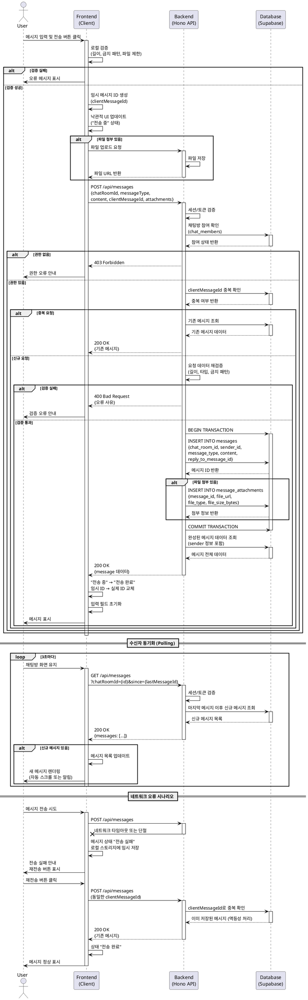

# 유스케이스 004: 메시지 전송 (Send Message)

## Primary Actor
- 채팅방 참여자 (발신자)

## Precondition
- 사용자가 로그인되어 있어야 함
- 사용자가 채팅방에 참여(chat_members)하고 있어야 함
- 사용자 계정 상태가 `active`여야 함
- 채팅방이 존재하고 활성 상태여야 함

## Trigger
- 사용자가 채팅방 화면에서 메시지 입력 후 전송 버튼 클릭 또는 엔터 키 입력
- 사용자가 이모지 선택기에서 이모지 선택 후 전송
- 사용자가 파일 첨부 후 전송

## Main Scenario

### 1. 메시지 입력 및 검증 (Client)
1. 사용자가 메시지 입력 필드에 텍스트 또는 이모지를 입력한다
2. (선택) 사용자가 파일 첨부 버튼을 클릭하여 파일을 선택한다
3. 사용자가 전송 버튼 클릭 또는 단축키(Enter)로 메시지 전송을 시도한다
4. 클라이언트가 즉시 로컬 검증을 수행한다:
   - 메시지 길이 검증 (빈 메시지 또는 최대 길이 초과 확인)
   - 금지 패턴 검증 (스팸, 욕설 등)
   - 파일 크기 및 형식 제한 확인
5. 검증 실패 시 사용자에게 즉시 오류 메시지를 표시하고 입력 내용을 유지한다

### 2. 메시지 전송 요청 (Client → Backend)
1. 클라이언트가 고유한 임시 메시지 ID를 생성한다 (중복 전송 방지용)
2. 낙관적 UI 업데이트: 메시지를 발신자 화면에 "전송 중" 상태로 즉시 표시한다
3. 파일 첨부가 있는 경우, 먼저 파일 업로드를 수행한다
4. 메시지 전송 API 요청을 보낸다:
   ```
   POST /api/messages
   {
     "chatRoomId": uuid,
     "messageType": "text" | "emoji" | "file",
     "content": string,
     "replyToMessageId": uuid (optional),
     "clientMessageId": uuid,
     "attachments": [{
       "fileUrl": string,
       "fileType": string,
       "fileSizeBytes": number
     }] (optional)
   }
   ```

### 3. 서버 측 검증 및 처리 (Backend)
1. 사용자 인증 및 권한 확인:
   - 세션/토큰 유효성 검증
   - 채팅방 참여 여부 확인 (`chat_members`)
   - 사용자 차단 상태 확인
2. 요청 데이터 재검증:
   - 메시지 타입 및 내용 유효성
   - 채팅방 존재 여부
   - 답장 대상 메시지 존재 여부 (reply_to가 있을 경우)
   - 첨부 파일 메타데이터 검증
3. 중복 전송 방지:
   - `clientMessageId`로 이미 처리된 요청인지 확인
   - 중복일 경우 기존 메시지 정보를 반환 (멱등성 보장)

### 4. 메시지 저장 (Backend → Database)
1. 트랜잭션 시작
2. `messages` 테이블에 새 레코드 삽입:
   - `id`: 서버 생성 UUID
   - `chat_room_id`: 채팅방 ID
   - `sender_id`: 발신자 사용자 ID
   - `message_type`: 메시지 타입
   - `content`: 메시지 내용
   - `reply_to_message_id`: 답장 대상 (있을 경우)
   - `created_at`, `updated_at`: 현재 시각
3. 파일 첨부가 있는 경우 `message_attachments` 테이블에 삽입:
   - `message_id`: 메시지 ID
   - `file_url`: 파일 경로
   - `file_type`: 파일 타입
   - `file_size_bytes`: 파일 크기
4. 트랜잭션 커밋
5. 저장된 메시지 데이터를 응답으로 반환

### 5. 클라이언트 상태 업데이트 (Backend → Client)
1. 서버가 성공 응답을 반환:
   ```
   {
     "success": true,
     "data": {
       "message": {
         "id": uuid,
         "chatRoomId": uuid,
         "senderId": uuid,
         "messageType": string,
         "content": string,
         "replyToMessageId": uuid | null,
         "isDeleted": false,
         "createdAt": timestamp,
         "updatedAt": timestamp,
         "attachments": [...],
         "sender": {
           "id": uuid,
           "nickname": string,
           "profileImageUrl": string
         }
       }
     }
   }
   ```
2. 클라이언트가 "전송 중" 상태를 "전송 완료"로 업데이트한다
3. 임시 ID를 서버에서 받은 실제 ID로 교체한다
4. 메시지 입력 필드를 초기화한다

### 6. 수신자 동기화 (Polling)
1. 채팅방의 다른 참여자들은 주기적으로 polling 요청을 보낸다:
   ```
   GET /api/messages?chatRoomId={id}&since={lastMessageId}
   ```
2. 서버는 마지막 메시지 이후의 신규 메시지를 반환한다
3. 클라이언트가 신규 메시지를 메시지 목록에 추가하고 렌더링한다
4. 읽지 않은 메시지 카운트를 업데이트한다
5. 채팅방 목록의 최신 메시지 정보를 갱신한다

## Edge Cases

### 1. 네트워크 단절 또는 타임아웃
- **상황**: 메시지 전송 중 네트워크 연결이 끊김
- **처리**:
  - 메시지를 로컬 스토리지에 임시 저장
  - "전송 실패" 상태로 표시
  - 재연결 시 자동 또는 수동 재전송 옵션 제공
  - 재전송 시 동일한 `clientMessageId` 사용으로 중복 방지

### 2. 중복 전송 방지
- **상황**: 네트워크 지연으로 사용자가 전송 버튼을 여러 번 클릭
- **처리**:
  - 클라이언트에서 전송 버튼 비활성화 (전송 완료/실패까지)
  - 서버에서 `clientMessageId` 기반 멱등성 체크
  - 중복 요청 시 기존 메시지 정보 반환

### 3. 파일 업로드 실패
- **상황**: 첨부 파일 업로드 중 오류 발생
- **처리**:
  - 파일 업로드 실패 시 메시지 전송을 중단
  - 사용자에게 실패 사유 안내 (파일 크기 초과, 지원하지 않는 형식 등)
  - 입력한 텍스트는 보존하고 파일만 재선택 가능하도록 함
  - 재시도 옵션 제공

### 4. 권한 상실
- **상황**: 메시지 전송 중 채팅방에서 제거되거나 차단됨
- **처리**:
  - 서버가 403 Forbidden 응답 반환
  - 메시지를 "전송 실패" 상태로 표시
  - 사용자에게 권한 부족 안내 메시지 표시
  - 채팅방 페이지에서 이탈 유도

### 5. 채팅방 삭제
- **상황**: 메시지 전송 시점에 채팅방이 이미 삭제됨
- **처리**:
  - 서버가 404 Not Found 응답 반환
  - 메시지를 "전송 실패" 상태로 표시
  - 채팅방 목록으로 리다이렉트
  - 삭제된 채팅방 안내 메시지 표시

### 6. 검증 실패
- **상황**: 서버 측 검증에서 메시지가 정책 위반으로 판단됨
- **처리**:
  - 서버가 400 Bad Request와 구체적인 오류 사유 반환
  - 사용자에게 위반 내용 안내 (예: 금지어 포함, 길이 초과)
  - 입력 내용을 유지하고 수정 유도
  - 재전송 가능

### 7. 서버 오류 (5xx)
- **상황**: 데이터베이스 오류 또는 서버 내부 오류
- **처리**:
  - 메시지를 "전송 실패" 상태로 표시
  - 사용자에게 일시적 오류 안내
  - 재시도 옵션 제공
  - 입력 내용 보존

## Postconditions

### 성공 시
- `messages` 테이블에 새 메시지 레코드가 생성됨
- 파일 첨부 시 `message_attachments` 테이블에 메타데이터가 저장됨
- 발신자 화면에 메시지가 "전송 완료" 상태로 표시됨
- 채팅방의 `updated_at` 타임스탬프가 갱신됨
- 수신자들은 다음 polling 시점에 신규 메시지를 받음
- 채팅 목록에서 해당 채팅방의 최신 메시지가 업데이트됨

### 실패 시
- 데이터베이스에 변경사항 없음 (트랜잭션 롤백)
- 사용자 화면에 오류 메시지와 재시도 옵션 표시
- 입력 내용이 보존되어 재전송 가능

## Business Rules

### BR-1: 메시지 길이 제한
- 텍스트 메시지는 최소 1자 이상 필수
- 텍스트 메시지는 최대 10,000자 제한
- 빈 메시지(공백만 포함)는 전송 불가

### BR-2: 메시지 타입 정책
- `message_type`은 `text`, `emoji`, `file`, `system` 중 하나여야 함
- `text`: 일반 텍스트 메시지
- `emoji`: 단일 이모지 메시지 (별도 렌더링 처리)
- `file`: 파일 첨부 메시지 (텍스트는 선택적)
- `system`: 시스템 자동 생성 메시지 (사용자 전송 불가)

### BR-3: 파일 첨부 제한
- 단일 메시지당 최대 5개 파일 첨부 가능
- 파일당 최대 크기: 50MB
- 지원 파일 형식: 이미지(jpg, png, gif, webp), 문서(pdf, docx, xlsx), 압축(zip)
- 전체 첨부 파일 크기 합계: 100MB 이하

### BR-4: 금지 패턴 검증
- 스팸 패턴 감지 (동일 메시지 단시간 반복 전송)
- 욕설 및 비속어 필터링 (서버 측 사전 기반)
- 악성 URL 패턴 차단

### BR-5: 권한 및 상태 검증
- 발신자는 반드시 `chat_members`에 등록된 참여자여야 함
- 발신자의 `account_status`가 `active`여야 함
- 차단된 사용자는 메시지 전송 불가
- 채팅방이 존재하고 삭제되지 않은 상태여야 함

### BR-6: 답장 제약
- `reply_to_message_id`가 지정된 경우, 해당 메시지가 동일 채팅방에 존재해야 함
- 삭제된 메시지에도 답장 가능 (UI에서 "삭제된 메시지" 표시)
- 시스템 메시지에는 답장 불가

### BR-7: 전송 속도 제한 (Rate Limiting)
- 동일 사용자는 초당 최대 5개 메시지 전송 가능
- 1분당 최대 30개 메시지 전송 가능
- 제한 초과 시 429 Too Many Requests 응답 및 대기 시간 안내

### BR-8: 멱등성 보장
- `clientMessageId`는 클라이언트 생성 UUID로 중복 방지
- 동일한 `clientMessageId`로 재요청 시 기존 메시지 반환 (새로 생성 안 함)
- 24시간 내 동일 ID 재사용 방지

## UI/UX 고려사항

### 1. 임시 저장 및 복원
- 입력 중인 메시지는 로컬 스토리지에 자동 저장 (5초마다)
- 페이지 새로고침 또는 앱 재시작 시 입력 내용 복원
- 메시지 전송 성공 시 임시 저장 데이터 삭제

### 2. 전송 상태 표시
- **전송 중**: 로딩 아이콘, 메시지 불투명도 낮춤
- **전송 완료**: 체크 아이콘, 정상 불투명도
- **전송 실패**: 경고 아이콘, 빨간색 표시, 재전송 버튼

### 3. Polling 주기 최적화
- 기본 polling 간격: 3초
- 메시지 전송 직후: 1초 간격으로 단축 (10초간)
- 백그라운드 상태: 10초 간격으로 연장
- 채팅방 이탈 시: polling 중단

### 4. 낙관적 UI 업데이트
- 메시지 전송 요청 시 즉시 UI에 표시 (대기 시간 최소화)
- 서버 응답 후 실제 ID로 교체
- 실패 시 UI에서 제거하거나 실패 상태로 변경

### 5. 입력 편의성
- Enter 키: 메시지 전송
- Shift + Enter: 줄바꿈
- 전송 버튼: 입력 내용이 있을 때만 활성화
- 파일 드래그 앤 드롭 지원

### 6. 스크롤 동작
- 새 메시지 전송 시 자동으로 최하단 스크롤
- 다른 사용자의 메시지 수신 시:
  - 이미 최하단에 있으면 자동 스크롤
  - 과거 메시지 탐색 중이면 스크롤 유지 + 신규 메시지 알림 배지 표시

## Data Requirements

### 입력 데이터 (Request)
```typescript
interface SendMessageRequest {
  chatRoomId: string;          // UUID, 필수
  messageType: 'text' | 'emoji' | 'file';  // 필수
  content: string;              // 필수 (파일 타입은 선택적)
  replyToMessageId?: string;    // UUID, 선택적
  clientMessageId: string;      // UUID, 필수 (중복 방지용)
  attachments?: Array<{
    fileUrl: string;            // 업로드된 파일 경로
    fileType: string;           // MIME type
    fileSizeBytes: number;      // 파일 크기 (bytes)
  }>;
}
```

### 출력 데이터 (Response)
```typescript
interface SendMessageResponse {
  success: true;
  data: {
    message: {
      id: string;               // 서버 생성 UUID
      chatRoomId: string;
      senderId: string;
      messageType: 'text' | 'emoji' | 'file';
      content: string;
      replyToMessageId: string | null;
      isDeleted: false;
      deletedAt: null;
      createdAt: string;        // ISO 8601 timestamp
      updatedAt: string;        // ISO 8601 timestamp
      attachments: Array<{
        id: string;
        messageId: string;
        fileUrl: string;
        fileType: string;
        fileSizeBytes: number;
        createdAt: string;
        updatedAt: string;
      }>;
      sender: {
        id: string;
        nickname: string;
        profileImageUrl: string;
      };
      replyTo?: {              // reply_to_message_id가 있을 경우
        id: string;
        content: string;
        sender: {
          id: string;
          nickname: string;
        };
        isDeleted: boolean;
      };
    };
  };
}
```

### 데이터베이스 스키마 (messages 테이블)
```sql
CREATE TABLE messages (
  id UUID PRIMARY KEY DEFAULT gen_random_uuid(),
  chat_room_id UUID NOT NULL REFERENCES chat_rooms(id),
  sender_id UUID NOT NULL REFERENCES users(id),
  message_type TEXT NOT NULL CHECK (message_type IN ('text', 'emoji', 'file', 'system')),
  content TEXT,
  reply_to_message_id UUID REFERENCES messages(id),
  is_deleted BOOLEAN DEFAULT FALSE,
  deleted_at TIMESTAMPTZ,
  created_at TIMESTAMPTZ DEFAULT NOW(),
  updated_at TIMESTAMPTZ DEFAULT NOW()
);

CREATE INDEX idx_messages_chat_room_created ON messages(chat_room_id, created_at DESC);
CREATE INDEX idx_messages_sender ON messages(sender_id);
CREATE INDEX idx_messages_reply_to ON messages(reply_to_message_id);
```

### 데이터베이스 스키마 (message_attachments 테이블)
```sql
CREATE TABLE message_attachments (
  id UUID PRIMARY KEY DEFAULT gen_random_uuid(),
  message_id UUID NOT NULL REFERENCES messages(id) ON DELETE CASCADE,
  file_url TEXT NOT NULL,
  file_type TEXT NOT NULL,
  file_size_bytes INTEGER NOT NULL,
  created_at TIMESTAMPTZ DEFAULT NOW(),
  updated_at TIMESTAMPTZ DEFAULT NOW()
);

CREATE INDEX idx_attachments_message ON message_attachments(message_id);
```

## Sequence Diagram



## 관련 유스케이스
- UC-001: 회원가입
- UC-002: 로그인
- UC-003: 새 채팅 생성
- UC-005: 메시지 답장
- UC-006: 메시지 리액션
- UC-007: 메시지 삭제
- UC-009: 채팅방 진입 및 메시지 동기화

## 참고 문서
- `/docs/prd.md` - 제품 요구사항 정의서 (3. 포함 페이지 - 채팅방 페이지)
- `/docs/userflow.md` - 사용자 흐름 정의 (4. 메시지 전송)
- `/docs/database.md` - 데이터베이스 스키마 (messages, message_attachments)
