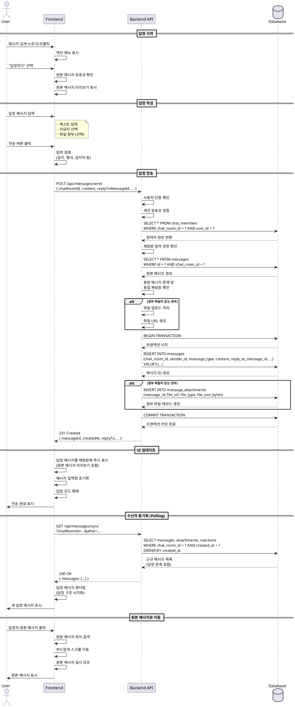

# 유스케이스 005: 메시지 답장 (Reply to Message)

## 1. 기능 개요
메시지 답장 기능은 채팅방 내에서 특정 메시지를 참조하여 답글을 작성하는 기능입니다. 사용자는 원본 메시지의 맥락을 유지하면서 대화의 흐름을 명확하게 이어나갈 수 있으며, 특히 그룹 채팅에서 여러 주제가 동시에 논의될 때 대화의 맥락을 잃지 않도록 돕습니다.

## 2. Primary Actor
- 답장을 작성하는 채팅방 참여자 (로그인된 사용자)

## 3. Stakeholders & Interests
- **답장 작성자**: 특정 메시지에 대한 명확한 응답을 전달하고자 함
- **원본 메시지 작성자**: 자신의 메시지에 대한 답장을 받고 알림을 확인함
- **다른 채팅방 참여자**: 답장 관계를 통해 대화의 맥락을 파악함

## 4. Precondition
- 사용자가 로그인된 상태여야 함
- 사용자가 채팅방의 활성 참여자(member)여야 함
- 답장하려는 원본 메시지가 존재하고 접근 가능해야 함
- 원본 메시지가 삭제되지 않았거나, 삭제된 경우 제한된 정보만 표시

## 5. Trigger
사용자가 채팅방 내에서 특정 메시지를 길게 누르거나(모바일) 우클릭/옵션 메뉴(웹)를 열어 "답장하기" 액션을 선택함

## 6. Main Scenario

### 6.1 답장 시작
1. 사용자가 채팅방 화면에서 답장하고자 하는 메시지를 길게 누르거나 옵션 메뉴를 연다
2. 시스템은 해당 메시지에 대한 액션 메뉴를 표시한다 (답장하기, 좋아요, 삭제 등)
3. 사용자가 "답장하기" 옵션을 선택한다
4. 클라이언트는 원본 메시지의 유효성(존재 여부, 접근 권한)을 확인한다
5. 원본 메시지 미리보기가 메시지 입력창 상단에 표시된다
   - 원본 작성자 닉네임
   - 원본 메시지 내용 요약 (최대 100자)
   - 메시지 타입별 표시 (텍스트, 이모지, 파일 등)

### 6.2 답장 메시지 작성
6. 사용자가 메시지 입력창에 답장 내용을 입력한다
   - 텍스트 입력
   - 이모지 선택 가능
   - 파일 첨부 가능 (선택적)
7. (선택적) 사용자가 답장을 취소하고 일반 메시지로 전환할 수 있다
   - 원본 메시지 미리보기 영역의 'X' 버튼 클릭
   - 입력된 내용은 유지됨

### 6.3 답장 전송
8. 사용자가 전송 버튼을 클릭하거나 엔터 키를 누른다
9. 클라이언트는 입력 검증을 수행한다
   - 메시지 길이 제한 (1자 이상, 5000자 이하)
   - 금지 패턴 검사 (선택적)
   - 첨부 파일 크기 및 형식 검증
10. 클라이언트는 서버에 답장 메시지 전송 요청을 보낸다
    - `message_type`: 'text' | 'emoji' | 'file'
    - `content`: 메시지 내용
    - `reply_to_message_id`: 원본 메시지 ID
    - `attachments`: 첨부 파일 정보 (있는 경우)

### 6.4 서버 처리
11. 서버는 요청을 검증한다
    - 사용자 인증 및 세션 유효성
    - 채팅방 참여 권한 확인
    - 원본 메시지 존재 및 접근 가능 여부 확인
    - 원본 메시지와 답장 메시지가 동일 채팅방에 속하는지 확인
12. 첨부 파일이 있는 경우 파일을 업로드하고 URL을 생성한다
13. 서버는 트랜잭션 내에서 다음을 수행한다
    - `messages` 테이블에 새 레코드 삽입
      - `chat_room_id`: 현재 채팅방 ID
      - `sender_id`: 현재 사용자 ID
      - `message_type`: 메시지 타입
      - `content`: 메시지 내용
      - `reply_to_message_id`: 원본 메시지 ID
      - `created_at`: 현재 시각
    - 첨부 파일이 있는 경우 `message_attachments` 테이블에 레코드 삽입
14. 서버는 생성된 메시지 정보를 응답으로 반환한다
    - 메시지 ID, 생성 시각, 원본 메시지 참조 정보 포함

### 6.5 클라이언트 UI 업데이트
15. 클라이언트는 전송 성공 응답을 받는다
16. 답장 메시지가 채팅방 화면에 즉시 표시된다
    - 답장 구조를 시각적으로 표시 (인용 박스, 연결선 등)
    - 원본 메시지 미리보기 포함
    - 원본 메시지 클릭 시 해당 메시지로 스크롤 이동
17. 메시지 입력창이 초기화된다
18. (선택적) 입력창 상단의 원본 메시지 미리보기가 제거된다

### 6.6 수신자 동기화
19. 다른 채팅방 참여자들은 다음 polling 요청에서 새 답장 메시지를 수신한다
20. 수신자의 채팅방 화면에 답장 구조가 포함된 메시지가 표시된다
21. 원본 메시지 작성자는 자신의 메시지에 답장이 달렸음을 인지한다 (선택적: 알림)

## 7. Alternative Flows

### A1. 원본 메시지가 삭제된 경우
- **분기점**: Main Scenario 4단계 (유효성 확인)
- **처리**:
  - 원본 메시지가 삭제된 경우(`is_deleted = true`), 제한된 정보만 표시
  - 원본 메시지 미리보기에 "삭제된 메시지입니다" 표시
  - 답장 전송은 여전히 가능 (답장 관계는 유지됨)
  - 답장 메시지 표시 시 원본 메시지는 "삭제된 메시지에 대한 답장" 으로 표시

### A2. 답장 취소
- **분기점**: Main Scenario 7단계 (답장 작성 중)
- **처리**:
  - 사용자가 원본 메시지 미리보기의 'X' 버튼 클릭
  - 답장 모드가 해제되고 일반 메시지 입력 모드로 전환
  - 입력된 텍스트는 유지됨
  - `reply_to_message_id` 참조가 제거됨

### A3. 원본 메시지 접근 권한 상실
- **분기점**: Main Scenario 11단계 (서버 검증)
- **처리**:
  - 답장 작성 중 사용자가 채팅방에서 제거된 경우
  - 서버는 403 Forbidden 오류 반환
  - 클라이언트는 "메시지를 전송할 수 없습니다. 채팅방 참여 상태를 확인해주세요" 안내
  - 입력된 내용은 임시 저장하여 복구 가능성 제공

### A4. 답장의 답장 (중첩 답장)
- **분기점**: Main Scenario 1단계
- **처리**:
  - 사용자가 이미 답장인 메시지에 다시 답장하려는 경우
  - 시스템은 최상위 원본 메시지를 참조하도록 처리 (답장 깊이 제한)
  - 또는 직전 답장 메시지를 참조하되, UI에서 스레드 구조로 표시

## 8. Exception Flows

### E1. 네트워크 오류
- **발생 시점**: Main Scenario 10단계 (전송 요청)
- **처리**:
  - 클라이언트는 요청 타임아웃 또는 연결 실패를 감지
  - 메시지를 로컬에 임시 저장 (draft 상태)
  - "메시지 전송 실패. 다시 시도하시겠습니까?" 안내 표시
  - 재시도 버튼 제공
  - 재전송 시 클라이언트 생성 고유 ID를 포함하여 중복 방지

### E2. 중복 전송 요청
- **발생 시점**: Main Scenario 10단계 (중복 클릭)
- **처리**:
  - 클라이언트는 전송 버튼을 비활성화하여 중복 클릭 방지
  - 서버는 클라이언트 생성 멱등 키(`idempotency_key`)를 검사
  - 동일 키로 이미 처리된 요청이면 기존 메시지 정보 반환
  - 새 메시지 중복 생성 방지

### E3. 원본 메시지가 동시에 삭제됨
- **발생 시점**: Main Scenario 11단계 (서버 검증)
- **처리**:
  - 답장 작성 중 원본 메시지가 삭제된 경우
  - 서버는 원본 메시지 상태를 확인하고 답장을 허용 (삭제된 메시지도 참조 가능)
  - 클라이언트는 다음 polling에서 원본 메시지의 삭제 상태를 반영
  - 답장 메시지에는 "삭제된 메시지에 대한 답장" 표시

### E4. 파일 업로드 실패
- **발생 시점**: Main Scenario 12단계 (파일 업로드)
- **처리**:
  - 파일 업로드가 실패하면 전체 메시지 전송을 중단
  - 서버는 트랜잭션 롤백
  - 클라이언트에 "파일 업로드 실패. 파일 크기나 형식을 확인해주세요" 안내
  - 입력된 텍스트는 유지하고 파일만 제거 후 재전송 가능

### E5. 채팅방 동시 접근 충돌
- **발생 시점**: Main Scenario 13단계 (DB 트랜잭션)
- **처리**:
  - 데이터베이스 잠금 대기 타임아웃 또는 데드락 발생
  - 서버는 자동 재시도 (최대 3회)
  - 재시도 실패 시 500 Internal Server Error 반환
  - 클라이언트는 일반 오류 처리 (재시도 안내)

## 9. Postconditions

### 성공 시
- `messages` 테이블에 `reply_to_message_id`가 설정된 새 메시지 레코드가 생성됨
- 첨부 파일이 있는 경우 `message_attachments` 테이블에 연결된 레코드가 생성됨
- 발신자의 채팅방 화면에 답장 구조가 포함된 메시지가 표시됨
- 다른 참여자들은 다음 polling에서 새 메시지를 수신함
- 원본 메시지와 답장 메시지 간의 관계가 데이터베이스에 유지됨
- 메시지 입력창이 초기화되고 답장 모드가 해제됨

### 실패 시
- 메시지가 전송되지 않으며 데이터베이스에 레코드가 생성되지 않음
- 입력된 내용이 유지되어 사용자가 수정 후 재전송 가능
- 실패 원인에 따른 적절한 안내 메시지가 표시됨
- 답장 모드는 유지되어 사용자가 재시도 가능

## 10. Business Rules

### BR-1: 답장 참조 유효성
- 답장 메시지의 `reply_to_message_id`는 반드시 존재하는 메시지를 참조해야 함
- 원본 메시지와 답장 메시지는 동일한 채팅방(`chat_room_id`)에 속해야 함
- 삭제된 메시지에 대한 답장도 허용하되, UI에서 구분하여 표시

### BR-2: 답장 깊이 제한
- 답장의 답장(중첩 답장)을 허용할지 결정 필요
- **옵션 A**: 무제한 중첩 허용 (스레드 구조)
- **옵션 B**: 1단계 답장만 허용 (답장의 답장은 최상위 원본을 참조)
- **권장**: 옵션 B (UI 복잡도 감소, 구현 단순화)

### BR-3: 답장 가능 메시지 타입
- 모든 메시지 타입(텍스트, 이모지, 파일, 시스템)에 대해 답장 가능
- 시스템 메시지에 대한 답장은 제한하거나 특별 처리 (예: "시스템 메시지에는 답장할 수 없습니다")

### BR-4: 답장 삭제 정책
- 원본 메시지가 삭제되어도 답장 메시지는 유지됨
- 답장 메시지가 삭제되어도 원본 메시지는 영향받지 않음
- 답장 메시지 삭제 시 답장 관계(`reply_to_message_id`)는 유지됨 (추적 목적)

### BR-5: 권한 및 접근 제어
- 답장을 작성하려면 채팅방의 활성 참여자여야 함
- 답장 작성 중 참여자 권한이 변경되면 전송 실패 처리
- 원본 메시지가 속한 채팅방에 대한 읽기 권한이 있어야 답장 가능

### BR-6: 입력 제한
- 답장 메시지 내용은 1자 이상 5000자 이하
- 첨부 파일은 일반 메시지와 동일한 제한 적용 (크기, 형식)
- 이모지 타입 답장은 단일 이모지만 허용

### BR-7: 멱등성 보장
- 동일한 답장 메시지의 중복 전송 방지
- 클라이언트 생성 고유 ID(`client_message_id`)를 사용하여 서버에서 중복 감지
- 동일 ID로 이미 처리된 요청은 기존 메시지 정보 반환

## 11. UI/UX 고려사항

### 답장 시작 UI
- 메시지 길게 누르기 또는 우클릭 시 액션 메뉴 표시
- "답장하기" 옵션을 상단에 배치하여 접근성 향상
- 원본 메시지 미리보기를 입력창 상단에 명확히 표시

### 원본 메시지 미리보기
- 원본 작성자 닉네임 표시 (색상 또는 아바타로 구분)
- 메시지 내용 요약 (긴 메시지는 100자로 제한하고 "..." 표시)
- 메시지 타입별 아이콘 표시 (파일, 이모지 등)
- 'X' 버튼으로 답장 취소 가능

### 답장 메시지 표시
- 답장 메시지 위에 원본 메시지 미리보기를 작게 표시
- 원본 메시지와 답장 메시지를 시각적으로 연결 (인용 박스, 왼쪽 세로선 등)
- 원본 메시지 클릭 시 해당 메시지로 부드럽게 스크롤 이동 (강조 효과)

### 스레드 표시 (선택적)
- 여러 답장이 있는 메시지는 스레드로 그룹화하여 표시
- "답장 N개 보기" 버튼으로 확장/축소 가능
- 답장 목록은 원본 메시지 아래에 들여쓰기로 표시

### 삭제된 메시지 처리
- 삭제된 원본 메시지는 "삭제된 메시지입니다" 텍스트로 표시
- 답장 미리보기에서도 동일하게 표시
- 클릭해도 스크롤 이동 없음 (이미 삭제됨)

### 모바일 최적화
- 길게 누르기 제스처로 답장 시작
- 원본 메시지 미리보기는 화면을 많이 차지하지 않도록 최소화
- 스와이프 제스처로 답장 모드 취소 가능

### 접근성
- 스크린 리더 사용자를 위해 "원본 메시지: [작성자] [내용]에 대한 답장" 음성 안내
- 키보드만으로 답장 시작, 작성, 취소 가능
- 충분한 색상 대비 및 포커스 표시

## 12. 데이터 요구사항

### messages 테이블
```sql
CREATE TABLE messages (
  id uuid PRIMARY KEY DEFAULT gen_random_uuid(),
  chat_room_id uuid NOT NULL REFERENCES chat_rooms(id),
  sender_id uuid NOT NULL REFERENCES users(id),
  message_type text NOT NULL CHECK (message_type IN ('text', 'emoji', 'file', 'system')),
  content text,
  reply_to_message_id uuid REFERENCES messages(id),  -- 답장 참조
  is_deleted boolean DEFAULT false,
  deleted_at timestamptz,
  created_at timestamptz DEFAULT now(),
  updated_at timestamptz DEFAULT now()
);

-- 답장 조회 성능을 위한 인덱스
CREATE INDEX idx_messages_reply_to ON messages(reply_to_message_id) WHERE reply_to_message_id IS NOT NULL;

-- 채팅방별 메시지 조회 (시간순)
CREATE INDEX idx_messages_chat_room_time ON messages(chat_room_id, created_at DESC);
```

### 답장 관계 메타데이터
- `reply_to_message_id`: 원본 메시지 ID (NULL이면 일반 메시지)
- 자기 참조 외래 키로 구현 (messages.id를 참조)
- 원본 메시지 삭제 시에도 참조는 유지됨 (`ON DELETE SET NULL` 사용하지 않음)

### 답장 메시지 조회 쿼리 예시
```sql
-- 특정 메시지의 모든 답장 조회
SELECT m.*, u.nickname, u.profile_image_url
FROM messages m
JOIN users u ON m.sender_id = u.id
WHERE m.reply_to_message_id = :message_id
  AND m.is_deleted = false
ORDER BY m.created_at ASC;

-- 답장 정보가 포함된 메시지 조회 (JOIN)
SELECT
  m.*,
  u.nickname,
  u.profile_image_url,
  reply_msg.id AS reply_to_id,
  reply_msg.content AS reply_to_content,
  reply_msg.message_type AS reply_to_type,
  reply_msg.is_deleted AS reply_to_is_deleted,
  reply_user.nickname AS reply_to_author
FROM messages m
JOIN users u ON m.sender_id = u.id
LEFT JOIN messages reply_msg ON m.reply_to_message_id = reply_msg.id
LEFT JOIN users reply_user ON reply_msg.sender_id = reply_user.id
WHERE m.chat_room_id = :chat_room_id
ORDER BY m.created_at DESC
LIMIT 50;
```

### 클라이언트 데이터 모델
```typescript
interface Message {
  id: string;
  chatRoomId: string;
  senderId: string;
  senderNickname: string;
  senderProfileImage: string;
  messageType: 'text' | 'emoji' | 'file' | 'system';
  content: string;
  replyTo?: {
    messageId: string;
    content: string;
    messageType: string;
    authorNickname: string;
    isDeleted: boolean;
  };
  attachments?: Attachment[];
  reactions?: Reaction[];
  isDeleted: boolean;
  deletedAt?: string;
  createdAt: string;
  updatedAt: string;
}
```

## 13. Sequence Diagram



## 14. Edge Cases 상세

### EC-1: 원본 메시지 삭제 후 답장
- **상황**: 사용자가 답장 작성 중 원본 메시지가 삭제됨
- **처리**:
  - 서버는 삭제된 메시지에 대한 답장을 허용
  - 클라이언트는 다음 polling에서 원본 메시지의 `is_deleted` 상태 확인
  - UI에 "삭제된 메시지에 대한 답장" 표시

### EC-2: 채팅방에서 강제 퇴장 중 답장 전송
- **상황**: 답장 작성 중 관리자가 사용자를 채팅방에서 제거
- **처리**:
  - 서버는 `chat_members` 테이블에서 참여자 상태 확인
  - 참여자가 아닌 경우 403 Forbidden 반환
  - 클라이언트는 "채팅방 참여 상태를 확인해주세요" 안내
  - 입력 내용은 로컬 저장소에 임시 보관

### EC-3: 매우 긴 원본 메시지에 답장
- **상황**: 5000자에 가까운 긴 메시지에 답장
- **처리**:
  - 원본 메시지 미리보기는 최대 100자로 제한
  - "..." 표시로 생략 표시
  - 클릭 시 전체 원본 메시지로 스크롤 이동

### EC-4: 파일 메시지에 답장
- **상황**: 파일(이미지, 문서 등)이 첨부된 메시지에 답장
- **처리**:
  - 원본 메시지 미리보기에 파일 타입 아이콘 표시
  - 파일명 표시 (최대 50자)
  - 이미지의 경우 썸네일 표시 (선택적)

### EC-5: 시스템 메시지에 답장 시도
- **상황**: "사용자가 채팅방에 참여했습니다" 같은 시스템 메시지에 답장
- **처리**:
  - 옵션 A: 시스템 메시지는 답장 옵션 자체를 표시하지 않음
  - 옵션 B: 답장 시도 시 "시스템 메시지에는 답장할 수 없습니다" 안내

### EC-6: 오래된 메시지에 답장 (무한 스크롤)
- **상황**: 수백 개의 메시지가 쌓인 후 초기 메시지에 답장
- **처리**:
  - 원본 메시지가 현재 뷰에 없어도 답장 가능
  - 답장 전송 후 원본 메시지 클릭 시:
    - 서버에서 원본 메시지 위치(offset) 계산
    - 해당 위치까지 메시지 로드
    - 원본 메시지로 스크롤 이동

### EC-7: 동일 메시지에 여러 사용자가 동시 답장
- **상황**: 인기 있는 메시지에 여러 사용자가 거의 동시에 답장
- **처리**:
  - 각 답장은 독립적인 메시지로 생성됨
  - `created_at` 순서로 정렬되어 표시
  - (선택적) 스레드 뷰에서 시간순으로 그룹화

### EC-8: 네트워크 불안정 환경
- **상황**: 메시지 전송 중 네트워크 단절
- **처리**:
  - 클라이언트는 요청 타임아웃 감지 (예: 10초)
  - 메시지를 로컬 스토리지에 임시 저장
  - "전송 실패" 상태로 표시 (재시도 버튼 제공)
  - 재시도 시 동일한 `client_message_id` 사용하여 중복 방지

### EC-9: 멱등성 처리
- **상황**: 사용자가 전송 버튼을 빠르게 여러 번 클릭
- **처리**:
  - 클라이언트는 첫 클릭 후 전송 버튼 비활성화
  - 서버는 `client_message_id` 기반으로 중복 요청 감지
  - 동일 ID로 이미 처리된 요청은 기존 메시지 정보 반환 (200 OK)
  - 클라이언트는 응답을 받으면 버튼 재활성화

### EC-10: 답장 깊이 제한 (중첩 답장)
- **상황**: 답장에 또 답장을 다는 경우
- **처리** (옵션 B 권장):
  - 답장의 답장 시도 시 최상위 원본 메시지를 참조
  - 예: A 메시지 → B 답장 → C 답장 시, C는 A를 참조
  - UI에서는 "B에 대한 답장" 으로 표시하되, 데이터는 A 참조
  - 스레드 뷰에서 모든 답장을 평면 구조로 표시

## 15. 성능 고려사항

### 답장 조회 최적화
- `reply_to_message_id`에 인덱스 생성하여 특정 메시지의 답장 목록을 빠르게 조회
- 메시지 목록 조회 시 답장 정보를 LEFT JOIN으로 한 번에 가져와 N+1 쿼리 방지
- 스레드 뷰는 선택적으로 로드 (초기에는 답장 개수만 표시)

### 대량 답장 처리
- 인기 메시지에 수백 개의 답장이 달린 경우 페이지네이션 적용
- "답장 N개 보기" 클릭 시 최신 10개만 먼저 로드
- "더 보기" 버튼으로 추가 답장 로드

### 캐싱 전략
- 자주 참조되는 원본 메시지 정보는 클라이언트에 캐시
- 답장 메시지 렌더링 시 원본 메시지를 다시 조회하지 않음
- 원본 메시지가 삭제되면 캐시 무효화

## 16. 보안 고려사항

### 권한 검증
- 답장 작성자가 채팅방의 활성 참여자인지 서버에서 반드시 검증
- 원본 메시지와 답장 메시지가 동일 채팅방에 속하는지 확인
- 답장 작성 중 권한이 변경되면 전송 거부

### 입력 검증
- 메시지 내용에 대한 XSS 공격 방지 (HTML 이스케이프)
- SQL 인젝션 방지 (파라미터화된 쿼리 사용)
- 메시지 길이 제한 초과 시 서버에서 거부

### Rate Limiting
- 동일 사용자가 짧은 시간에 대량의 답장을 작성하는 것을 제한
- 예: 1분에 최대 20개 메시지 전송
- 초과 시 429 Too Many Requests 반환

## 17. 테스트 시나리오

### 기능 테스트
1. 일반 텍스트 메시지에 답장 작성 및 전송
2. 이모지 메시지에 답장 작성
3. 파일 첨부 메시지에 답장 작성
4. 답장 작성 중 취소
5. 답장 모드에서 파일 첨부 후 전송
6. 원본 메시지 클릭하여 스크롤 이동 확인
7. 삭제된 메시지에 답장 시도
8. 답장의 답장(중첩 답장) 처리 확인

### 에러 처리 테스트
1. 네트워크 오류 중 답장 전송 → 재시도 확인
2. 전송 버튼 중복 클릭 → 중복 전송 방지 확인
3. 답장 작성 중 채팅방 퇴장 → 권한 오류 확인
4. 원본 메시지가 존재하지 않는 경우 처리
5. 파일 업로드 실패 시 트랜잭션 롤백 확인

### 성능 테스트
1. 수백 개의 메시지가 있는 채팅방에서 답장 조회 성능
2. 동일 메시지에 대한 대량 답장 처리
3. 무한 스크롤 환경에서 오래된 메시지에 답장 후 스크롤 이동

### 접근성 테스트
1. 키보드만으로 답장 시작, 작성, 전송, 취소
2. 스크린 리더로 답장 관계 인식 확인
3. 색상 대비 및 포커스 표시 확인

---

**문서 버전**: 1.0
**작성일**: 2025-10-17
**최종 수정일**: 2025-10-17
