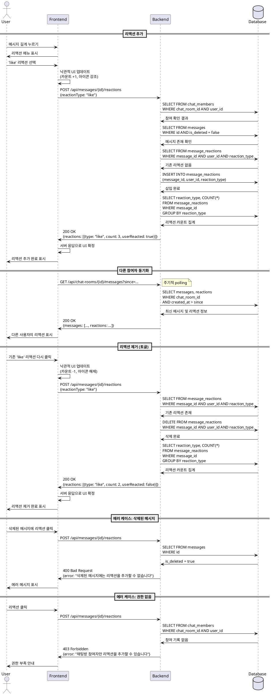

# 메시지 리액션 (Message Reaction)

## Primary Actor
- 채팅방 참여자 (로그인된 사용자)

## Precondition
- 사용자가 로그인되어 있어야 한다.
- 사용자가 채팅방에 참여하고 있어야 한다.
- 리액션을 추가할 메시지가 존재하고 삭제되지 않았어야 한다.

## Trigger
- 사용자가 메시지를 길게 누르거나 옵션 메뉴를 열어 리액션 기능을 선택한다.
- 사용자가 제공된 리액션 아이콘(like, bookmark, empathy)을 클릭한다.

## Main Scenario

### 1. 리액션 추가
1. 사용자가 채팅방에서 메시지를 길게 누르거나 옵션 메뉴를 연다.
2. 시스템이 리액션 선택 UI(like, bookmark, empathy)를 표시한다.
3. 사용자가 원하는 리액션 타입을 선택한다.
4. 클라이언트가 메시지 ID, 사용자 ID, 리액션 타입을 서버에 전송한다.
5. 서버가 다음을 검증한다:
   - 사용자의 채팅방 참여 여부
   - 메시지 존재 여부 및 삭제 상태
   - 사용자 권한
6. 서버가 `message_reactions` 테이블에서 동일한 (message_id, user_id, reaction_type) 조합을 확인한다.
7. 리액션이 존재하지 않으면 새로운 레코드를 삽입한다.
8. 서버가 업데이트된 리액션 정보를 응답으로 반환한다.
9. 클라이언트가 해당 메시지의 리액션 아이콘과 카운트를 즉시 갱신한다.
10. 다른 참여자들은 다음 polling 응답에서 갱신된 리액션 정보를 받아 UI를 업데이트한다.

### 2. 리액션 제거 (토글)
1. 사용자가 이미 리액션을 추가한 메시지에서 동일한 리액션을 다시 선택한다.
2. 클라이언트가 메시지 ID, 사용자 ID, 리액션 타입을 서버에 전송한다.
3. 서버가 검증 후 `message_reactions` 테이블에서 해당 레코드를 확인한다.
4. 리액션이 이미 존재하면 해당 레코드를 삭제한다.
5. 서버가 업데이트된 리액션 정보를 응답으로 반환한다.
6. 클라이언트가 해당 메시지의 리액션 카운트를 감소시키고 UI를 갱신한다.
7. 다른 참여자들도 polling을 통해 동일한 변경사항을 반영한다.

## Alternative Flows

### A1. 같은 메시지에 다른 타입의 리액션 추가
1. 사용자가 이미 'like' 리액션을 추가한 메시지에 'bookmark' 리액션을 추가한다.
2. 서버는 (message_id, user_id)는 같지만 reaction_type이 다른 새로운 레코드를 생성한다.
3. 메시지에 여러 타입의 리액션이 동시에 표시된다.

### A2. 삭제된 메시지에 리액션 시도
1. 사용자가 삭제된 메시지에 리액션을 시도한다.
2. 서버가 메시지의 `is_deleted` 플래그를 확인하고 실패 응답을 반환한다.
3. 클라이언트가 "삭제된 메시지에는 리액션을 추가할 수 없습니다" 안내를 표시한다.

### A3. 권한 없는 채팅방의 메시지에 리액션 시도
1. 사용자가 더 이상 참여하지 않는 채팅방의 메시지에 리액션을 시도한다.
2. 서버가 `chat_members` 테이블에서 참여 여부를 확인하고 실패 응답을 반환한다.
3. 클라이언트가 "채팅방에 참여하지 않아 리액션을 추가할 수 없습니다" 안내를 표시한다.

## Edge Cases

### E1. 동시 리액션 요청
- **문제**: 같은 사용자가 빠르게 여러 번 같은 리액션을 클릭하는 경우
- **처리**:
  - 서버는 (message_id, user_id, reaction_type) 복합 기본 키로 중복 삽입을 자동 방지
  - 클라이언트는 요청 중 상태를 표시하고 중복 클릭을 비활성화
  - 멱등 처리로 동일 요청은 동일 결과를 반환

### E2. 리액션 카운트 불일치
- **문제**: 네트워크 지연이나 polling 간격으로 인한 카운트 불일치
- **처리**:
  - 서버는 항상 데이터베이스에서 실시간 카운트를 집계하여 응답
  - 클라이언트는 서버 응답을 신뢰할 수 있는 소스로 간주
  - Polling 응답에 전체 리액션 정보를 포함하여 동기화

### E3. 네트워크 오류
- **문제**: 리액션 추가/제거 요청 중 네트워크 실패
- **처리**:
  - 클라이언트는 낙관적 UI 업데이트 후 서버 응답을 대기
  - 실패 시 이전 상태로 롤백하고 재시도 옵션 제공
  - 타임아웃 시 로컬 상태를 복원하고 사용자에게 안내

### E4. 리액션 타입 제한
- **문제**: 지원하지 않는 리액션 타입 전송
- **처리**:
  - 클라이언트는 허용된 타입만 UI에 표시
  - 서버는 `reaction_type` 체크 제약으로 유효하지 않은 타입 거부
  - 실패 응답과 함께 유효한 타입 목록 반환

### E5. 연속 리액션
- **문제**: 사용자가 여러 메시지에 빠르게 연속으로 리액션 추가
- **처리**:
  - 각 리액션 요청을 독립적으로 처리
  - 클라이언트는 비동기로 병렬 요청 가능
  - 각 메시지별로 UI 상태를 개별 관리

## Postconditions

### 성공 시
- `message_reactions` 테이블에 리액션이 추가되거나 제거된다.
- 해당 메시지의 리액션 카운트가 즉시 갱신된다.
- 모든 채팅방 참여자가 다음 polling에서 동일한 리액션 상태를 확인한다.
- UI에 리액션 아이콘과 카운트가 정확하게 표시된다.

### 실패 시
- 데이터베이스 상태가 변경되지 않는다.
- 사용자에게 실패 사유가 명확하게 전달된다.
- 클라이언트 UI는 이전 상태를 유지하거나 롤백한다.

## Business Rules

### BR1. 리액션 타입
- 지원되는 리액션 타입: `like`, `bookmark`, `empathy`
- 각 타입은 명확한 의미와 아이콘을 가진다.
- 향후 타입 추가 시 데이터베이스 체크 제약을 업데이트해야 한다.

### BR2. 리액션 중복 방지
- 사용자는 하나의 메시지에 같은 타입의 리액션을 한 번만 추가할 수 있다.
- (message_id, user_id, reaction_type) 복합 기본 키로 강제한다.
- 같은 타입을 다시 선택하면 리액션이 제거된다(토글).

### BR3. 다중 리액션 허용
- 사용자는 하나의 메시지에 여러 타입의 리액션을 동시에 추가할 수 있다.
- 예: like와 bookmark를 동시에 추가 가능

### BR4. 채팅방 참여 제한
- 채팅방에 참여하지 않은 사용자는 메시지에 리액션을 추가할 수 없다.
- `chat_members` 테이블에서 참여 여부를 확인한다.

### BR5. 삭제된 메시지 제한
- 삭제된 메시지(`is_deleted = true`)에는 리액션을 추가할 수 없다.
- 기존에 추가된 리액션은 메시지 삭제 시에도 유지된다.

### BR6. 멱등 처리
- 동일한 리액션 추가 요청은 여러 번 전송되어도 같은 결과를 반환한다.
- 리액션 제거 요청도 멱등하게 처리된다.

### BR7. 실시간 동기화
- 리액션 변경사항은 polling을 통해 모든 참여자에게 전달된다.
- Polling 응답에 메시지별 리액션 타입과 카운트를 포함한다.

### BR8. 카운트 정확성
- 리액션 카운트는 항상 데이터베이스 집계 결과를 기준으로 한다.
- 클라이언트 캐시보다 서버 응답을 우선한다.

## UI/UX 고려사항

### UX1. 직관적 인터페이스
- 메시지 하단이나 옆에 리액션 아이콘을 명확하게 표시한다.
- 각 리액션 타입별 아이콘과 색상을 일관되게 유지한다.
- 현재 사용자가 추가한 리액션은 시각적으로 강조한다(예: 색상 채움).

### UX2. 리액션 추가 방식
- **방법 1**: 메시지 길게 누르기 → 리액션 메뉴 표시
- **방법 2**: 메시지에 항상 표시된 리액션 아이콘 클릭
- 두 방법 모두 지원하여 사용자 편의성 향상

### UX3. 실시간 피드백
- 리액션 클릭 즉시 UI를 낙관적으로 업데이트한다.
- 서버 응답 대기 중 로딩 상태를 표시한다.
- 실패 시 애니메이션과 함께 이전 상태로 되돌린다.

### UX4. 카운트 표시
- 각 리액션 타입별 카운트를 아이콘 옆에 표시한다.
- 카운트가 많을 경우 축약 표시(예: 99+)를 고려한다.
- 카운트 변경 시 부드러운 애니메이션 적용

### UX5. 리액션 목록 보기
- 리액션 카운트를 클릭하면 해당 리액션을 추가한 사용자 목록을 표시한다.
- 목록에는 닉네임과 프로필 이미지를 포함한다.

### UX6. 토글 동작 안내
- 같은 리액션을 다시 클릭하면 제거된다는 것을 시각적으로 안내한다.
- 첫 사용 시 툴팁이나 가이드를 제공할 수 있다.

### UX7. 접근성
- 리액션 버튼에 명확한 레이블과 alt text를 제공한다.
- 키보드 네비게이션을 지원한다.
- 스크린 리더 사용자를 위한 적절한 aria 속성을 추가한다.

## 데이터 요구사항

### message_reactions 테이블
```sql
CREATE TABLE message_reactions (
  message_id UUID NOT NULL REFERENCES messages(id) ON DELETE CASCADE,
  user_id UUID NOT NULL REFERENCES users(id) ON DELETE CASCADE,
  reaction_type TEXT NOT NULL CHECK (reaction_type IN ('like', 'bookmark', 'empathy')),
  created_at TIMESTAMPTZ DEFAULT NOW(),
  updated_at TIMESTAMPTZ DEFAULT NOW(),
  PRIMARY KEY (message_id, user_id, reaction_type)
);

CREATE INDEX idx_message_reactions_message ON message_reactions(message_id);
CREATE INDEX idx_message_reactions_user ON message_reactions(user_id);
```

### 리액션 조회 쿼리
```sql
-- 메시지별 리액션 카운트
SELECT
  message_id,
  reaction_type,
  COUNT(*) as count
FROM message_reactions
WHERE message_id = ?
GROUP BY message_id, reaction_type;

-- 사용자별 리액션 확인
SELECT reaction_type
FROM message_reactions
WHERE message_id = ? AND user_id = ?;

-- 특정 리액션을 추가한 사용자 목록
SELECT u.id, u.nickname, u.profile_image_url
FROM message_reactions mr
JOIN users u ON mr.user_id = u.id
WHERE mr.message_id = ? AND mr.reaction_type = ?
ORDER BY mr.created_at DESC;
```

## API 명세

### POST /api/messages/{messageId}/reactions
**설명**: 메시지에 리액션 추가 (이미 존재하면 토글로 제거)

**요청**:
```json
{
  "reactionType": "like"
}
```

**응답 (201 Created / 200 OK)**:
```json
{
  "success": true,
  "data": {
    "messageId": "uuid",
    "reactions": [
      {
        "type": "like",
        "count": 3,
        "userReacted": true
      },
      {
        "type": "bookmark",
        "count": 1,
        "userReacted": false
      }
    ]
  }
}
```

### DELETE /api/messages/{messageId}/reactions/{reactionType}
**설명**: 특정 리액션 제거

**응답 (200 OK)**:
```json
{
  "success": true,
  "data": {
    "messageId": "uuid",
    "reactions": [
      {
        "type": "bookmark",
        "count": 1,
        "userReacted": false
      }
    ]
  }
}
```

### GET /api/messages/{messageId}/reactions
**설명**: 메시지의 모든 리액션 조회

**응답 (200 OK)**:
```json
{
  "success": true,
  "data": {
    "reactions": [
      {
        "type": "like",
        "count": 5,
        "users": [
          {
            "userId": "uuid",
            "nickname": "김민준",
            "profileImageUrl": "https://picsum.photos/200"
          }
        ]
      }
    ]
  }
}
```

## Sequence Diagram



## 테스트 시나리오

### TS1. 정상 흐름
1. 사용자가 채팅방의 메시지에 'like' 리액션을 추가한다.
2. 리액션이 성공적으로 저장되고 카운트가 표시된다.
3. 같은 메시지에 'bookmark' 리액션을 추가한다.
4. 두 리액션이 모두 표시된다.

### TS2. 토글 동작
1. 사용자가 메시지에 'like' 리액션을 추가한다.
2. 같은 리액션을 다시 클릭한다.
3. 리액션이 제거되고 카운트가 감소한다.

### TS3. 동시 리액션
1. 여러 사용자가 동시에 같은 메시지에 리액션을 추가한다.
2. 모든 리액션이 정확하게 저장된다.
3. 카운트가 정확하게 집계된다.

### TS4. 삭제된 메시지
1. 사용자가 메시지를 삭제한다.
2. 다른 사용자가 삭제된 메시지에 리액션을 시도한다.
3. 에러 메시지가 표시되고 리액션이 추가되지 않는다.

### TS5. 권한 없음
1. 사용자가 채팅방에서 나간다.
2. 나간 채팅방의 메시지에 리액션을 시도한다.
3. 권한 부족 에러가 반환된다.

### TS6. 네트워크 오류
1. 네트워크 연결을 끊는다.
2. 리액션을 추가한다.
3. 낙관적 UI는 업데이트되지만 서버 저장은 실패한다.
4. 네트워크 복구 후 재시도하여 성공한다.

## 성능 고려사항

### P1. 인덱스 최적화
- `message_id`와 `user_id`에 인덱스를 생성하여 조회 성능 향상
- 복합 기본 키로 중복 확인 성능 최적화

### P2. 카운트 캐싱
- 자주 조회되는 리액션 카운트를 Redis 등에 캐싱 고려
- 캐시 무효화 전략 수립 필요

### P3. Polling 최적화
- Polling 응답에 변경된 메시지의 리액션만 포함
- `since` 타임스탬프 기반 증분 업데이트

### P4. 배치 조회
- 여러 메시지의 리액션을 한 번의 쿼리로 조회
- N+1 문제 방지

### P5. 데이터베이스 부하
- 리액션 추가/제거 시 트랜잭션 최소화
- 카운트 집계 쿼리 최적화
