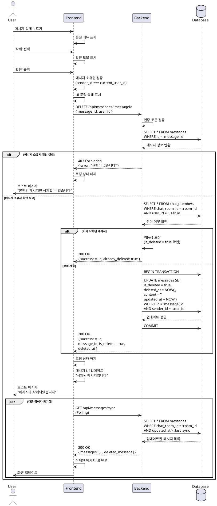

# 유스케이스 007: 메시지 삭제 (Delete Message)

## 1. 기능 개요
메시지 작성자가 자신이 보낸 메시지를 채팅방에서 삭제할 수 있는 기능입니다. 삭제된 메시지는 소프트 삭제(Soft Delete) 방식으로 처리되며, 데이터베이스에서 완전히 제거되지 않고 `is_deleted` 플래그로 표시됩니다. 삭제된 메시지는 다른 참여자에게 "삭제된 메시지입니다"로 표시되며, 답장 관계는 유지됩니다.

## 2. Primary Actor
- **메시지 작성자**: 자신이 보낸 메시지를 삭제하려는 사용자

## 3. Preconditions (사전 조건)
- 사용자가 로그인되어 있어야 합니다.
- 사용자가 채팅방에 참여하고 있어야 합니다.
- 삭제하려는 메시지의 작성자여야 합니다 (본인 메시지만 삭제 가능).
- 메시지가 이미 삭제되지 않은 상태여야 합니다.

## 4. Trigger (트리거)
사용자가 자신이 보낸 메시지를 길게 누르거나 옵션 메뉴를 열어 '삭제' 기능을 선택합니다.

## 5. Main Scenario (기본 흐름)

### 5.1 사용자 인터랙션
1. 사용자가 채팅방에서 자신이 보낸 메시지를 길게 누르거나 옵션 메뉴를 엽니다.
2. 표시된 옵션 메뉴에서 '삭제' 버튼을 선택합니다.
3. 확인 모달이 표시되면 "삭제하시겠습니까?" 메시지를 확인합니다.
4. 사용자가 '확인' 버튼을 클릭하여 삭제를 승인합니다.

### 5.2 클라이언트 처리
1. 메시지 소유권을 확인합니다 (`sender_id === current_user_id`).
2. 삭제 진행 중 상태를 UI에 반영합니다 (로딩 인디케이터 표시).
3. 서버에 DELETE 요청을 전송합니다:
   - 엔드포인트: `DELETE /api/messages/:messageId`
   - 헤더: 인증 토큰
   - 바디: `{ message_id, user_id }`

### 5.3 서버 처리
1. 요청 인증 및 권한 확인:
   - 사용자 인증 토큰 검증
   - 메시지 존재 여부 확인
   - 메시지 소유권 확인 (`messages.sender_id === authenticated_user_id`)
   - 채팅방 참여 여부 확인 (`chat_members` 테이블)

2. 비즈니스 로직 실행:
   - 이미 삭제된 메시지인지 확인 (`is_deleted === true`)
   - 멱등성 보장: 이미 삭제된 경우에도 성공 응답 반환

3. 데이터베이스 업데이트 (트랜잭션):
   ```sql
   UPDATE messages
   SET
     is_deleted = true,
     deleted_at = NOW(),
     content = '',
     updated_at = NOW()
   WHERE id = :message_id
     AND sender_id = :user_id
     AND is_deleted = false;
   ```

4. 성공 응답 반환:
   ```json
   {
     "success": true,
     "data": {
       "message_id": "uuid",
       "is_deleted": true,
       "deleted_at": "2025-10-17T12:34:56Z"
     }
   }
   ```

### 5.4 클라이언트 상태 업데이트
1. 서버 응답을 받아 로컬 메시지 상태를 갱신합니다.
2. 해당 메시지를 "삭제된 메시지입니다" 텍스트로 표시합니다.
3. 메시지의 원본 콘텐츠, 첨부파일 버튼, 리액션 버튼을 숨깁니다.
4. 답장 구조는 유지하되 원본 내용을 "삭제된 메시지" 텍스트로 대체합니다.

### 5.5 동기화 (Polling)
1. 다른 참여자는 다음 polling 요청 시 삭제된 메시지 정보를 받습니다.
2. 응답에 포함된 `is_deleted: true` 플래그를 확인하여 UI를 업데이트합니다.
3. 모든 클라이언트에서 동일한 "삭제된 메시지입니다" 표시가 나타납니다.

## 6. Alternative Flows (대체 흐름)

### 6.1 권한 부족
- **조건**: 다른 사용자의 메시지를 삭제하려고 시도
- **처리**:
  - 서버가 `403 Forbidden` 응답 반환
  - 클라이언트가 "본인의 메시지만 삭제할 수 있습니다" 토스트 메시지 표시
  - 원본 메시지는 변경되지 않음

### 6.2 이미 삭제된 메시지
- **조건**: 이미 `is_deleted = true`인 메시지 삭제 시도
- **처리**:
  - 서버가 멱등성을 보장하며 `200 OK` 성공 응답 반환
  - 클라이언트는 추가 UI 변경 없이 현재 상태 유지

### 6.3 메시지 미존재
- **조건**: 존재하지 않는 메시지 ID로 삭제 요청
- **처리**:
  - 서버가 `404 Not Found` 응답 반환
  - 클라이언트가 "메시지를 찾을 수 없습니다" 에러 메시지 표시
  - 메시지 목록 새로고침 유도

### 6.4 삭제 취소
- **조건**: 사용자가 확인 모달에서 '취소' 버튼 클릭
- **처리**:
  - 모달 닫기
  - 서버 요청 전송하지 않음
  - 메시지 상태 변경 없음

## 7. Exception Flows (예외 흐름)

### 7.1 네트워크 실패
- **상황**: 삭제 요청 중 네트워크 연결 끊김 또는 타임아웃
- **처리**:
  - 클라이언트가 로딩 상태 해제
  - "네트워크 오류가 발생했습니다. 다시 시도해주세요" 에러 메시지 표시
  - 재시도 버튼 제공
  - 로컬 상태를 원본 메시지로 롤백

### 7.2 동시 삭제 요청
- **상황**: 동일 메시지에 대해 거의 동시에 두 번의 삭제 요청 발생
- **처리**:
  - 데이터베이스 트랜잭션으로 첫 번째 요청만 실제 업데이트 수행
  - 두 번째 요청은 이미 삭제된 상태를 확인하고 멱등 응답 반환
  - 양쪽 클라이언트 모두 성공으로 처리

### 7.3 서버 에러 (5xx)
- **상황**: 데이터베이스 연결 실패, 내부 서버 오류
- **처리**:
  - 서버가 `500 Internal Server Error` 응답 반환
  - 클라이언트가 "일시적인 오류가 발생했습니다" 메시지 표시
  - 자동 재시도 (최대 3회, exponential backoff)
  - 재시도 실패 시 사용자에게 지원 경로 안내

### 7.4 세션 만료
- **상황**: 삭제 요청 중 인증 토큰 만료
- **처리**:
  - 서버가 `401 Unauthorized` 응답 반환
  - 클라이언트가 자동으로 토큰 갱신 시도
  - 갱신 성공 시 삭제 요청 재실행
  - 갱신 실패 시 로그인 페이지로 리다이렉트

## 8. Postconditions (사후 조건)
- `messages` 테이블에서 해당 메시지의 `is_deleted` 플래그가 `true`로 설정됩니다.
- `deleted_at` 타임스탬프가 기록됩니다.
- `content` 필드가 빈 문자열로 업데이트됩니다.
- 첨부파일은 `message_attachments` 테이블에 유지되지만 UI에서 노출되지 않습니다.
- 리액션은 `message_reactions` 테이블에 유지되지만 UI에서 숨겨집니다.
- 답장 관계(`reply_to_message_id`)는 유지되며, 답장된 메시지에서 원본을 "삭제된 메시지"로 표시합니다.
- 모든 채팅방 참여자에게 동일한 삭제 상태가 반영됩니다.

## 9. Business Rules (비즈니스 규칙)

### 9.1 소유권 규칙
- 메시지는 오직 작성자 본인만 삭제할 수 있습니다.
- 채팅방 관리자나 다른 참여자는 타인의 메시지를 삭제할 수 없습니다.

### 9.2 소프트 삭제 정책
- 삭제된 메시지는 데이터베이스에서 물리적으로 제거되지 않습니다.
- `is_deleted` 플래그와 `deleted_at` 타임스탬프로 삭제 상태를 관리합니다.
- 콘텐츠는 비워지지만 메시지 ID와 메타데이터는 유지됩니다.

### 9.3 멱등성 보장
- 동일 메시지에 대한 중복 삭제 요청은 항상 성공 응답을 반환합니다.
- 이미 삭제된 메시지를 다시 삭제 시도해도 에러가 발생하지 않습니다.

### 9.4 답장 관계 유지
- 삭제된 메시지에 대한 답장은 유지됩니다.
- 답장 메시지에서 원본 메시지는 "삭제된 메시지입니다"로 표시됩니다.
- 삭제된 메시지에 새로운 답장은 생성할 수 없습니다 (UI에서 답장 버튼 비활성화).

### 9.5 리액션 처리
- 삭제된 메시지의 기존 리액션은 데이터베이스에 유지됩니다.
- UI에서는 리액션이 표시되지 않습니다.
- 삭제된 메시지에 새로운 리액션을 추가할 수 없습니다.

### 9.6 채팅 목록 반영
- 삭제된 메시지가 채팅방의 마지막 메시지인 경우:
  - 채팅 목록에서 해당 채팅방의 미리보기는 "삭제된 메시지입니다"로 표시됩니다.
  - 이전 메시지를 미리보기로 사용하지 않습니다 (구현 복잡도 고려).

### 9.7 삭제 시간 제한 없음
- 메시지 삭제에 시간 제한을 두지 않습니다.
- 과거에 보낸 메시지도 언제든 삭제 가능합니다.

## 10. UI/UX 고려사항

### 10.1 삭제 확인 모달
- **제목**: "메시지 삭제"
- **내용**: "이 메시지를 삭제하시겠습니까? 삭제된 메시지는 모든 참여자에게 '삭제된 메시지입니다'로 표시됩니다."
- **버튼**:
  - 주 버튼: "삭제" (빨간색, 위험 강조)
  - 부 버튼: "취소" (회색)

### 10.2 삭제 진행 중 표시
- 메시지에 반투명 오버레이와 스피너 표시
- 다른 상호작용 버튼 비활성화

### 10.3 삭제된 메시지 표시
- 텍스트: "삭제된 메시지입니다" (이탤릭체, 회색)
- 아이콘: 휴지통 아이콘 또는 금지 아이콘 (선택적)
- 배경: 약간 어두운 배경 또는 점선 테두리
- 작성자 정보와 타임스탬프는 유지
- 첨부파일, 리액션, 답장 버튼은 모두 숨김

### 10.4 답장 컨텍스트에서 삭제된 메시지
- 답장된 메시지에서 원본 인용 영역:
  - "삭제된 메시지입니다" 텍스트 표시
  - 원본 내용은 표시하지 않음
  - 클릭해도 원본 메시지로 스크롤하지 않음

### 10.5 토스트 메시지
- 성공: "메시지가 삭제되었습니다" (2초간 표시)
- 실패: 구체적인 에러 메시지 (예: "권한이 없습니다", "네트워크 오류가 발생했습니다")

### 10.6 접근성
- 삭제 버튼에 명확한 aria-label 제공: "메시지 삭제"
- 확인 모달에서 키보드 네비게이션 지원 (Tab, Enter, Esc)
- 스크린 리더 사용자를 위한 삭제 완료 알림

## 11. 데이터 요구사항

### 11.1 messages 테이블 구조
```sql
CREATE TABLE messages (
  id uuid PRIMARY KEY DEFAULT gen_random_uuid(),
  chat_room_id uuid NOT NULL REFERENCES chat_rooms(id),
  sender_id uuid NOT NULL REFERENCES users(id),
  message_type text NOT NULL CHECK (message_type IN ('text', 'emoji', 'file', 'system')),
  content text,
  reply_to_message_id uuid REFERENCES messages(id),
  is_deleted boolean NOT NULL DEFAULT false,
  deleted_at timestamptz,
  created_at timestamptz NOT NULL DEFAULT NOW(),
  updated_at timestamptz NOT NULL DEFAULT NOW()
);
```

### 11.2 인덱스
- `CREATE INDEX idx_messages_chat_room_created ON messages(chat_room_id, created_at);`
- `CREATE INDEX idx_messages_is_deleted ON messages(is_deleted) WHERE is_deleted = true;`

### 11.3 제약 조건
- `is_deleted`가 `true`이면 `deleted_at`은 NOT NULL이어야 합니다.
- `deleted_at`이 설정되면 `content`는 빈 문자열이어야 합니다.
- `deleted_at`은 `created_at`보다 나중이어야 합니다.

### 11.4 조회 쿼리
```sql
-- 채팅방의 모든 메시지 조회 (삭제 상태 포함)
SELECT
  id,
  sender_id,
  message_type,
  CASE
    WHEN is_deleted THEN ''
    ELSE content
  END as content,
  reply_to_message_id,
  is_deleted,
  deleted_at,
  created_at
FROM messages
WHERE chat_room_id = :chat_room_id
ORDER BY created_at ASC;
```

## 12. Sequence Diagram



## 13. 성능 고려사항

### 13.1 인덱스 최적화
- `is_deleted` 부분 인덱스로 삭제된 메시지 조회 최적화
- `chat_room_id`, `created_at` 복합 인덱스로 메시지 목록 조회 성능 보장

### 13.2 캐싱 전략
- 삭제된 메시지 정보는 클라이언트 로컬 스토리지에 캐싱
- 다음 세션에서도 삭제 상태 유지

### 13.3 동시성 제어
- 데이터베이스 트랜잭션으로 동시 삭제 요청 안전하게 처리
- Optimistic Locking 대신 `updated_at` 타임스탬프로 충돌 감지

## 14. 보안 고려사항

### 14.1 권한 검증
- 서버 측에서 반드시 메시지 소유권 재검증
- 클라이언트 측 검증만으로는 부족 (위조 가능)

### 14.2 SQL Injection 방지
- Prepared Statement 사용
- 사용자 입력을 직접 쿼리에 삽입하지 않음

### 14.3 Rate Limiting
- 동일 사용자의 과도한 삭제 요청 제한
- IP 기반 또는 사용자 ID 기반 Rate Limit 적용

## 15. 테스트 시나리오

### 15.1 기본 기능 테스트
- 본인 메시지 삭제 성공
- 삭제된 메시지 UI 정상 표시
- 다른 참여자 화면에 삭제 상태 반영

### 15.2 권한 테스트
- 타인 메시지 삭제 시도 차단
- 채팅방 비참여자의 메시지 삭제 차단

### 15.3 엣지 케이스 테스트
- 이미 삭제된 메시지 재삭제 (멱등성)
- 존재하지 않는 메시지 ID로 삭제 시도
- 네트워크 타임아웃 시나리오
- 동시 삭제 요청 처리

### 15.4 답장 관계 테스트
- 삭제된 메시지에 대한 기존 답장 유지
- 삭제된 메시지에 새 답장 불가

### 15.5 성능 테스트
- 대량 메시지 중 특정 메시지 삭제 성능
- 동시 다수 사용자 삭제 요청 처리

## 16. 향후 개선 방안

### 16.1 복구 기능
- 삭제 후 일정 시간 내 복구 기능 추가
- "실행 취소" 버튼으로 즉시 복구

### 16.2 삭제 이력 관리
- 관리자용 삭제 이력 로그 테이블 생성
- 감사 추적(Audit Trail) 목적

### 16.3 하드 삭제 정책
- 일정 기간(예: 30일) 경과 후 자동 하드 삭제
- 배치 작업으로 오래된 삭제 메시지 정리

### 16.4 삭제 알림
- 메시지 삭제 시 답장한 사용자에게 알림
- "답장한 메시지가 삭제되었습니다" 푸시 알림

### 16.5 대량 삭제
- 여러 메시지를 한 번에 선택하여 삭제
- 채팅방 전체 메시지 삭제 (본인 메시지만)
