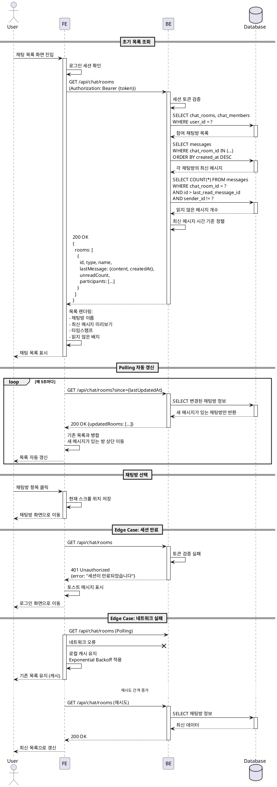

# 유스케이스 008: 채팅 목록 조회

## Primary Actor
- 로그인한 사용자

## Precondition
- 사용자가 로그인되어 있고 유효한 세션을 보유한 상태
- 사용자가 최소 한 개 이상의 채팅방에 참여했거나, 참여하지 않은 경우 빈 목록이 표시됨

## Trigger
- 사용자가 로그인 후 채팅 목록 화면으로 진입
- 상단 탭에서 채팅 목록 화면으로 전환
- 앱을 백그라운드에서 포그라운드로 복귀
- 수동 새로고침 버튼 클릭
- 자동 갱신 주기(Polling) 도래

## Main Scenario

### 1. 초기 목록 조회
1. 사용자가 채팅 목록 화면으로 진입
2. FE는 로그인 세션을 확인하고 채팅 목록 조회 API 요청 전송
3. BE는 세션 토큰을 검증하고 사용자 ID를 추출
4. BE는 다음 정보를 데이터베이스에서 조회:
   - 사용자가 참여한 모든 채팅방 목록 (chat_rooms, chat_members)
   - 각 채팅방의 최신 메시지 내용 및 시간 (messages)
   - 각 채팅방의 읽지 않은 메시지 개수 (last_read_message_id 기준)
   - 채팅방 타입 (direct/group)과 참여자 정보
5. BE는 최신 메시지 시간 기준으로 내림차순 정렬된 목록을 반환
6. FE는 응답 데이터를 렌더링:
   - 채팅방 이름/참여자 닉네임
   - 최신 메시지 미리보기 (삭제된 메시지는 "삭제된 메시지입니다" 표시)
   - 최신 메시지 타임스탬프 (상대 시간 표시: "방금 전", "3분 전", "어제" 등)
   - 읽지 않은 메시지 개수 배지 (0이면 숨김)
   - 프로필 이미지 (1:1은 상대방, 그룹은 기본 이미지)

### 2. 자동 갱신 (Polling)
1. FE는 일정 주기(예: 5초)마다 채팅 목록 갱신 요청 전송
2. BE는 변경된 채팅방 정보만 반환 (최적화):
   - 마지막 조회 이후 새 메시지가 있는 채팅방
   - 읽음 상태가 변경된 채팅방
   - 삭제되거나 나간 채팅방
3. FE는 변경사항을 기존 목록에 병합하여 최신 상태 유지
4. 새 메시지가 있는 채팅방은 목록 최상단으로 재정렬

### 3. 채팅방 선택
1. 사용자가 특정 채팅방 항목을 클릭
2. FE는 현재 스크롤 위치를 저장
3. 선택된 채팅방 화면으로 이동
4. 채팅 목록으로 돌아올 때 저장된 스크롤 위치로 복원

### 4. 검색 및 필터 (선택적 기능)
1. 사용자가 검색창에 키워드 입력
2. FE는 로컬에서 채팅방 이름 또는 최신 메시지 내용 기준으로 필터링
3. 필터링된 결과를 실시간으로 표시
4. 검색 해제 시 전체 목록 복원

## Edge Cases

### 1. 빈 목록
- **상황**: 사용자가 어떤 채팅방에도 참여하지 않은 경우
- **처리**:
  - 안내 메시지 표시: "아직 참여한 채팅방이 없습니다"
  - "새 채팅 시작" 버튼을 강조하여 유도

### 2. 세션 만료
- **상황**: 조회 중 세션이 만료되어 401 Unauthorized 응답
- **처리**:
  - 토스트 메시지로 "로그인이 만료되었습니다" 안내
  - 로그인 화면으로 자동 이동
  - 이전 경로를 저장하여 재로그인 후 복귀 가능하도록 지원

### 3. 네트워크 실패
- **상황**: 초기 조회 또는 Polling 중 네트워크 오류 발생
- **처리**:
  - 초기 조회 실패 시: 오류 메시지와 재시도 버튼 표시
  - Polling 실패 시: 로컬 캐시 유지, 백그라운드에서 재시도 (Exponential Backoff)
  - 네트워크 복구 시 자동으로 최신 데이터 동기화

### 4. 동시성 충돌
- **상황**: 여러 기기에서 동시에 채팅방을 나가거나 메시지를 읽음 처리
- **처리**:
  - 서버에서 최신 타임스탬프 기준으로 상태 병합
  - 클라이언트는 충돌 시 서버 응답을 신뢰하여 덮어쓰기

### 5. 삭제된 채팅방
- **상황**: Polling 응답에 사용자가 나간 채팅방 정보 포함
- **처리**:
  - 해당 채팅방을 목록에서 제거
  - 현재 선택된 채팅방이라면 목록 화면으로 강제 이동
  - 토스트 메시지로 "채팅방에서 나갔습니다" 안내

### 6. 과도한 미읽음 메시지
- **상황**: 읽지 않은 메시지가 999개를 초과
- **처리**:
  - 배지에 "999+" 형태로 표시하여 UI 깨짐 방지

### 7. 긴 메시지 미리보기
- **상황**: 최신 메시지가 200자 이상의 긴 텍스트
- **처리**:
  - 50자까지만 표시하고 "..." 처리
  - 줄바꿈은 공백으로 치환하여 한 줄로 표시

### 8. 프로필 이미지 로드 실패
- **상황**: 프로필 이미지 URL이 유효하지 않거나 로드 실패
- **처리**:
  - 기본 아바타 이미지로 대체
  - 백그라운드에서 재시도 (3회 제한)

## Business Rules

### BR-1: 정렬 우선순위
- 최신 메시지 타임스탬프 기준 내림차순 정렬
- 메시지가 없는 채팅방은 생성 시간 기준 정렬
- 고정(Pin) 기능이 추가되면 고정된 채팅방이 최상단 우선

### BR-2: 읽지 않은 개수 계산
- `last_read_message_id` 이후 생성된 메시지 개수로 계산
- 본인이 보낸 메시지는 제외
- 삭제된 메시지는 카운트에서 제외

### BR-3: 채팅방 이름 표시
- **1:1 채팅**: 상대방 닉네임 표시
- **그룹 채팅**:
  - 이름이 설정된 경우 해당 이름 사용
  - 이름이 없는 경우 참여자 닉네임을 쉼표로 연결 (최대 3명까지, 이후는 "외 N명")

### BR-4: 메시지 미리보기 규칙
- **텍스트 메시지**: 본문 내용 표시 (50자 제한)
- **이모지 메시지**: 이모지 원본 표시
- **파일 메시지**: "[파일] 파일명" 형태로 표시
- **시스템 메시지**: 내용 그대로 표시
- **삭제된 메시지**: "삭제된 메시지입니다" 고정 텍스트

### BR-5: Polling 주기
- 기본 주기: 5초
- 네트워크 실패 시 Exponential Backoff: 5초 → 10초 → 20초 (최대 60초)
- 앱이 백그라운드 상태일 때는 Polling 중단
- 포그라운드 복귀 시 즉시 갱신 요청

### BR-6: 캐시 정책
- 채팅 목록은 메모리 캐시로 유지 (React Query 기본 동작)
- 앱 재시작 시 초기 조회 필수
- Stale Time: 0초 (항상 최신 상태 유지 지향)
- Cache Time: 5분 (백그라운드 데이터 보존)

### BR-7: 권한 관리
- 채팅방에서 나간 경우 목록에서 즉시 제거
- 차단된 사용자와의 1:1 채팅은 목록에 유지되지만 메시지 전송 불가 표시
- 비활성화/탈퇴한 사용자와의 채팅방은 유지되지만 "[탈퇴한 사용자]" 표시

## Sequence Diagram



## Data Requirements

### 요청 데이터
- **초기 조회**:
  - Authorization Header (Bearer 토큰)
  - Query Parameter (선택): `limit`, `offset` (페이지네이션용)

- **Polling 갱신**:
  - Authorization Header
  - Query Parameter: `since` (마지막 조회 타임스탬프, ISO 8601 형식)

### 응답 데이터
```typescript
interface ChatListResponse {
  rooms: ChatRoomItem[]
  hasMore: boolean // 페이지네이션용
  updatedAt: string // 이번 응답 타임스탬프
}

interface ChatRoomItem {
  id: string
  type: 'direct' | 'group'
  name: string | null // 그룹 채팅방 이름
  participants: Participant[] // 1:1은 2명, 그룹은 전체 참여자
  lastMessage: {
    id: string
    content: string
    type: 'text' | 'emoji' | 'file' | 'system'
    senderId: string
    senderNickname: string
    isDeleted: boolean
    createdAt: string // ISO 8601
  } | null // 메시지가 없는 경우 null
  unreadCount: number
  createdAt: string
  updatedAt: string
}

interface Participant {
  id: string
  nickname: string
  profileImageUrl: string
}
```

### 데이터베이스 쿼리 예시
```sql
-- 사용자가 참여한 채팅방 목록 조회
SELECT
  cr.id,
  cr.room_type,
  cr.name,
  cr.created_at,
  cr.updated_at
FROM chat_rooms cr
INNER JOIN chat_members cm ON cr.id = cm.chat_room_id
WHERE cm.user_id = $1
ORDER BY cr.updated_at DESC;

-- 각 채팅방의 최신 메시지 조회
SELECT
  m.id,
  m.content,
  m.message_type,
  m.sender_id,
  m.is_deleted,
  m.created_at,
  u.nickname AS sender_nickname
FROM messages m
INNER JOIN users u ON m.sender_id = u.id
WHERE m.chat_room_id = $1
  AND m.is_deleted = false
ORDER BY m.created_at DESC
LIMIT 1;

-- 읽지 않은 메시지 개수 계산
SELECT COUNT(*) AS unread_count
FROM messages m
WHERE m.chat_room_id = $1
  AND m.sender_id != $2 -- 본인 메시지 제외
  AND m.is_deleted = false
  AND m.id > (
    SELECT last_read_message_id
    FROM chat_members
    WHERE chat_room_id = $1 AND user_id = $2
  );
```

## UI/UX 고려사항

### 1. 시각적 피드백
- 읽지 않은 메시지가 있는 채팅방은 채팅방 이름을 볼드체로 표시
- 새 메시지 도착 시 부드러운 애니메이션으로 목록 상단으로 이동
- 로딩 상태는 스켈레톤 UI로 표시 (초기 로딩 시)
- Polling 갱신 시 로딩 인디케이터 표시하지 않음 (UX 방해 최소화)

### 2. 성능 최적화
- 가상 스크롤 (Virtual Scroll) 적용 (채팅방이 100개 이상인 경우)
- 프로필 이미지는 Lazy Loading
- 목록 아이템은 React.memo로 메모이제이션
- Polling 응답은 변경된 항목만 포함 (Incremental Update)

### 3. 접근성
- 각 채팅방 항목은 키보드로 탐색 가능 (Tab)
- 읽지 않은 메시지 개수는 Screen Reader로 읽힘
- 새 채팅방 알림은 ARIA Live Region으로 공지

### 4. 오프라인 지원
- 네트워크 단절 시 "오프라인 모드" 표시
- 캐시된 데이터로 목록 유지
- 네트워크 복구 시 자동 동기화 및 "다시 연결됨" 토스트

### 5. 빈 상태 (Empty State)
- 아직 채팅방이 없는 경우 일러스트레이션과 안내 메시지
- "새 채팅 시작" 버튼을 CTA로 강조
- 검색 결과가 없는 경우 "검색 결과가 없습니다" 메시지

## 관련 유스케이스
- [003] 새 채팅 생성: 목록에서 "새 채팅 시작" 버튼 클릭 시 연결
- [004] 메시지 전송: 선택한 채팅방에서 메시지 전송
- [009] 채팅방 진입 및 메시지 동기화: 목록에서 채팅방 선택 시 진입

## 참고 문서
- `/docs/prd.md` - 채팅 목록 페이지 요구사항
- `/docs/userflow.md` - 8. 채팅 목록 조회 흐름
- `/docs/database.md` - chat_rooms, chat_members, messages 스키마
