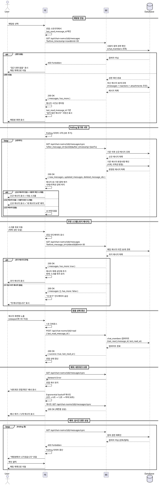

# 유스케이스 009: 채팅방 진입 및 메시지 동기화

## Primary Actor
- 채팅방 참여자 (로그인된 사용자)

## Precondition
- 사용자가 로그인된 상태여야 한다.
- 사용자가 해당 채팅방의 유효한 참여자여야 한다 (chat_members 테이블에 등록).
- 채팅방이 삭제되지 않은 상태여야 한다.

## Trigger
- 사용자가 채팅 목록에서 특정 채팅방을 클릭/탭하여 진입
- 푸시 알림을 통해 채팅방으로 직접 진입
- 딥링크를 통한 채팅방 진입

## Main Scenario

### 1. 채팅방 진입
1. 사용자가 채팅 목록에서 채팅방을 선택한다.
2. FE가 로컬 스토리지에서 마지막으로 본 메시지 ID 또는 타임스탬프를 확인한다.
3. FE가 `/api/chat-rooms/{room_id}/messages` 엔드포인트에 초기 메시지 요청을 보낸다.
   - Query params: `before_timestamp` (현재 시각), `limit` (30)
4. BE가 사용자의 채팅방 참여 권한을 검증한다 (chat_members 테이블 조회).
5. BE가 최신 메시지 30개를 조회한다 (messages, message_reactions, message_attachments 조인).
6. BE가 각 메시지의 답장 정보(reply_to_message_id)를 포함하여 응답한다.
7. FE가 메시지 목록을 시간 순으로 렌더링한다.
8. FE가 사용자의 마지막 읽음 위치(last_read_message_id)를 기준으로 "읽지 않은 메시지" 구분선을 표시한다.

### 2. Polling 기반 실시간 동기화
1. FE가 채팅방 진입 후 즉시 polling 타이머를 시작한다 (기본 주기: 3초).
2. 매 polling 주기마다 FE가 `/api/chat-rooms/{room_id}/messages/sync` 엔드포인트를 호출한다.
   - Query params: `after_message_id` (클라이언트가 가진 마지막 메시지 ID), `after_timestamp` (마지막 메시지 타임스탬프)
3. BE가 해당 기준 이후의 신규 메시지를 조회한다.
4. BE가 기존 메시지의 변경사항도 확인한다:
   - 삭제된 메시지 (is_deleted = true)
   - 리액션 변경 (message_reactions 테이블)
5. FE가 응답받은 데이터를 기존 메시지 목록과 병합한다:
   - 메시지 ID 기준으로 중복 제거
   - 삭제/수정된 메시지 상태 갱신
   - 리액션 카운트 업데이트
6. 신규 메시지가 있고 사용자가 스크롤 하단에 있으면 자동으로 스크롤을 이동한다.
7. 신규 메시지가 있고 사용자가 스크롤 중간에 있으면 "새 메시지 N개" 배지를 표시한다.

### 3. 무한 스크롤 (과거 메시지 로드)
1. 사용자가 메시지 목록을 위로 스크롤하여 상단에 도달한다.
2. FE가 "더 보기" 인디케이터를 표시하고 로딩 상태로 전환한다.
3. FE가 `/api/chat-rooms/{room_id}/messages` 엔드포인트를 호출한다.
   - Query params: `before_message_id` (현재 목록의 가장 오래된 메시지 ID), `limit` (30)
4. BE가 해당 메시지 이전의 과거 메시지 30개를 조회한다.
5. BE가 더 이상 과거 메시지가 없으면 `has_more: false`를 응답에 포함한다.
6. FE가 과거 메시지를 목록 상단에 추가한다.
7. FE가 현재 스크롤 위치를 유지한다 (스크롤 점프 방지).
8. `has_more: false`인 경우 "더 보기" 인디케이터를 숨긴다.

### 4. 읽음 상태 갱신
1. 사용자가 메시지를 화면에서 읽는다 (viewport에 메시지가 일정 시간 이상 노출).
2. FE가 읽은 메시지의 ID를 추적한다.
3. FE가 일정 시간(예: 1초) 디바운스 후 `/api/chat-rooms/{room_id}/read` 엔드포인트를 호출한다.
   - Body: `{ last_read_message_id }`
4. BE가 chat_members 테이블의 `last_read_message_id`와 `last_read_at`을 업데이트한다.
5. 다음 polling 시 다른 참여자에게 읽음 정보가 전달된다 (선택적).

## Alternative Flows

### A1. 채팅방 진입 시 읽지 않은 메시지로 스크롤
- Main Scenario 1-8 이후
- FE가 `last_read_message_id`가 존재하고 해당 메시지가 초기 로드된 목록에 포함되어 있으면:
  1. 해당 메시지 위치로 자동 스크롤
  2. "읽지 않은 메시지" 구분선 표시
- `last_read_message_id`가 초기 목록에 없으면 (너무 오래된 경우):
  1. 가장 최신 메시지로 스크롤
  2. "N개의 읽지 않은 메시지" 배지 표시

### A2. 백그라운드에서 포그라운드로 전환
- 사용자가 앱을 백그라운드로 전환했다가 다시 채팅방으로 돌아온 경우:
  1. polling 타이머가 일시 중지되었다면 즉시 재시작
  2. 즉시 sync 엔드포인트 호출하여 누락된 메시지 가져오기
  3. Main Scenario 2-5~7 진행

### A3. 네트워크 재연결 후 동기화
- 네트워크가 끊겼다가 재연결된 경우:
  1. FE가 네트워크 재연결을 감지
  2. 즉시 sync 엔드포인트 호출
  3. 로컬 캐시와 서버 데이터를 비교하여 병합
  4. 누락된 메시지가 있으면 사용자에게 "N개의 새 메시지를 불러왔습니다" 알림

## Exception Flows

### E1. 채팅방 참여 권한 없음
- Main Scenario 1-4에서 BE가 사용자가 chat_members에 없음을 확인
- BE가 403 Forbidden 응답 반환
- FE가 "채팅방에 접근할 수 없습니다" 메시지를 표시하고 채팅 목록으로 이동

### E2. 네트워크 연결 실패
- Polling 또는 초기 로드 중 네트워크 오류 발생:
  1. FE가 로컬 캐시된 메시지를 유지
  2. "네트워크 연결을 확인해주세요" 배너 표시
  3. Exponential backoff 전략으로 재시도 (3초 → 6초 → 12초 → 최대 30초)
  4. 재연결 시 Alternative Flow A3 진행

### E3. 메시지 로드 중 사용자가 채팅방 이탈
- 무한 스크롤 또는 sync 요청이 진행 중인데 사용자가 다른 채팅방으로 이동:
  1. FE가 진행 중인 요청을 AbortController로 취소
  2. polling 타이머 정리
  3. 메모리 정리 (메시지 목록, 리스너 등)

### E4. 서버 오류
- BE에서 500 에러 응답:
  1. FE가 "일시적인 오류가 발생했습니다" 메시지 표시
  2. 현재 로드된 메시지 유지
  3. 3회까지 재시도, 이후 polling 중단
  4. 사용자가 수동 새로고침 버튼으로 재시도 가능

### E5. 메시지 중복 수신
- Polling 응답에 이미 로컬에 있는 메시지 포함:
  1. FE가 메시지 ID 기준으로 중복 체크
  2. 중복된 메시지는 무시
  3. 타임스탬프나 리액션 등 메타데이터만 업데이트 필요 시 머지

### E6. 참여 권한 상실 (실시간)
- Polling 중 사용자가 채팅방에서 강퇴되거나 탈퇴한 경우:
  1. BE가 sync 엔드포인트에서 403 응답
  2. FE가 polling 중단
  3. "채팅방에서 나가셨습니다" 모달 표시
  4. 확인 버튼 클릭 시 채팅 목록으로 이동

## Postconditions
- 사용자가 채팅방의 최신 메시지를 확인할 수 있다.
- 사용자의 읽음 상태(last_read_message_id, last_read_at)가 갱신된다.
- 신규 메시지, 리액션, 삭제 상태가 실시간(polling 주기 내)으로 동기화된다.
- 과거 메시지를 스크롤로 탐색할 수 있다.

## Business Rules

### BR-1. Polling 주기
- 기본 polling 주기: 3초
- 채팅방에 포커스가 없을 때: polling 중단 또는 주기 연장 (30초)
- 네트워크 오류 시: Exponential backoff (최대 30초)

### BR-2. 페이지네이션
- 초기 로드 및 무한 스크롤 시 한 번에 최대 30개 메시지 로드
- 30개 미만 응답 시 더 이상 과거 메시지가 없음을 의미
- `has_more` 플래그로 명시적으로 종료 신호 전달

### BR-3. 메시지 중복 제거
- 모든 메시지는 고유한 ID(UUID)를 가진다.
- FE는 메시지 ID를 기준으로 Set/Map 자료구조로 중복 방지
- 동일 ID 메시지가 여러 번 수신되면 최신 데이터로 덮어쓰기

### BR-4. 읽음 상태 업데이트
- 읽음 상태 업데이트는 1초 디바운스
- 화면에 완전히 노출된 메시지만 읽음 처리 (Intersection Observer 활용)
- 사용자가 스크롤 중이면 읽음 처리 일시 중지

### BR-5. 스크롤 위치 유지
- 과거 메시지 로드 시 현재 보고 있던 메시지가 화면에서 유지되어야 함
- 신규 메시지 수신 시:
  - 사용자가 스크롤 하단(최신 메시지 근처)에 있으면 자동 스크롤
  - 사용자가 과거 메시지를 읽고 있으면 스크롤 유지 + 배지 표시

### BR-6. 응답 데이터 구조
- 각 메시지는 다음을 포함:
  - 기본 정보: id, chat_room_id, sender_id, content, message_type, created_at
  - 답장 정보: reply_to_message_id, reply_to_message (원본 메시지 요약)
  - 리액션 정보: reactions (타입별 카운트 및 사용자의 리액션 여부)
  - 첨부파일: attachments (file_url, file_type, file_size_bytes)
  - 발신자 정보: sender (nickname, profile_image_url)
  - 삭제 정보: is_deleted, deleted_at

### BR-7. 네트워크 최적화
- Polling 응답이 비어있으면 (변경사항 없음) 빈 배열 반환
- HTTP 304 Not Modified 활용 (선택적)
- Gzip 압축 활용

### BR-8. 캐시 전략
- FE는 최근 본 메시지 최대 100개를 메모리 캐시
- 채팅방 이탈 시 캐시 유지 (빠른 재진입 대응)
- 앱 재시작 시 캐시 초기화

## UI/UX 고려사항

### 스크롤 동작
- 초기 진입 시 최신 메시지 또는 마지막 읽은 위치로 스크롤
- 신규 메시지 도착 시:
  - 하단에 있으면: 부드럽게 자동 스크롤
  - 중간에 있으면: "새 메시지 N개" 플로팅 버튼 표시
- 과거 메시지 로드 시: 스크롤 점프 없이 자연스럽게 확장

### 읽지 않은 메시지 표시
- 마지막 읽은 메시지와 읽지 않은 메시지 사이에 구분선 표시
- 구분선 문구: "여기까지 읽으셨습니다" 또는 "N개의 읽지 않은 메시지"
- 읽지 않은 메시지 배지는 채팅 목록에도 동기화

### 로딩 상태
- 초기 로드: 스켈레톤 UI (메시지 형태의 placeholder)
- 무한 스크롤: 목록 상단에 작은 스피너
- Polling: UI 차단 없이 백그라운드 진행 (에러 시에만 배너 표시)

### 에러 표시
- 네트워크 오류: 화면 상단 고정 배너 "연결 끊김" + 재시도 버튼
- 권한 오류: 모달 "채팅방 접근 권한이 없습니다" + 확인 버튼
- 서버 오류: 토스트 "메시지를 불러오지 못했습니다" + 재시도 버튼

### 성능 최적화
- 메시지 목록 가상화 (react-window 또는 유사 라이브러리)
- 이미지 lazy loading
- 리액션/첨부파일 정보 필요 시에만 렌더링

## Data Requirements

### 요청 데이터

#### 초기 메시지 로드
```typescript
GET /api/chat-rooms/{room_id}/messages
Query Params:
  - before_timestamp?: string (ISO 8601)
  - before_message_id?: string (UUID)
  - limit?: number (default: 30, max: 100)
```

#### Polling 동기화
```typescript
GET /api/chat-rooms/{room_id}/messages/sync
Query Params:
  - after_message_id: string (UUID)
  - after_timestamp: string (ISO 8601)
```

#### 읽음 상태 업데이트
```typescript
POST /api/chat-rooms/{room_id}/read
Body:
  - last_read_message_id: string (UUID)
```

### 응답 데이터

#### 메시지 목록 응답
```typescript
{
  messages: [
    {
      id: string,
      chat_room_id: string,
      sender_id: string,
      sender: {
        nickname: string,
        profile_image_url: string
      },
      message_type: 'text' | 'emoji' | 'file' | 'system',
      content: string,
      reply_to_message_id?: string,
      reply_to_message?: {
        id: string,
        content: string,
        sender: { nickname: string }
      },
      is_deleted: boolean,
      deleted_at?: string,
      reactions: [
        {
          reaction_type: 'like' | 'bookmark' | 'empathy',
          count: number,
          reacted_by_me: boolean
        }
      ],
      attachments: [
        {
          id: string,
          file_url: string,
          file_type: string,
          file_size_bytes: number
        }
      ],
      created_at: string,
      updated_at: string
    }
  ],
  has_more: boolean,
  oldest_message_id?: string,
  newest_message_id?: string
}
```

#### Sync 응답
```typescript
{
  new_messages: Message[], // 위와 동일한 구조
  updated_messages: Message[], // 삭제/리액션 변경된 메시지
  deleted_message_ids: string[]
}
```

#### 읽음 상태 업데이트 응답
```typescript
{
  success: true,
  last_read_message_id: string,
  last_read_at: string
}
```

### 데이터베이스 쿼리

#### 초기 메시지 조회 (최신 30개)
```sql
SELECT
  m.id, m.chat_room_id, m.sender_id, m.message_type, m.content,
  m.reply_to_message_id, m.is_deleted, m.deleted_at, m.created_at, m.updated_at,
  u.nickname, u.profile_image_url,
  reply_m.content AS reply_content, reply_u.nickname AS reply_sender_nickname,
  COALESCE(json_agg(DISTINCT jsonb_build_object(
    'reaction_type', mr.reaction_type,
    'count', reaction_counts.count,
    'reacted_by_me', (mr.user_id = $2)
  )) FILTER (WHERE mr.message_id IS NOT NULL), '[]') AS reactions,
  COALESCE(json_agg(DISTINCT jsonb_build_object(
    'id', ma.id,
    'file_url', ma.file_url,
    'file_type', ma.file_type,
    'file_size_bytes', ma.file_size_bytes
  )) FILTER (WHERE ma.id IS NOT NULL), '[]') AS attachments
FROM messages m
JOIN users u ON m.sender_id = u.id
LEFT JOIN messages reply_m ON m.reply_to_message_id = reply_m.id
LEFT JOIN users reply_u ON reply_m.sender_id = reply_u.id
LEFT JOIN message_reactions mr ON m.id = mr.message_id
LEFT JOIN (
  SELECT message_id, reaction_type, COUNT(*) as count
  FROM message_reactions
  GROUP BY message_id, reaction_type
) reaction_counts ON m.id = reaction_counts.message_id AND mr.reaction_type = reaction_counts.reaction_type
LEFT JOIN message_attachments ma ON m.id = ma.message_id
WHERE m.chat_room_id = $1
  AND m.created_at < $3 -- before_timestamp
ORDER BY m.created_at DESC
LIMIT $4
GROUP BY m.id, u.id, reply_m.id, reply_u.id;
```

#### 신규 메시지 조회 (Polling)
```sql
SELECT ... (위와 동일한 SELECT 절)
FROM messages m
...
WHERE m.chat_room_id = $1
  AND (m.created_at > $3 OR (m.created_at = $3 AND m.id > $2)) -- after_timestamp & after_message_id
ORDER BY m.created_at ASC
LIMIT 100; -- polling은 제한 없이 또는 최대 100개
```

#### 읽음 상태 업데이트
```sql
UPDATE chat_members
SET
  last_read_message_id = $3,
  last_read_at = NOW(),
  updated_at = NOW()
WHERE chat_room_id = $1 AND user_id = $2
RETURNING last_read_message_id, last_read_at;
```

## Sequence Diagram



